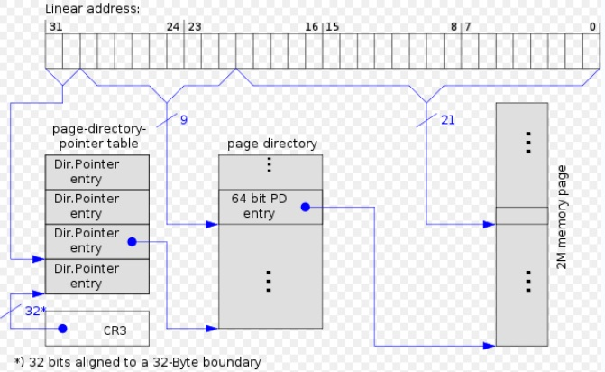
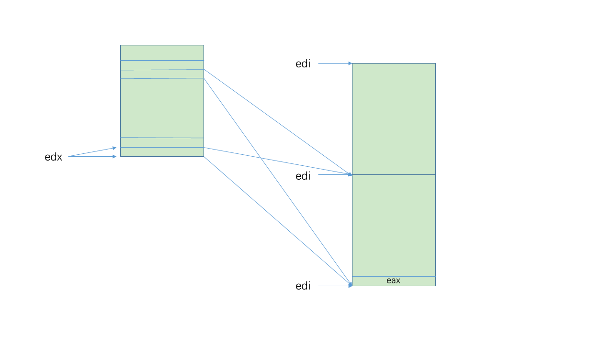
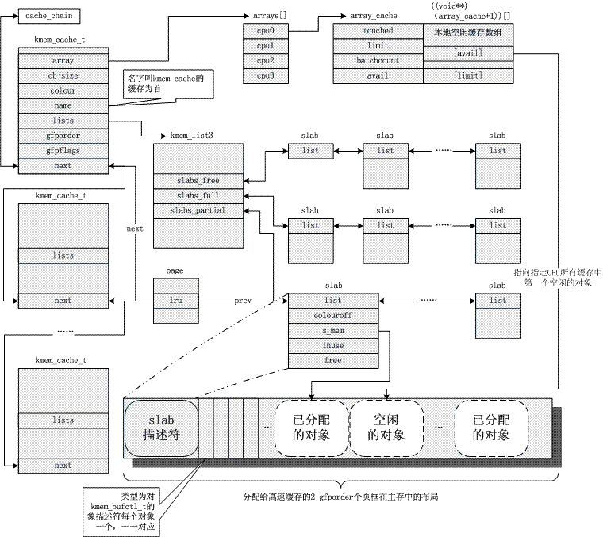
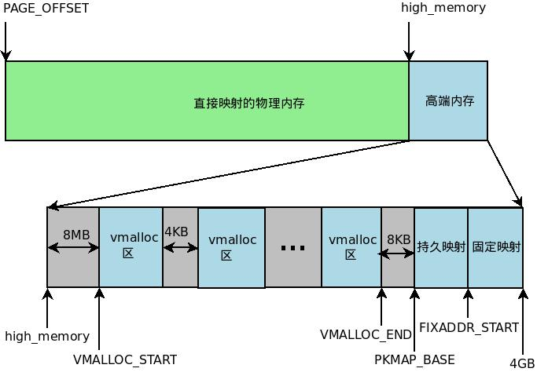
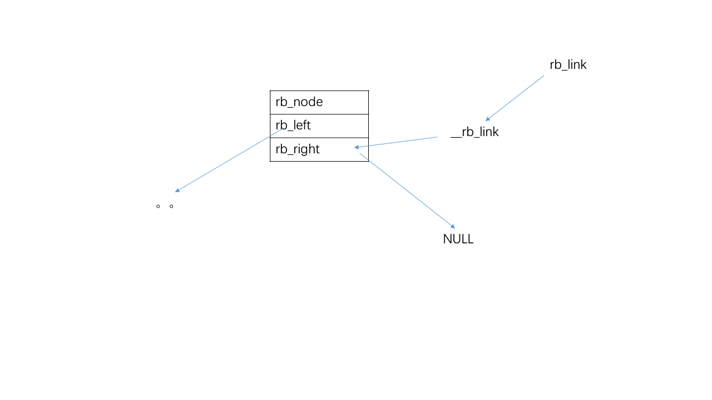

# 深入理解 Linux 内核

## 第一章 绪论

### 1.1 Linux 与其他类 Unix 内核的比较

### 1.2 硬件的依赖性

### 1.3 Linux 版本

### 1.4 操作系统基本概念

### 1.5 Unix 文件系统概述

### 1.6 Unix 内核概述

## 第二章 内存寻址

### 2.1 内存地址

### 2.2 硬件中的分段

### 2.3 Linux 中的分段

### 2.4 硬件中的分页

#### 2.4.5 物理地址扩展 (PAE) 分页机制

- 页表项大小从 32 位变为 64 位，一个 4KB 的页表包含 512 个表项。
- 线性地址仍为 32 位。
- 只有内核能够修改页表，允许内核使用高达 64GB 的 RAM 。

**未启用 PAE 下的 4K 分页的页表结构**：


**未启用 PAE 下的 4M 分页的页表结构**：


**启用 PAE 下 4K 分页的页表结构**：


**启用 PAE 下 2M 分页的页表结构**：



### 2.5 Linux 中的分页

#### 2.5.4 进程页表

进程的线性地址空间分为两部分：

1. 0x00000000 - 0xbfffffff 用户态和内核态都可以寻址
2. 0xc0000000 - 0xffffffff 只有内核态的进程才可以寻址

#### 2.5.5 内核页表

当内核被解压到线性地址 0x100000 后，为了继续启动内核，即启动内核的第一进程即 swapper 进程，内核需要建立一张临时页表供其使用。

**内核初始化自己的页表的两个阶段**：

1. 内核创建 128KB 空间
   - 代码段
   - 数据段
   - 初始页表
   - 动态数据结构
2. 利用剩余的 RAM 并建立分页表

##### 2.5.5.1 临时内核页表

**假设前 8MB 空间**：

- 内核使用的段
- 临时页表 (`pg0` 变量，紧接在 `_end` 后面)
- 128KB 空间

**变量定义**：

- `swapper_pg_dir` 变量存放**页全局目录**的线性地址
- `pg0` 变量存放第一张**页表**的线性地址

**目标**：

- 在实模式和保护模式都可以对 8MB 进行寻址
- 0x00000000 - 0x007fffff 和 0xc0000000 - 0xc07fffff 的线性地址映射到 0x00000000 - 0x007fffff 物理地址

**页全局目录的初步初始化**：

```armasm
ENTRY(swapper_pg_dir)
	.fill 1024,4,0
```

这两行汇编代码执行了页全局目录的初步初始化，它的意思是从 `swapper_pg_dir` 开始，填充 1024 项，每项为 4 字节，值为 0，正好是 4K 一个页面。

**页全局目录进一步初始化**：

为映射 8MB 地址空间，内核通过填充 `swapper_pg_dir` 中第 0 项，1 项，768 项和 769 项实现（768 和 769 是通过计算内核线性地址空间对应的页目录偏移量获得的）。前两项是给用户线性地址映射，后两项给内核线性地址映射。内核会将 `swapper_gp_dir` 的 0 项和 768 项字段设置为 `pg0` 的物理地址（`pg0` 中存放第一张页表的地址），而 1 项和 769 项设置为紧随 `pg0` 后的页框的物理地址（一般是 `pg0` + 4k）。

```armas
page_pde_offset = (__PAGE_OFFSET >> 20);			// 0xc00 = 0x300 * 4 每一项4字节

	movl $(pg0 - __PAGE_OFFSET), %edi					// 页表的物理地址
	movl $(swapper_pg_dir - __PAGE_OFFSET), %edx		// 页目录的物理地址
	movl $0x007, %eax			/* 0x007 = PRESENT+RW+USER */
10:
	leal 0x007(%edi),%ecx			/* Create PDE entry */
	movl %ecx,(%edx)			/* Store identity PDE entry */
	movl %ecx,page_pde_offset(%edx)		/* Store kernel PDE entry */
	addl $4,%edx				// 下一个页目录项
	movl $1024, %ecx
11:
	// 将 EAX 中的值保存到 ES:EDI 指向的地址中，若设置了 EFLAGS 中的方向位置位 (即在 STOSL 指令前使用 STD 指令) 则 EDI 自减 4，否则(使用 CLD 指令)EDI 自增 4；
	stosl
	addl $0x1000,%eax		// 4KB
	loop 11b
	/* End condition: we must map up to and including INIT_MAP_BEYOND_END */
	/* bytes beyond the end of our own page tables; the +0x007 is the attribute bits */
	// 结束条件: 从代码中可知，当映射到当前所操作的页表项往下 INIT_MAP_BEYOND_END（128K）处映射结束。临时页表的后面(edi结束时指向的位置)需要有128KB的空间(eax结束时指向的位置)。
				// 128KB
	leal (INIT_MAP_BEYOND_END+0x007)(%edi),%ebp
	cmpl %ebp,%eax
	jb 10b
	/* 最后把 edi 放入 init_pg_tables_end 所表示的物理地址中。也在 /boot/System.map 中。*/
	movl %edi,(init_pg_tables_end - __PAGE_OFFSET)
```

**映射后示意图**：




##### 2.5.5.2 当 RAM 小于 896MB 时的最终内核页表

把内核的可用内存空间 (896MB) 固定映射到物理内存 (0 ~ 896MB - 1) 处，其余物理内存由动态重映射处理。

**`__pa` 和 `__va` 定义**：

```c
#define __pa(x)			((unsigned long)(x)-PAGE_OFFSET)
#define __va(x)			((void *)((unsigned long)(x)+PAGE_OFFSET))
```

**`paging_init()`**：

```c
void __init paging_init(void)
{
#ifdef CONFIG_X86_PAE
	set_nx();
	if (nx_enabled)
		printk("NX (Execute Disable) protection: active\n");
#endif

	pagetable_init();	// 1

	load_cr3(swapper_pg_dir);	// 2

#ifdef CONFIG_X86_PAE
	/*
	 * We will bail out later - printk doesn't work right now so
	 * the user would just see a hanging kernel.
	 */
	if (cpu_has_pae)
		set_in_cr4(X86_CR4_PAE);	// 3
#endif
	__flush_tlb_all();	// 4

	kmap_init();
	zone_sizes_init();
}
```

**`pagetable_init()`**：

将每一个 4MB 页的物理地址保存到相应的页目录项处。

##### 2.5.5.3 当RAM 大小在 896MB 和 4096MB 之间时的最终内核页表

- 把一个 896MB 的 RAM 窗口映射到内核线性地址空间
- 其余部分采用动态重映射方式
- 使用与前一种情况相同的代码初始化页全局目录

##### 2.5.5.4 当 RAM 大于 4096MB 时的最终内核页表

- 把一个 896MB 的 RAM 窗口映射到内核线性地址空间
- 其余部分采用动态重映射方式
- 使用三级分页模型

```c
static void __init pagetable_init (void)
{
	unsigned long vaddr;
	pgd_t *pgd_base = swapper_pg_dir;

#ifdef CONFIG_X86_PAE
	int i;
	/* Init entries of the first-level page table to the zero page */
    // PTRS_PER_PGD: 二级页表 1024，三级页表 4
	for (i = 0; i < PTRS_PER_PGD; i++)
		set_pgd(pgd_base + i, __pgd(__pa(empty_zero_page) | _PAGE_PRESENT));
#endif

	/* Enable PSE if available */
	if (cpu_has_pse) {
		set_in_cr4(X86_CR4_PSE);
	}

	/* Enable PGE if available */
	if (cpu_has_pge) {
		set_in_cr4(X86_CR4_PGE);
		__PAGE_KERNEL |= _PAGE_GLOBAL;
		__PAGE_KERNEL_EXEC |= _PAGE_GLOBAL;
	}

	kernel_physical_mapping_init(pgd_base);		// ->
	remap_numa_kva();

	/*
	 * Fixed mappings, only the page table structure has to be
	 * created - mappings will be set by set_fixmap():
	 */
	vaddr = __fix_to_virt(__end_of_fixed_addresses - 1) & PMD_MASK;
	page_table_range_init(vaddr, 0, pgd_base);

	permanent_kmaps_init(pgd_base);

#ifdef CONFIG_X86_PAE
	/*
	 * Add low memory identity-mappings - SMP needs it when
	 * starting up on an AP from real-mode. In the non-PAE
	 * case we already have these mappings through head.S.
	 * All user-space mappings are explicitly cleared after
	 * SMP startup.
	 */
	pgd_base[0] = pgd_base[USER_PTRS_PER_PGD];
#endif
}
```

```c
static void __init kernel_physical_mapping_init(pgd_t *pgd_base)
{
	unsigned long pfn;
	pgd_t *pgd;
	pmd_t *pmd;
	pte_t *pte;
	int pgd_idx, pmd_idx, pte_ofs;

	pgd_idx = pgd_index(PAGE_OFFSET);
	pgd = pgd_base + pgd_idx;
	pfn = 0;

	for (; pgd_idx < PTRS_PER_PGD; pgd++, pgd_idx++) {
		pmd = one_md_table_init(pgd);		// ->
		if (pfn >= max_low_pfn)
			continue;
		for (pmd_idx = 0; pmd_idx < PTRS_PER_PMD && pfn < max_low_pfn; pmd++, pmd_idx++) {
			unsigned int address = pfn * PAGE_SIZE + PAGE_OFFSET;

			/* Map with big pages if possible, otherwise create normal page tables. */
			if (cpu_has_pse) {
				unsigned int address2 = (pfn + PTRS_PER_PTE - 1) * PAGE_SIZE + PAGE_OFFSET + PAGE_SIZE-1;

				if (is_kernel_text(address) || is_kernel_text(address2))
					set_pmd(pmd, pfn_pmd(pfn, PAGE_KERNEL_LARGE_EXEC));
				else
					set_pmd(pmd, pfn_pmd(pfn, PAGE_KERNEL_LARGE));
				pfn += PTRS_PER_PTE;
			} else {
				pte = one_page_table_init(pmd);

				for (pte_ofs = 0; pte_ofs < PTRS_PER_PTE && pfn < max_low_pfn; pte++, pfn++, pte_ofs++) {
						if (is_kernel_text(address))
							set_pte(pte, pfn_pte(pfn, PAGE_KERNEL_EXEC));
						else
							set_pte(pte, pfn_pte(pfn, PAGE_KERNEL));
				}
			}
		}
	}
}
```

```c
static pmd_t * __init one_md_table_init(pgd_t *pgd)
{
	pud_t *pud;
	pmd_t *pmd_table;
		
#ifdef CONFIG_X86_PAE
	pmd_table = (pmd_t *) alloc_bootmem_low_pages(PAGE_SIZE);
	set_pgd(pgd, __pgd(__pa(pmd_table) | _PAGE_PRESENT));
	pud = pud_offset(pgd, 0);
	if (pmd_table != pmd_offset(pud, 0)) 
		BUG();
#else
	pud = pud_offset(pgd, 0);
	pmd_table = pmd_offset(pud, 0);
#endif

	return pmd_table;
}
```

#### 2.5.6 固定映射的线性地址

每个固定映射的线性地址都映射一个物理内存的**页框**。

## 第三章 进程

### 3.1 进程、轻量级进程和线程

### 3.2 进程描述符

#### 3.2.5 进程资源限制

- `current->signal->rlim[RLIMIT_CPU].rlim_cur` 正运行进程所占用 CPU 时间的**当前**限制
- `current->signal->rlim[RLIMIT_CPU].rlim_max` 正运行进程所占用 CPU 时间的**最大**限制
- 只有超级用户可以修改

### 3.3 进程切换

### 3.4 创建进程

### 3.5 撤销进程

## 第四章 中断和异常

### 4.1 中断信号的作用

### 4.2 中断和异常

### 4.3 中断和异常处理程序的嵌套执行

### 4.4 初始化中断描述符表

### 4.5 异常处理

### 4.6 中断处理

### 4.7 软中断及 tasklet

### 4.8 工作队列

### 4.9 从中断和异常返回

## 第五章 内核同步

### 5.1 内核如何为不同的请求提供服务

### 5.2 同步原语

#### 5.2.4 自旋锁

- 当**内核控制路径**必须访问共享数据结构或进入临界区时，就需要为自己获取一把锁
- 用来在多处理器环境中工作
- 在单处理器系统上，自旋锁仅仅是禁止或启用内核抢占
- 忙等（尝试获取自旋锁的另一个进程不断尝试获取被占用的自旋锁，中间只 pause 一下 ），等待进程可以被抢占
- 临界区禁止内核抢占
- 保护模式下禁止内核抢占的方法：
  1. 执行终端服务例程时
  2. 执行软中断和 `tasklet` 时 
  3. 设置本地 CPU 计数器 `preempt_count `

##### 5.2.4.1 具有内核抢占的 `spin_lock` 宏

- 在抢占式内核的 `spin_lock` 宏中，第一次关抢占，目的是防止死锁（防止一个已经获取自旋锁而未释放的进程被抢占！！）。而后又开抢占，目的是让已经释放自旋锁的进程可以被调度出去，让其他进程可以进入临界区。当然，开启内核抢占后，调度器调度的进程是不是在忙等的进程不可而知！   

1. 禁用内核抢占
2. 是否可以获得自旋锁
3. 不能获得自旋锁，开启内核抢占，给其他进程机会
4. 等待自旋锁空闲
5. 跳到 1

##### 5.2.4.2 非抢占式内核中的 `spin_lock` 宏

- 循环直到获取到锁

##### 5.2.4.3 `spin_unlock` 宏

- `movb $1, slp->slock`
- 启用内核抢占

#### 5.2.5 读 / 写自旋锁

1. 特点
   - 增加内核的并发能力
   - 允许同时读
   - 获取写锁写

2. 读 / 写自旋锁：`rwlock_t` 结构体

```c
typedef struct {
	volatile unsigned int lock;
#ifdef CONFIG_DEBUG_SPINLOCK
	unsigned magic;
#endif
#ifdef CONFIG_PREEMPT
	unsigned int break_lock;	// 是否有其他进程等待该锁
#endif
} rwlock_t;
```

3. `lock` 字段
   - 0 - 23 位：补码，并发进行读操作的内核控制路径的数目
   - 24 位：没有读或写为 1
   - 未锁：0x01000000
   - 获取写锁：0x00000000
   - 多个读锁：0x00ffffff(-1)、0xfffffe(-2)

##### 5.2.5.1 为读获取和释放一个锁

`read_lock` 宏

- 内核抢占：执行与 `spin_lock` 非常相似的操作
- 禁止内核抢占：忙等待自旋锁的释放

##### 5.2.5.2 为写获取和释放一个锁

`write_lock` 宏，与上面类似

#### 5.2.6 顺序锁

`seqlock_t` 结构体

```c
typedef struct {
	unsigned sequence;	// 顺序计数器
	spinlock_t lock;
} seqlock_t;
```

- 读 / 写自旋锁读者和写者优先权相同
- 顺序锁为写者赋予较高的优先级
- 写者永远不会等待（读者正在读时允许写者运行）
- 读者需要重复多次读，两次 `sequence` 相同数据有效

#### 5.2.7 读 - 拷贝 - 更新 (RCU)

- 保护被多个 CPU 读的数据结构
- 允许多个读者和写者并发执行
- 不使用锁，开销小
- 只保护**动态分配，指针引用**的数据结构
- 内核控制路径**不能睡眠**

```c
void fastcall call_rcu(struct rcu_head *head,
				void (*func)(struct rcu_head *rcu))
{
	unsigned long flags;
	struct rcu_data *rdp;

	head->func = func;
	head->next = NULL;
	local_irq_save(flags);
	rdp = &__get_cpu_var(rcu_data);
	*rdp->nxttail = head;
	rdp->nxttail = &head->next;
	local_irq_restore(flags);
}
```

### 5.3 对内核数据结构的同步访问

### 5.4 避免竞争条件的实例

## 第六章 定时测量

### 6.1 时钟和定时器电路

### 6.2 Linux 计时体系结构

### 6.3 更新时间和日期

### 6.4 更新系统统计数

### 6.5 软定时器和延迟函数

### 6.6 与定时测量相关的系统调用

## 第七章 进程调度

### 7.1 调度策略

### 7.2 调度算法

### 7.3 调度程序所使用的数据结构

### 7.4 调度程序所使用的函数

### 7.5 多处理器系统中运行队列的平衡

### 7.6 与调度相关的系统调用

## 第八章 内存管理

### 8.1 页框管理

#### 8.1.4 保留的页框池

- 原子内存请求不能被阻塞
- 为了减小原子内存分配失败发生的可能性，内核保留一个页框池，只有在内存不足时才使用
- 保留内存的数量 -> `min_free_kbytes` -> 1024KB
- 管理区描述符中的字段`pages_min` 管理区内保留页框的数目
- `pages_low` = `pages_min` * 5/4
- `pages_high` = `pages_min` * 3/2

#### 8.1.6 高端内存页框的内核映射

### 8.2 内存区管理

slab 相关数据结构图解



#### 8.2.3 slab 描述符

#### 8.2.4 普通和专用高速缓存

#### 8.2.5 slab 分配器与分区页框分配器的接口

#### 8.2.6 给高速缓存分配 slab

必须满足两个条件：

- 已发出一个分配新对象的请求
- 高速缓存不包含任何空闲对象

```c
static int cache_grow (kmem_cache_t * cachep, int flags, int nodeid)
{
	struct slab	*slabp;
	void		*objp;
	size_t		 offset;
	int		 local_flags;
	unsigned long	 ctor_flags;

    // ...
    
	// 1. 获取一组页框存放 slab，返回线性地址，见 8.2.5
	/* Get mem for the objs. */
	if (!(objp = kmem_getpages(cachep, flags, nodeid)))
		goto failed;

    // 2. 获得一个新的 slab 描述符，见下一个函数
	/* Get slab management. */
    // offset 见 8.2.10
	if (!(slabp = alloc_slabmgmt(cachep, objp, offset, local_flags)))
		goto opps1;

    // 3. 给定一个页框，可以迅速得到相应高速缓存和 slab 描述符的地址
	set_slab_attr(cachep, slabp, objp);

    // 4. 将构造方法(如果定义了的话)应用到新 slab 包含的所有对象上
	cache_init_objs(cachep, slabp, ctor_flags);

	if (local_flags & __GFP_WAIT)
		local_irq_disable();
	check_irq_off();
	spin_lock(&cachep->spinlock);

	/* Make slab active. */
    // 5. 插入到高速缓存描述符全空 slab 链表的末端
	list_add_tail(&slabp->list, &(list3_data(cachep)->slabs_free));
	STATS_INC_GROWN(cachep);
    // 6. 更新高速缓存中空闲对象计数器
	list3_data(cachep)->free_objects += cachep->num;
	spin_unlock(&cachep->spinlock);
	return 1;
opps1:
	kmem_freepages(cachep, objp);
failed:
	if (local_flags & __GFP_WAIT)
		local_irq_disable();
	return 0;
}
```

```c
static struct slab* alloc_slabmgmt (kmem_cache_t *cachep,
			void *objp, int colour_off, int local_flags)
{
	struct slab *slabp;
	
    // #define	OFF_SLAB(x)	((x)->flags & CFLGS_OFF_SLAB)
	if (OFF_SLAB(cachep)) {	// slab 描述符存放在 slab 外部
		/* Slab management obj is off-slab. */
        // 见 8.2.12
        // 每一个对象为一个 slab 描述符
		slabp = kmem_cache_alloc(cachep->slabp_cache, local_flags);
		if (!slabp)
			return NULL;
	} else {	// 从 slab 的第一个页框中分配 slab 描述符
		slabp = objp+colour_off;
		colour_off += cachep->slab_size;
	}
	slabp->inuse = 0;
	slabp->colouroff = colour_off;
	slabp->s_mem = objp+colour_off;

	return slabp;
}
```

```c
static void set_slab_attr(kmem_cache_t *cachep, struct slab *slabp, void *objp)
{
	int i;
	struct page *page;

	/* Nasty!!!!!! I hope this is OK. */
	i = 1 << cachep->gfporder;
	page = virt_to_page(objp);
	do {
        // 强制转换
        // #define	SET_PAGE_CACHE(pg,x)  ((pg)->lru.next = (struct list_head *)(x))
		SET_PAGE_CACHE(page, cachep);
        // #define	SET_PAGE_SLAB(pg,x)   ((pg)->lru.prev = (struct list_head *)(x))
		SET_PAGE_SLAB(page, slabp);
		page++;
	} while (--i);
}
```

#### 8.2.7 从高速缓存中释放 slab

必须满足两个条件：

- slab 高速缓存中有太多的空闲对象
- 被周期性调用的定时器函数确定是否**有完全未使用的** slab 能被释放

#### 8.2.8 对象描述符

`kmem_bufctl_t` 结构体 (`unsigned short`)

- 位于相应的 slab 描述符之后
- 值为下一个空闲对象在 slab 中的下标，形成一个空闲对象链表

#### 8.2.9 对齐内存中的对象

```c
kmem_cache_t *
kmem_cache_create (const char *name, size_t size, size_t align,
	unsigned long flags, void (*ctor)(void*, kmem_cache_t *, unsigned long),
	void (*dtor)(void*, kmem_cache_t *, unsigned long))
{
    size_t left_over, slab_size, ralign;
	kmem_cache_t *cachep = NULL;
    
	// ...

	/* calculate out the final buffer alignment: */
	/* 1) arch recommendation: can be overridden for debug */
	if (flags & SLAB_HWCACHE_ALIGN) {	// 0
		/* Default alignment: as specified by the arch code.
		 * Except if an object is really small, then squeeze multiple
		 * objects into one cacheline.
		 */
		ralign = cache_line_size();	// L1_CACHE_BYTES 高速缓存行(cache line)
		while (size <= ralign/2)	// 2
			ralign /= 2;
	} else {	// 缺省情况
		ralign = BYTES_PER_WORD;
	}
    
    // ...
}
```

#### 8.2.10 Slab 着色

- 把 slab 中的一些空闲区域从末尾移到开始，达到把对象展开在不同的线性地址的效果。
- 对齐：对象的地址为 `aln` 的倍数

```c
static int cache_grow (kmem_cache_t * cachep, int flags, int nodeid)
{
	// ...

	/* Get colour for the slab, and cal the next value. */
	offset = cachep->colour_next;	// col
	cachep->colour_next++;
	if (cachep->colour_next >= cachep->colour)
		cachep->colour_next = 0;
    // dsize == 0 猜测：slab对象描述符在外部
	offset *= cachep->colour_off;	// colour_off: aln

	// ...

	/* Get slab management. */
	if (!(slabp = alloc_slabmgmt(cachep, objp, offset, local_flags)))
		goto opps1;

	// ...
}
```

#### 8.2.11 空闲 Slab 对象的本地高速缓存

slab 本地高速缓存：`array_cache` 结构体

- 每 CPU 元素
- 本地高速缓存数组紧跟其之后
- avail 存放 slab 中对象数组的下标

#### 8.2.12 分配 Slab 对象

1. 从 avail 中找
2. 从共享本地高速缓存填充 avail
3. 从部分或空闲 slab 中的一个空闲对象填充 avail
4. 换一个对象再找

```c
static void* cache_alloc_refill(kmem_cache_t* cachep, int flags)
{
	int batchcount;
	struct kmem_list3 *l3;
	struct array_cache *ac;

	check_irq_off();
	ac = ac_data(cachep);	// 1
retry:
	batchcount = ac->batchcount;
	if (!ac->touched && batchcount > BATCHREFILL_LIMIT) {
		/* if there was little recent activity on this
		 * cache, then perform only a partial refill.
		 * Otherwise we could generate refill bouncing.
		 */
		batchcount = BATCHREFILL_LIMIT;
	}
	l3 = list3_data(cachep);

	BUG_ON(ac->avail > 0);
	spin_lock(&cachep->spinlock);	// 2
	if (l3->shared) {	// 3.1
		struct array_cache *shared_array = l3->shared;
		if (shared_array->avail) {	// 3.2
			if (batchcount > shared_array->avail)
				batchcount = shared_array->avail;
            
            /* 
             * ac->avail == 0
             * 把 shared_array->avail 中 batchcount 个可使用对象的指针给了 ac->avail
             */
			shared_array->avail -= batchcount;	// 3.3
			ac->avail = batchcount;
            
             /*
             static inline void ** ac_entry(struct array_cache *ac)
			{
				// 返回 ac 后的本地高速缓存数组
				return (void**)(ac+1);
			}
              */ 
			memcpy(ac_entry(ac), &ac_entry(shared_array)[shared_array->avail],
					sizeof(void*)*batchcount);	// 3.4
			shared_array->touched = 1;
			goto alloc_done;	// -> 6
		}
	}
	while (batchcount > 0) {	// 4.a.1
		struct list_head *entry;
		struct slab *slabp;
		/* Get slab alloc is to come from. */
		entry = l3->slabs_partial.next;
		if (entry == &l3->slabs_partial) {	// slabs_partial 为空
			l3->free_touched = 1;	// 由 slab 分配器的页回收算法使用
			entry = l3->slabs_free.next;
			if (entry == &l3->slabs_free)	// slabs_free 为空
				goto must_grow;	// -> 5
		}

         // 4.a.2
		slabp = list_entry(entry, struct slab, list);
		check_slabp(cachep, slabp);
		check_spinlock_acquired(cachep);
		while (slabp->inuse < cachep->num && batchcount--) {
			kmem_bufctl_t next;
			STATS_INC_ALLOCED(cachep);
			STATS_INC_ACTIVE(cachep);
			STATS_SET_HIGH(cachep);

             // 4.b
			/* get obj pointer */
			ac_entry(ac)[ac->avail++] = slabp->s_mem + slabp->free*cachep->objsize;

			slabp->inuse++;
             /*
             static inline kmem_bufctl_t *slab_bufctl(struct slab *slabp)
             {
             	 // 返回 slab 描述符后的对象描述符数组
                 return (kmem_bufctl_t *)(slabp+1);
             }
              */
			next = slab_bufctl(slabp)[slabp->free];
#if DEBUG
			slab_bufctl(slabp)[slabp->free] = BUFCTL_FREE;
#endif
		       	slabp->free = next;
		}
		check_slabp(cachep, slabp);

         // 4.c
		/* move slabp to correct slabp list: */
		list_del(&slabp->list);
		if (slabp->free == BUFCTL_END)
			list_add(&slabp->list, &l3->slabs_full);
		else
			list_add(&slabp->list, &l3->slabs_partial);
	}

must_grow:
	l3->free_objects -= ac->avail;	// 5
alloc_done:
	spin_unlock(&cachep->spinlock);	// 6

	if (unlikely(!ac->avail)) {	// 7.1
		int x;
		x = cache_grow(cachep, flags, -1);	// 8
		
         // 9
		// cache_grow can reenable interrupts, then ac could change.
		ac = ac_data(cachep);
		if (!x && ac->avail == 0)	// no objects in sight? abort
			return NULL;

		if (!ac->avail)		// objects refilled by interrupt?
			goto retry;
	}
	ac->touched = 1;	// 7.2
	return ac_entry(ac)[--ac->avail];	// 7.3
}
```

#### 8.2.13 释放 Slab 对象

```c
static void cache_flusharray (kmem_cache_t* cachep, struct array_cache *ac)
{
	int batchcount;

	batchcount = ac->batchcount;
#if DEBUG
	BUG_ON(!batchcount || batchcount > ac->avail);
#endif
	check_irq_off();
	spin_lock(&cachep->spinlock);	// 1
	if (cachep->lists.shared) {	// 2.1
		struct array_cache *shared_array = cachep->lists.shared;
		int max = shared_array->limit-shared_array->avail;
		if (max) {	// 2.2
			if (batchcount > max)
				batchcount = max;
			memcpy(&ac_entry(shared_array)[shared_array->avail],
					&ac_entry(ac)[0],
					sizeof(void*)*batchcount);	// 2.3
			shared_array->avail += batchcount;
			goto free_done;	// -> 4
		}
	}

	free_block(cachep, &ac_entry(ac)[0], batchcount);	// 3
free_done:
#if STATS
	{
		int i = 0;
		struct list_head *p;

		p = list3_data(cachep)->slabs_free.next;
		while (p != &(list3_data(cachep)->slabs_free)) {
			struct slab *slabp;

			slabp = list_entry(p, struct slab, list);
			BUG_ON(slabp->inuse);

			i++;
			p = p->next;
		}
		STATS_SET_FREEABLE(cachep, i);
	}
#endif
	spin_unlock(&cachep->spinlock);	// 4
	ac->avail -= batchcount;	// 5
	memmove(&ac_entry(ac)[0], &ac_entry(ac)[batchcount],
			sizeof(void*)*ac->avail);	// 6	为什么不把高地址的复制过去？？
}
```

```c
static void free_block(kmem_cache_t *cachep, void **objpp, int nr_objects)
{
	int i;

	check_spinlock_acquired(cachep);

	/* NUMA: move add into loop */
	cachep->lists.free_objects += nr_objects;	// a

	for (i = 0; i < nr_objects; i++) {
		void *objp = objpp[i];
		struct slab *slabp;
		unsigned int objnr;

         // #define	GET_PAGE_SLAB(pg)     ((struct slab *)(pg)->lru.prev)
		slabp = GET_PAGE_SLAB(virt_to_page(objp));	// b
		list_del(&slabp->list);	// c
		objnr = (objp - slabp->s_mem) / cachep->objsize;	// d
		check_slabp(cachep, slabp);
#if DEBUG
		if (slab_bufctl(slabp)[objnr] != BUFCTL_FREE) {
			printk(KERN_ERR "slab: double free detected in cache '%s', objp %p.\n",
						cachep->name, objp);
			BUG();
		}
#endif
		slab_bufctl(slabp)[objnr] = slabp->free;	// e
		slabp->free = objnr;	// e
		STATS_DEC_ACTIVE(cachep);
		slabp->inuse--;	// f
		check_slabp(cachep, slabp);

		/* fixup slab chains */
		if (slabp->inuse == 0) {	// g.1
			if (cachep->lists.free_objects > cachep->free_limit) {	// g.2
				cachep->lists.free_objects -= cachep->num;	// g.3
				slab_destroy(cachep, slabp);	// g.3	见 8.2.7
			} else {	// h
				list_add(&slabp->list,
				&list3_data_ptr(cachep, objp)->slabs_free);
			}
		} else {	// i
			/* Unconditionally move a slab to the end of the
			 * partial list on free - maximum time for the
			 * other objects to be freed, too.
			 */
			list_add_tail(&slabp->list,
				&list3_data_ptr(cachep, objp)->slabs_partial);
		}
	}
}
```

#### 8.2.14 通用对象

- `kmalloc()`

  调用 `malloc_cache_alloc()` 分配对象

- `kfree()`

  调用 `kmem_cache_free()` 释放相应的内存区

#### 8.2.15 内存池

内存池：`mempool_t` 结构体

- 一个内存池允许一个内核成分，如块设备子系统，仅在内存不足的紧急情况下分配一些动态内存来使用。
- 与 8.1.4 区分

### 8.3 非连续内存区管理

#### 8.3.1 非连续内存区的线性地址



#### 8.3.2 非连续内存区的描述符

`vm_struct` 结构体

**`get_vm_area()`**：

```c
struct vm_struct *get_vm_area(unsigned long size, unsigned long flags)
{
	return __get_vm_area(size, flags, VMALLOC_START, VMALLOC_END);
}
```

```c
// 计算x以a为倍数的上界
#define ALIGN(x,a) (((x)+(a)-1)&~((a)-1))
```

```c
struct vm_struct *__get_vm_area(unsigned long size, unsigned long flags,
				unsigned long start, unsigned long end)
{
	struct vm_struct **p, *tmp, *area;
	unsigned long align = 1;
	unsigned long addr;

	if (flags & VM_IOREMAP) {
        // fls(): find last bit set
		int bit = fls(size);

		if (bit > IOREMAP_MAX_ORDER)
			bit = IOREMAP_MAX_ORDER;
		else if (bit < PAGE_SHIFT)
			bit = PAGE_SHIFT;

		align = 1ul << bit;
	}
	addr = ALIGN(start, align);

	area = kmalloc(sizeof(*area), GFP_KERNEL);	// 1
	if (unlikely(!area))
		return NULL;

	/*
	 * We always allocate a guard page.
	 */
	size += PAGE_SIZE;
	if (unlikely(!size)) {
		kfree (area);
		return NULL;
	}

	write_lock(&vmlist_lock);	// 2.1
    // vmlist 中是已分配的
    //									p 指向 tmp->next
	for (p = &vmlist; (tmp = *p) != NULL ;p = &tmp->next) {
		if ((unsigned long)tmp->addr < addr) {	// 查找到的地址在初始位置之前
            // // 查找到的末尾地址在初始位置之后
			if((unsigned long)tmp->addr + tmp->size >= addr)
				addr = ALIGN(tmp->size + 
					     (unsigned long)tmp->addr, align);
			continue;
		}
		if ((size + addr) < addr)	// 溢出
			goto out;
        // 从上一个分配的到tmp有size大小的空闲区域
		if (size + addr <= (unsigned long)tmp->addr)
			goto found;
		addr = ALIGN(tmp->size + (unsigned long)tmp->addr, align);
		if (addr > end - size)	// 空间不足
			goto out;
	}

found:	// 3
	area->next = *p;
	*p = area;

	area->flags = flags;
	area->addr = (void *)addr;
	area->size = size;
	area->pages = NULL;
	area->nr_pages = 0;
	area->phys_addr = 0;
	write_unlock(&vmlist_lock);

	return area;

out:	// 4
	write_unlock(&vmlist_lock);
	kfree(area);
	if (printk_ratelimit())
		printk(KERN_WARNING "allocation failed: out of vmalloc space - use vmalloc=<size> to increase size.\n");
	return NULL;
}
```


#### 8.3.3 分配非连续内存区

- 获取足够的页框

```c
void *vmalloc(unsigned long size)
{
       return __vmalloc(size, GFP_KERNEL | __GFP_HIGHMEM, PAGE_KERNEL);
}
```

```c
void *__vmalloc(unsigned long size, int gfp_mask, pgprot_t prot)
{
	struct vm_struct *area;
	struct page **pages;
	unsigned int nr_pages, array_size, i;

	size = PAGE_ALIGN(size);	// 1
	if (!size || (size >> PAGE_SHIFT) > num_physpages)
		return NULL;

	area = get_vm_area(size, VM_ALLOC);		// 2
	if (!area)
		return NULL;

	nr_pages = size >> PAGE_SHIFT;
	array_size = (nr_pages * sizeof(struct page *));

	area->nr_pages = nr_pages;
	/* Please note that the recursion is strictly bounded. */
	if (array_size > PAGE_SIZE)
        // 递归给 页描述符指针数组 分配 连续页框
		pages = __vmalloc(array_size, gfp_mask, PAGE_KERNEL);
	else
		pages = kmalloc(array_size, (gfp_mask & ~__GFP_HIGHMEM));	// 3
	area->pages = pages;
	if (!area->pages) {		// 见下一节
		remove_vm_area(area->addr);
		kfree(area);
		return NULL;
	}
	memset(area->pages, 0, array_size);		// 4

	for (i = 0; i < area->nr_pages; i++) {		// 5
		area->pages[i] = alloc_page(gfp_mask);
		if (unlikely(!area->pages[i])) {
			/* Successfully allocated i pages, free them in __vunmap() */
			area->nr_pages = i;
			goto fail;
		}
	}
	
	if (map_vm_area(area, prot, &pages))	// 6
		goto fail;
	return area->addr;

fail:
	vfree(area->addr);
	return NULL;
}
```

- 修改页表，将 非连续页框 映射到 连续线性地址空间

```c
#define PGDIR_SHIFT	22
#define PTRS_PER_PGD	1024	/* pgtable-2level-defs.h */
#define PGDIR_SHIFT	30
#define PTRS_PER_PGD	4		/* pgtable-3level-defs.h */
#define pgd_index(address) (((address) >> PGDIR_SHIFT) & (PTRS_PER_PGD-1))
#define pgd_offset(mm, address) ((mm)->pgd+pgd_index(address))	/* P354 */
#define pgd_offset_k(address) pgd_offset(&init_mm, address)
```

```c
int map_vm_area(struct vm_struct *area, pgprot_t prot, struct page ***pages)
{
	unsigned long address = (unsigned long) area->addr;
	unsigned long end = address + (area->size-PAGE_SIZE);
	unsigned long next;
	pgd_t *pgd;
	int err = 0;
	int i;

	pgd = pgd_offset_k(address);		// 主内核页全局目录中 address 对应的目录项
	spin_lock(&init_mm.page_table_lock);
	for (i = pgd_index(address); i <= pgd_index(end-1); i++) {
		pud_t *pud = pud_alloc(&init_mm, pgd, address);
		if (!pud) {
			err = -ENOMEM;
			break;
		}
		next = (address + PGDIR_SIZE) & PGDIR_MASK;
		if (next < address || next > end)
			next = end;
		if (map_area_pud(pud, address, next, prot, pages)) {
			err = -ENOMEM;
			break;
		}

		address = next;
		pgd++;
	}

	spin_unlock(&init_mm.page_table_lock);
	flush_cache_vmap((unsigned long) area->addr, end);
	return err;
}
```

```c
static int map_area_pud(pud_t *pud, unsigned long address,
			       unsigned long end, pgprot_t prot,
			       struct page ***pages)
{
	do {
		pmd_t *pmd = pmd_alloc(&init_mm, pud, address);
		if (!pmd)
			return -ENOMEM;
		if (map_area_pmd(pmd, address, end - address, prot, pages))
			return -ENOMEM;
		address = (address + PUD_SIZE) & PUD_MASK;	// 将地址对齐，便于计算
		pud++;
	} while (address && address < end);

	return 0;
}
```

```c
static int map_area_pmd(pmd_t *pmd, unsigned long address,
			       unsigned long size, pgprot_t prot,
			       struct page ***pages)
{
	unsigned long base, end;

	base = address & PUD_MASK;	// 高位
	address &= ~PUD_MASK;		// 低位
	end = address + size;
	if (end > PUD_SIZE)
		end = PUD_SIZE;

	do {
		pte_t * pte = pte_alloc_kernel(&init_mm, pmd, base + address);
		if (!pte)
			return -ENOMEM;
		if (map_area_pte(pte, address, end - address, prot, pages))
			return -ENOMEM;
		address = (address + PMD_SIZE) & PMD_MASK;
		pmd++;
	} while (address < end);

	return 0;
}
```

```c
static int map_area_pte(pte_t *pte, unsigned long address,
			       unsigned long size, pgprot_t prot,
			       struct page ***pages)
{
	unsigned long end;

	address &= ~PMD_MASK;	// 即使下面的地址不用，也要分配空间
	end = address + size;
	if (end > PMD_SIZE)
		end = PMD_SIZE;

	do {
		struct page *page = **pages;
		WARN_ON(!pte_none(*pte));
		if (!page)
			return -ENOMEM;

		set_pte(pte, mk_pte(page, prot));
		address += PAGE_SIZE;
		pte++;
		(*pages)++;
	} while (address < end);
	return 0;
}
```

#### 8.3.4 释放非连续内存区

```c
void __vunmap(void *addr, int deallocate_pages)
{
	struct vm_struct *area;

	if (!addr)
		return;

	if ((PAGE_SIZE-1) & (unsigned long)addr) {
		printk(KERN_ERR "Trying to vfree() bad address (%p)\n", addr);
		WARN_ON(1);
		return;
	}

	area = remove_vm_area(addr);	// 1
	if (unlikely(!area)) {
		printk(KERN_ERR "Trying to vfree() nonexistent vm area (%p)\n",
				addr);
		WARN_ON(1);
		return;
	}
	
	if (deallocate_pages) {
		int i;

		for (i = 0; i < area->nr_pages; i++) {
			if (unlikely(!area->pages[i]))
				BUG();
			__free_page(area->pages[i]);	// 2
		}

		if (area->nr_pages > PAGE_SIZE/sizeof(struct page *))
			vfree(area->pages);
		else
			kfree(area->pages);
	}

	kfree(area);	// 3
	return;
}
```

## 第九章 进程地址空间

### 9.1 进程的地址空间

由允许进程使用的全部线性地址组成

### 9.2 内存描述符

**`mm_struct` 结构体**：

[Linux 进程地址管理之 mm_struct](https://www.cnblogs.com/Rofael/archive/2013/04/13/3019153.html)

**`mm_users` vs `mm_count`**：

- All of the `mm_users` represent one increment of `mm_count`. When `mm_users` reaches zero (all threads using this address space exit), `mm_count` is decremented by one. When `mm_count` reaches zero, the `mm_struct` is freed.
- 内核线程在运行时会借用其他进程的 `mm_struct`, 这样的线程叫 "anonymous users",  因为他们不关心 `mm_struct` 指向的用户空间, 也不会去访问这个用户空间. 他们只是临时借用.  mm_count 记录这样的线程. 

#### 9.2.1 内核线程的内存描述符

[linux 内核中的 active_mm 的作用](https://blog.csdn.net/renyisheng/article/details/77822789)

### 9.3 线性区

- `vm_area_struct` 结构体
- 合并
  - 紧邻
  - 访问权限相匹配

#### 9.3.1 线性区数据结构

- **链表**：扫描整个线性区集合
- **红黑树**：确定含有指定地址的线性区

#### 9.3.2 线性区访问权限

#### 9.3.3 线性区的处理

##### 9.3.3.1 查找给定地址的最邻近区：`find_vma()`

```c
struct vm_area_struct * find_vma(struct mm_struct * mm, unsigned long addr)
{
	struct vm_area_struct *vma = NULL;

	if (mm) {
		/* Check the cache first. */
		/* (Cache hit rate is typically around 35%.) */
		vma = mm->mmap_cache;
        // 局部性原理
		if (!(vma && vma->vm_end > addr && vma->vm_start <= addr)) {
            // 在红黑树中查找
			struct rb_node * rb_node;

			rb_node = mm->mm_rb.rb_node;
			vma = NULL;

			while (rb_node) {
				struct vm_area_struct * vma_tmp;

				vma_tmp = rb_entry(rb_node,
						struct vm_area_struct, vm_rb);

				if (vma_tmp->vm_end > addr) {
					vma = vma_tmp;		// 只要找到vm_end > addr的就可以了
					if (vma_tmp->vm_start <= addr)	// 尽可能找包含addr的
						break;
					rb_node = rb_node->rb_left;
				} else
					rb_node = rb_node->rb_right;
			}
			if (vma)
				mm->mmap_cache = vma;
		}
	}
	return vma;
}
```

```c
struct vm_area_struct *
find_vma_prev(struct mm_struct *mm, unsigned long addr,
			struct vm_area_struct **pprev)
{
	struct vm_area_struct *vma = NULL, *prev = NULL;
	struct rb_node * rb_node;
	if (!mm)
		goto out;

	/* Guard against addr being lower than the first VMA */
	vma = mm->mmap;

	/* Go through the RB tree quickly. */
	rb_node = mm->mm_rb.rb_node;

	while (rb_node) {
        // 找到偏左的一个，然后试探紧跟后面的是否是所求的
		struct vm_area_struct *vma_tmp;
		vma_tmp = rb_entry(rb_node, struct vm_area_struct, vm_rb);

		if (addr < vma_tmp->vm_end) {
			rb_node = rb_node->rb_left;
		} else {
			prev = vma_tmp;
            // 靠左的不符合条件，所以只需要vm_end > addr
			if (!prev->vm_next || (addr < prev->vm_next->vm_end))
				break;
			rb_node = rb_node->rb_right;
		}
	}

out:
	*pprev = prev;
	return prev ? prev->vm_next : vma;
}
```

```c
static struct vm_area_struct *
find_vma_prepare(struct mm_struct *mm, unsigned long addr,
		struct vm_area_struct **pprev, struct rb_node ***rb_link,
		struct rb_node ** rb_parent)
{
	struct vm_area_struct * vma;
	struct rb_node ** __rb_link, * __rb_parent, * rb_prev;

	__rb_link = &mm->mm_rb.rb_node;		// __rb_link 指向 rb_node
	rb_prev = __rb_parent = NULL;
	vma = NULL;

	while (*__rb_link) {
		struct vm_area_struct *vma_tmp;

		__rb_parent = *__rb_link;
		vma_tmp = rb_entry(__rb_parent, struct vm_area_struct, vm_rb);

		if (vma_tmp->vm_end > addr) {
			vma = vma_tmp;
			if (vma_tmp->vm_start <= addr)
				return vma;		// 找到了一个包含addr的vma，预示无法分配所需空间
			__rb_link = &__rb_parent->rb_left;
		} else {
			rb_prev = __rb_parent;
			__rb_link = &__rb_parent->rb_right;
		}
	}

    /*
     * *__rb_link 为空
     * 若 *__rb_link 为右孩子，则 rb_prev 为父节点
     * 若 *__rb_link 为左孩子，由于 *__rb_link 为空，即它没有左孩子，因此 rb_prev 为祖先节点中第一个作为右孩子的节点的父节点
     */
	*pprev = NULL;
	if (rb_prev)
		*pprev = rb_entry(rb_prev, struct vm_area_struct, vm_rb);	// 前一个节点
	*rb_link = __rb_link;	// 所求节点
	*rb_parent = __rb_parent;	// 父节点
	return vma;
}
```



##### 9.3.3.2 查找一个与给定的地址区间相重叠的线性区：`find_vma_intersection()`

两个区间交叉

```c
static inline struct vm_area_struct * 
find_vma_intersection(struct mm_struct * mm, unsigned long start_addr, 
                      unsigned long end_addr)
{
	struct vm_area_struct * vma = find_vma(mm,start_addr);

	if (vma && end_addr <= vma->vm_start)
		vma = NULL;
	return vma;
}
```

##### 9.3.3.3 查找一个空闲的地址区间：`get_unmapped_area()`

```c
unsigned long
get_unmapped_area(struct file *file, unsigned long addr, unsigned long len,
		unsigned long pgoff, unsigned long flags)
{
	if (flags & MAP_FIXED) {
		unsigned long ret;

		if (addr > TASK_SIZE - len)		// 是否在用户态空间
			return -ENOMEM;
		if (addr & ~PAGE_MASK)			// 是否与页边界对齐
			return -EINVAL;
		if (file && is_file_hugepages(file))  {
			/*
			 * Check if the given range is hugepage aligned, and
			 * can be made suitable for hugepages.
			 */
			ret = prepare_hugepage_range(addr, len);
		} else {
			/*
			 * Ensure that a normal request is not falling in a
			 * reserved hugepage range.  For some archs like IA-64,
			 * there is a separate region for hugepages.
			 */
			ret = is_hugepage_only_range(addr, len);
		}
		if (ret)
			return -EINVAL;
		return addr;
	}

    // 文件内存映射
	if (file && file->f_op && file->f_op->get_unmapped_area)
		return file->f_op->get_unmapped_area(file, addr, len,
						pgoff, flags);

    // 匿名内存映射
	return current->mm->get_unmapped_area(file, addr, len, pgoff, flags);	// ->
}
```

```c
unsigned long
arch_get_unmapped_area(struct file *filp, unsigned long addr,
		unsigned long len, unsigned long pgoff, unsigned long flags)
{
	struct mm_struct *mm = current->mm;
	struct vm_area_struct *vma;
	unsigned long start_addr;

	if (len > TASK_SIZE)	// 检查区间的长度
		return -ENOMEM;

	if (addr) {
		addr = PAGE_ALIGN(addr);
		vma = find_vma(mm, addr);
        // 空出了从addr开始的len长度的空间
		if (TASK_SIZE - len >= addr &&
		    (!vma || addr + len <= vma->vm_start))
			return addr;
	}
	start_addr = addr = mm->free_area_cache;

full_search:
	for (vma = find_vma(mm, addr); ; vma = vma->vm_next) {
		/* At this point:  (!vma || addr < vma->vm_end). */
		if (TASK_SIZE - len < addr) {
			/*
			 * Start a new search - just in case we missed
			 * some holes.
			 */
            // #define TASK_UNMAPPED_BASE	(PAGE_ALIGN(TASK_SIZE / 3))
            // 从用户态地址空间的三分之一处重新开始搜索
			if (start_addr != TASK_UNMAPPED_BASE) {
				start_addr = addr = TASK_UNMAPPED_BASE;
				goto full_search;
			}
            // 已经完成第二次搜索
			return -ENOMEM;
		}
		if (!vma || addr + len <= vma->vm_start) {
			/*
			 * Remember the place where we stopped the search:
			 */
			mm->free_area_cache = addr + len;
			return addr;
		}
		addr = vma->vm_end;
	}
}
```

##### 9.3.3.4 向内存描述符链表中插入一个线性区：`insert_vm_struct()`

```c
int insert_vm_struct(struct mm_struct * mm, struct vm_area_struct * vma)
{
	struct vm_area_struct * __vma, * prev;
	struct rb_node ** rb_link, * rb_parent;

	/*
	 * The vm_pgoff of a purely anonymous vma should be irrelevant
	 * until its first write fault, when page's anon_vma and index
	 * are set.  But now set the vm_pgoff it will almost certainly
	 * end up with (unless mremap moves it elsewhere before that
	 * first wfault), so /proc/pid/maps tells a consistent story.
	 *
	 * By setting it to reflect the virtual start address of the
	 * vma, merges and splits can happen in a seamless way, just
	 * using the existing file pgoff checks and manipulations.
	 * Similarly in do_mmap_pgoff and in do_brk.
	 */
	if (!vma->vm_file) {
		BUG_ON(vma->anon_vma);
		vma->vm_pgoff = vma->vm_start >> PAGE_SHIFT;
	}
	__vma = find_vma_prepare(mm,vma->vm_start,&prev,&rb_link,&rb_parent);
	if (__vma && __vma->vm_start < vma->vm_end)		// 没有足够大的空闲区域
		return -ENOMEM;
	vma_link(mm, vma, prev, rb_link, rb_parent);	// ->
	return 0;
}
```

```c
static void vma_link(struct mm_struct *mm, struct vm_area_struct *vma,
			struct vm_area_struct *prev, struct rb_node **rb_link,
			struct rb_node *rb_parent)
{
	struct address_space *mapping = NULL;

	if (vma->vm_file)
		mapping = vma->vm_file->f_mapping;

	if (mapping) {
		spin_lock(&mapping->i_mmap_lock);
		vma->vm_truncate_count = mapping->truncate_count;
	}
	anon_vma_lock(vma);

	__vma_link(mm, vma, prev, rb_link, rb_parent);		// ->
	__vma_link_file(vma);

	anon_vma_unlock(vma);
	if (mapping)
		spin_unlock(&mapping->i_mmap_lock);

	mm->map_count++;	// 4
	validate_mm(mm);
}
```

**`__vma_link()`**：

```c
static void
__vma_link(struct mm_struct *mm, struct vm_area_struct *vma,
	struct vm_area_struct *prev, struct rb_node **rb_link,
	struct rb_node *rb_parent)
{
	__vma_link_list(mm, vma, prev, rb_parent);		// 1	->
	__vma_link_rb(mm, vma, rb_link, rb_parent);		// 2	->
	__anon_vma_link(vma);							// 3
}
```

```c
static inline void
__vma_link_list(struct mm_struct *mm, struct vm_area_struct *vma,
		struct vm_area_struct *prev, struct rb_node *rb_parent)
{
	if (prev) {
		vma->vm_next = prev->vm_next;
		prev->vm_next = vma;
	} else {	// vma 为第一个元素
		mm->mmap = vma;
		if (rb_parent)
			vma->vm_next = rb_entry(rb_parent,
					struct vm_area_struct, vm_rb);
		else
			vma->vm_next = NULL;
	}
}
```

```c
void __vma_link_rb(struct mm_struct *mm, struct vm_area_struct *vma,
		struct rb_node **rb_link, struct rb_node *rb_parent)
{
	rb_link_node(&vma->vm_rb, rb_parent, rb_link);		// ->
	rb_insert_color(&vma->vm_rb, &mm->mm_rb);	// 红黑树维护操作
}
```

```c
static inline void rb_link_node(struct rb_node * node, struct rb_node * parent,
				struct rb_node ** rb_link)
{
	node->rb_parent = parent;
	node->rb_color = RB_RED;
	node->rb_left = node->rb_right = NULL;

	*rb_link = node;	// 将 node 链接到红黑树上
}
```

**`__vma_unlink()`**：

```c
static inline void
__vma_unlink(struct mm_struct *mm, struct vm_area_struct *vma,
		struct vm_area_struct *prev)
{
	prev->vm_next = vma->vm_next;
	rb_erase(&vma->vm_rb, &mm->mm_rb);
	if (mm->mmap_cache == vma)
		mm->mmap_cache = prev;
}
```

#### 9.3.4 分配线性地址区间

```c
static inline unsigned long do_mmap(struct file *file, unsigned long addr,
	unsigned long len, unsigned long prot,
	unsigned long flag, unsigned long offset)
{
	unsigned long ret = -EINVAL;
	if ((offset + PAGE_ALIGN(len)) < offset)	// 溢出
		goto out;
	if (!(offset & ~PAGE_MASK))		// 与页对齐
		ret = do_mmap_pgoff(file, addr, len, prot, flag, offset >> PAGE_SHIFT);
out:
	return ret;
}
```

```c
static inline int can_do_mlock(void)
{
	if (capable(CAP_IPC_LOCK))
		return 1;
	if (current->signal->rlim[RLIMIT_MEMLOCK].rlim_cur != 0)
		return 1;
	return 0;
}
```

[linux 进程地址空间 --vma 的基本操作](http://abcdxyzk.github.io/blog/2015/09/11/kernel-mm-vma-base/)

```c
/*
 * Given a mapping request (addr,end,vm_flags,file,pgoff), figure out
 * whether that can be merged with its predecessor or its successor.
 * Or both (it neatly fills a hole).
 *
 * In most cases - when called for mmap, brk or mremap - [addr,end) is
 * certain not to be mapped by the time vma_merge is called; but when
 * called for mprotect, it is certain to be already mapped (either at
 * an offset within prev, or at the start of next), and the flags of
 * this area are about to be changed to vm_flags - and the no-change
 * case has already been eliminated.
 *
 * The following mprotect cases have to be considered, where AAAA is
 * the area passed down from mprotect_fixup, never extending beyond one
 * vma, PPPPPP is the prev vma specified, and NNNNNN the next vma after:
 *
 *     AAAA             AAAA                AAAA          AAAA
 *    PPPPPPNNNNNN    PPPPPPNNNNNN    PPPPPPNNNNNN    PPPPNNNNXXXX
 *    cannot merge    might become    might become    might become
 *                    PPNNNNNNNNNN    PPPPPPPPPPNN    PPPPPPPPPPPP 6 or
 *    mmap, brk or    case 4 below    case 5 below    PPPPPPPPXXXX 7 or
 *    mremap move:                                    PPPPNNNNNNNN 8
 *        AAAA
 *    PPPP    NNNN    PPPPPPPPPPPP    PPPPPPPPNNNN    PPPPNNNNNNNN
 *    might become    case 1 below    case 2 below    case 3 below
 *
 * Odd one out? Case 8, because it extends NNNN but needs flags of XXXX:
 * mprotect_fixup updates vm_flags & vm_page_prot on successful return.
 */
struct vm_area_struct *vma_merge(struct mm_struct *mm,
			struct vm_area_struct *prev, unsigned long addr,
			unsigned long end, unsigned long vm_flags,
		     	struct anon_vma *anon_vma, struct file *file,
			pgoff_t pgoff, struct mempolicy *policy)
{
	pgoff_t pglen = (end - addr) >> PAGE_SHIFT;
	struct vm_area_struct *area, *next;

	/*
	 * We later require that vma->vm_flags == vm_flags,
	 * so this tests vma->vm_flags & VM_SPECIAL, too.
	 */
	if (vm_flags & VM_SPECIAL)
		return NULL;

	if (prev)
		next = prev->vm_next;
	else
		next = mm->mmap;
	area = next;
    /* 
     * 后驱节点存在，并且后驱vma的结束地址和给定区域的结束地址相同，
	 * 也就是说两者有重叠，那么调整后驱vma
	 */
	if (next && next->vm_end == end)		/* cases 6, 7, 8 */
		next = next->vm_next;

	/*
	 * Can it merge with the predecessor?
	 */
    /*
	 * 先判断给定的区域能否和前驱vma进行合并，需要判断如下的几个方面:
	 * 1.前驱vma必须存在
	 * 2.前驱vma的结束地址正好等于给定区域的起始地址
	 * 3.两者的struct mempolicy中的相关属性要相同，这项检查只对NUMA架构有意义
	 * 4.其他相关项必须匹配，包括两者的vm_flags，是否映射同一个文件等等
	 */
	if (prev && prev->vm_end == addr &&
  			mpol_equal(vma_policy(prev), policy) &&
			can_vma_merge_after(prev, vm_flags,
						anon_vma, file, pgoff)) {
		/*
		 * OK, it can.  Can we now merge in the successor as well?
		 */
        /*
		 * 确定可以和前驱vma合并后再判断是否能和后驱vma合并，判断方式和前面一样，
		 * 不过这里多了一项检查，在给定区域能和前驱、后驱vma合并的情况下还要检查
		 * 前驱、后驱vma的匿名映射可以合并
		 */
		if (next && end == next->vm_start &&
				mpol_equal(policy, vma_policy(next)) &&
				can_vma_merge_before(next, vm_flags,
					anon_vma, file, pgoff+pglen) &&
				is_mergeable_anon_vma(prev->anon_vma,
						      next->anon_vma)) {
							/* cases 1, 6 */
			vma_adjust(prev, prev->vm_start,
				next->vm_end, prev->vm_pgoff, NULL);
		} else					/* cases 2, 5, 7 */
			vma_adjust(prev, prev->vm_start,
				end, prev->vm_pgoff, NULL);
		return prev;
	}

	/*
	 * Can this new request be merged in front of next?
	 */
    /* 如果前面的步骤失败，那么则从后驱vma开始进行和上面类似的步骤 */
	if (next && end == next->vm_start &&
 			mpol_equal(policy, vma_policy(next)) &&
			can_vma_merge_before(next, vm_flags,
					anon_vma, file, pgoff+pglen)) {
		if (prev && addr < prev->vm_end)	/* case 4 */
			vma_adjust(prev, prev->vm_start,
				addr, prev->vm_pgoff, NULL);
		else					/* cases 3, 8 */
			vma_adjust(area, addr, next->vm_end,
				next->vm_pgoff - pglen, NULL);
		return area;
	}

	return NULL;
}
```

```c
// 										  NULL				  NULL
unsigned long do_mmap_pgoff(struct file * file, unsigned long addr,
			unsigned long len, unsigned long prot,
			unsigned long flags, unsigned long pgoff)
{
	struct mm_struct * mm = current->mm;
	struct vm_area_struct * vma, * prev;
	struct inode *inode;
	unsigned int vm_flags;
	int correct_wcount = 0;
	int error;
	struct rb_node ** rb_link, * rb_parent;
	int accountable = 1;
	unsigned long charged = 0;

	if (file) {
		// ...
	}
	/*
	 * Does the application expect PROT_READ to imply PROT_EXEC?
	 *
	 * (the exception is when the underlying filesystem is noexec
	 *  mounted, in which case we dont add PROT_EXEC.)
	 */
	if ((prot & PROT_READ) && (current->personality & READ_IMPLIES_EXEC))
		if (!(file && (file->f_vfsmnt->mnt_flags & MNT_NOEXEC)))
			prot |= PROT_EXEC;

	if (!len)	// 1.1.1
		return addr;

	/* Careful about overflows.. */
	len = PAGE_ALIGN(len);
	if (!len || len > TASK_SIZE)	// 1.1.2
		return -EINVAL;

	/* offset overflow? */
	// ...

	/* Too many mappings? */
	if (mm->map_count > sysctl_max_map_count)	// 1.2
		return -ENOMEM;

	/* Obtain the address to map to. we verify (or select) it and ensure
	 * that it represents a valid section of the address space.
	 */
	addr = get_unmapped_area(file, addr, len, pgoff, flags);	// 2
	if (addr & ~PAGE_MASK)
		return addr;

	/* Do simple checking here so the lower-level routines won't have
	 * to. we assume access permissions have been handled by the open
	 * of the memory object, so we don't do any here.
	 */
	vm_flags = calc_vm_prot_bits(prot) | calc_vm_flag_bits(flags) |
			mm->def_flags | VM_MAYREAD | VM_MAYWRITE | VM_MAYEXEC;	// 3.1

	if (flags & MAP_LOCKED) {	// 1.3.1
		if (!can_do_mlock())	// 1.3.2	<-
			return -EPERM;
		vm_flags |= VM_LOCKED;	// 3.2
	}
	/* mlock MCL_FUTURE? */
	if (vm_flags & VM_LOCKED) {		// 1.3.3
		unsigned long locked, lock_limit;
		locked = mm->locked_vm << PAGE_SHIFT;
		lock_limit = current->signal->rlim[RLIMIT_MEMLOCK].rlim_cur;
		locked += len;
		if (locked > lock_limit && !capable(CAP_IPC_LOCK))
			return -EAGAIN;
	}

	inode = file ? file->f_dentry->d_inode : NULL;

	if (file) {
		// ...
	} else {
		switch (flags & MAP_TYPE) {
		case MAP_SHARED:	// 3.3
			vm_flags |= VM_SHARED | VM_MAYSHARE;
			break;
		case MAP_PRIVATE:
			/*
			 * Set pgoff according to addr for anon_vma.
			 */
			pgoff = addr >> PAGE_SHIFT;
			break;
		default:
			return -EINVAL;
		}
	}

	error = security_file_mmap(file, prot, flags);
	if (error)
		return error;
		
	/* Clear old maps */
	error = -ENOMEM;
munmap_back:
	vma = find_vma_prepare(mm, addr, &prev, &rb_link, &rb_parent);	// 4
	if (vma && vma->vm_start < addr + len) {	// 重叠
		if (do_munmap(mm, addr, len))	// 释放
			return -ENOMEM;
		goto munmap_back;
	}

	/* Check against address space limit. */
	if ((mm->total_vm << PAGE_SHIFT) + len
	    > current->signal->rlim[RLIMIT_AS].rlim_cur)	// 5
		return -ENOMEM;

	if (accountable && (!(flags & MAP_NORESERVE) ||
			    sysctl_overcommit_memory == OVERCOMMIT_NEVER)) {	// 6
		if (vm_flags & VM_SHARED) {
			/* Check memory availability in shmem_file_setup? */
			vm_flags |= VM_ACCOUNT;
		} else if (vm_flags & VM_WRITE) {	// 包含私有可写页
			/*
			 * Private writable mapping: check memory availability
			 */
			charged = len >> PAGE_SHIFT;
			if (security_vm_enough_memory(charged))	// 是否有足够的空闲页框
				return -ENOMEM;
			vm_flags |= VM_ACCOUNT;
		}
	}

	/*
	 * Can we just expand an old private anonymous mapping?
	 * The VM_SHARED test is necessary because shmem_zero_setup
	 * will create the file object for a shared anonymous map below.
	 */
	if (!file && !(vm_flags & VM_SHARED) &&
	    vma_merge(mm, prev, addr, addr + len, vm_flags,
					NULL, NULL, pgoff, NULL))	// 7	<-
		goto out;	// 扩展成功		-> 12

	/*
	 * Determine the object being mapped and call the appropriate
	 * specific mapper. the address has already been validated, but
	 * not unmapped, but the maps are removed from the list.
	 */
	vma = kmem_cache_alloc(vm_area_cachep, SLAB_KERNEL);	// 8
	if (!vma) {
		error = -ENOMEM;
		goto unacct_error;
	}
	memset(vma, 0, sizeof(*vma));

	vma->vm_mm = mm;
	vma->vm_start = addr;
	vma->vm_end = addr + len;
	vma->vm_flags = vm_flags;
	vma->vm_page_prot = protection_map[vm_flags & 0x0f];
	vma->vm_pgoff = pgoff;

	if (file) {
		error = -EINVAL;
		if (vm_flags & (VM_GROWSDOWN|VM_GROWSUP))
			goto free_vma;
		if (vm_flags & VM_DENYWRITE) {
			error = deny_write_access(file);
			if (error)
				goto free_vma;
			correct_wcount = 1;
		}
		vma->vm_file = file;
		get_file(file);
		error = file->f_op->mmap(file, vma);
		if (error)
			goto unmap_and_free_vma;
	} else if (vm_flags & VM_SHARED) {
		error = shmem_zero_setup(vma);
		if (error)
			goto free_vma;
	}

	/* We set VM_ACCOUNT in a shared mapping's vm_flags, to inform
	 * shmem_zero_setup (perhaps called through /dev/zero's ->mmap)
	 * that memory reservation must be checked; but that reservation
	 * belongs to shared memory object, not to vma: so now clear it.
	 */
	if ((vm_flags & (VM_SHARED|VM_ACCOUNT)) == (VM_SHARED|VM_ACCOUNT))
		vma->vm_flags &= ~VM_ACCOUNT;

	/* Can addr have changed??
	 *
	 * Answer: Yes, several device drivers can do it in their
	 *         f_op->mmap method. -DaveM
	 */
	addr = vma->vm_start;
	pgoff = vma->vm_pgoff;
	vm_flags = vma->vm_flags;

	if (!file || !vma_merge(mm, prev, addr, vma->vm_end,
			vma->vm_flags, NULL, file, pgoff, vma_policy(vma))) {
		file = vma->vm_file;
		vma_link(mm, vma, prev, rb_link, rb_parent);
		if (correct_wcount)
			atomic_inc(&inode->i_writecount);
	} else {
		if (file) {
			if (correct_wcount)
				atomic_inc(&inode->i_writecount);
			fput(file);
		}
		mpol_free(vma_policy(vma));
		kmem_cache_free(vm_area_cachep, vma);
	}
out:	
	mm->total_vm += len >> PAGE_SHIFT;
	__vm_stat_account(mm, vm_flags, file, len >> PAGE_SHIFT);
	if (vm_flags & VM_LOCKED) {
		mm->locked_vm += len >> PAGE_SHIFT;
		make_pages_present(addr, addr + len);
	}
	if (flags & MAP_POPULATE) {
		up_write(&mm->mmap_sem);
		sys_remap_file_pages(addr, len, 0,
					pgoff, flags & MAP_NONBLOCK);
		down_write(&mm->mmap_sem);
	}
	acct_update_integrals();
	update_mem_hiwater();
	return addr;

unmap_and_free_vma:
	if (correct_wcount)
		atomic_inc(&inode->i_writecount);
	vma->vm_file = NULL;
	fput(file);

	/* Undo any partial mapping done by a device driver. */
	zap_page_range(vma, vma->vm_start, vma->vm_end - vma->vm_start, NULL);
free_vma:
	kmem_cache_free(vm_area_cachep, vma);
unacct_error:
	if (charged)
		vm_unacct_memory(charged);
	return error;
}
```


#### 9.3.5 释放线性地址区间

##### 9.3.5.1 `do_munmap()` 函数

##### 9.3.5.2 `split_vma()` 函数

##### 9.3.5.3 `umnap_region()` 函数

### 9.4 缺页异常处理程序

### 9.5 创建和删除进程的地址空间

### 9.6 堆的管理

## 第十章 系统调用

### 10.1 POSIX API 和系统调用

### 10.2 系统调用处理程序及服务例程

### 10.3 进入和退出系统调用

### 10.4 参数传递

### 10.5 内核封装例程

## 第二十章 程序的执行

### 20.1 可执行文件

#### 20.1.4 程序段和进程的线性区

Unix 程序的线性地址空间被划分为几个叫做段的区间


##### 20.1.4.1 灵活线性区布局

固定用户态堆栈的大小，文件内存映射与匿名线性区紧跟在用户态堆栈尾，堆和其他线性区可以自由扩展

## 索引

### 宏定义索引

#### 第二章

##### *_SHIFT

- P64
- 简化页表处理

##### \*\_PER\_\*

- P65
- 计算表项个数

#### 第三章

##### TASK*

- P87
- 进程状态

##### RLIMIT_*

- P106
- 资源限制

##### CLONE_*

- P120
- clone 标志

#### 第八章

##### PG_*

- P297
- 页描述符 (`page`) 中的 `flags` 字段
- 描述页框状态的标志

##### _\_GFP\_*

- P305
- 用于请求页框的标志

##### GFP_*

- P305
- 用于请求页框的一组标志

##### VM*

- P344
- 非连续区映射的内存的类型

#### 第九章

##### VM_*

- P363
- 线性区描述符 (`vm_area_struct`) 中的 `vm_flags` 字段
- 线性区标志

##### MAP_*

- P369
- 线性区的其他标志

### 寄存器索引

#### cr0

**包含了 6 个预定义标志**:

- 0 位

  保护允许位 PE (Protected Enable)，用于启动保护模式

  PE = 1，保护模式

  PE = 0，实模式

- 1 位

  监控协处理位 MP (Monitor coprocessor)，它与第 3 位一起决定

  TS = 1，操作码 WAIT 是否产生一个 “协处理器不能使用” 的出错信号。

- 2 位

  模拟协处理器位 EM (Emulate coprocessor)

  EM = 1，不能使用协处理器

  EM = 0，允许使用协处理器

- 3 位是任务转换位(Task Switch)

  当一个任务转换完成之后，自动将它置 1。随着 TS=1，就不能使用协处理器。

- 4 位

  微处理器的扩展类型位 ET (Processor Extension Type)，其内保存着处理器扩展类型的信息
  ET = 0，系统使用的是 287 协处理器

  ET = 1，系统使用的是 387 浮点协处理器。

- 31 位

  分页允许位 PG (Paging Enable)，它表示芯片上的分页部件是否允许工作。

#### cr2

页故障线性地址寄存器，保存最后一次出现页故障的全32位线性地址

#### cr3

页目录基址寄存器，保存页目录表的物理地址，页目录表总是放在以4K字节为单位的存储器边界上，因此，它的地址的低12位总为0，不起作用，即使写上内容，也不会被理会。

#### cr4

