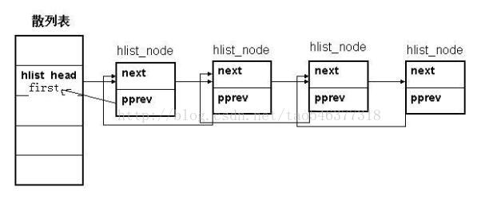

### 3.2 进程描述符

```c
struct task_struct {
	volatile long state;	/* -1 unrunnable, 0 runnable, >0 stopped */
	struct thread_info *thread_info;	// 进程的基本信息
	atomic_t usage;
	unsigned long flags;	/* per process flags, defined below */
	unsigned long ptrace;

	int lock_depth;		/* Lock depth */

	int prio, static_prio;
	struct list_head run_list;
	prio_array_t *array;

	unsigned long sleep_avg;
	unsigned long long timestamp, last_ran;
	int activated;

	unsigned long policy;
	cpumask_t cpus_allowed;
	unsigned int time_slice, first_time_slice;

#ifdef CONFIG_SCHEDSTATS
	struct sched_info sched_info;
#endif

	struct list_head tasks;
	/*
	 * ptrace_list/ptrace_children forms the list of my children
	 * that were stolen by a ptracer.
	 */
	struct list_head ptrace_children;
	struct list_head ptrace_list;

	struct mm_struct *mm, *active_mm;	// 指向内存区描述符的指针

/* task state */
	struct linux_binfmt *binfmt;
	long exit_state;
	int exit_code, exit_signal;
	int pdeath_signal;  /*  The signal sent when the parent dies  */
	/* ??? */
	unsigned long personality;
	unsigned did_exec:1;
	pid_t pid;
	pid_t tgid;
	/* 
	 * pointers to (original) parent process, youngest child, younger sibling,
	 * older sibling, respectively.  (p->father can be replaced with 
	 * p->parent->pid)
	 */
	struct task_struct *real_parent; /* real parent process (when being debugged) */
	struct task_struct *parent;	/* parent process */
	/*
	 * children/sibling forms the list of my children plus the
	 * tasks I'm ptracing.
	 */
	struct list_head children;	/* list of my children */
	struct list_head sibling;	/* linkage in my parent's children list */
	struct task_struct *group_leader;	/* threadgroup leader */

	/* PID/PID hash table linkage. */
	struct pid pids[PIDTYPE_MAX];

	struct completion *vfork_done;		/* for vfork() */
	int __user *set_child_tid;		/* CLONE_CHILD_SETTID */
	int __user *clear_child_tid;		/* CLONE_CHILD_CLEARTID */

	unsigned long rt_priority;
	unsigned long it_real_value, it_real_incr;
	cputime_t it_virt_value, it_virt_incr;
	cputime_t it_prof_value, it_prof_incr;
	struct timer_list real_timer;
	cputime_t utime, stime;
	unsigned long nvcsw, nivcsw; /* context switch counts */
	struct timespec start_time;
/* mm fault and swap info: this can arguably be seen as either mm-specific or thread-specific */
	unsigned long min_flt, maj_flt;
/* process credentials */
	uid_t uid,euid,suid,fsuid;
	gid_t gid,egid,sgid,fsgid;
	struct group_info *group_info;
	kernel_cap_t   cap_effective, cap_inheritable, cap_permitted;
	unsigned keep_capabilities:1;
	struct user_struct *user;
#ifdef CONFIG_KEYS
	struct key *session_keyring;	/* keyring inherited over fork */
	struct key *process_keyring;	/* keyring private to this process (CLONE_THREAD) */
	struct key *thread_keyring;	/* keyring private to this thread */
#endif
	int oomkilladj; /* OOM kill score adjustment (bit shift). */
	char comm[TASK_COMM_LEN];
/* file system info */
	int link_count, total_link_count;
/* ipc stuff */
	struct sysv_sem sysvsem;
/* CPU-specific state of this task */
	struct thread_struct thread;
/* filesystem information */
	struct fs_struct *fs;	// 当前目录
/* open file information */
	struct files_struct *files;		// 指向文件描述符的指针
/* namespace */
	struct namespace *namespace;
/* signal handlers */
	struct signal_struct *signal;	// 所接收的信号
	struct sighand_struct *sighand;

	sigset_t blocked, real_blocked;
	struct sigpending pending;

	unsigned long sas_ss_sp;
	size_t sas_ss_size;
	int (*notifier)(void *priv);
	void *notifier_data;
	sigset_t *notifier_mask;
	
	void *security;
	struct audit_context *audit_context;

/* Thread group tracking */
   	u32 parent_exec_id;
   	u32 self_exec_id;
/* Protection of (de-)allocation: mm, files, fs, tty, keyrings */
	spinlock_t alloc_lock;
/* Protection of proc_dentry: nesting proc_lock, dcache_lock, write_lock_irq(&tasklist_lock); */
	spinlock_t proc_lock;
/* context-switch lock */
	spinlock_t switch_lock;

/* journalling filesystem info */
	void *journal_info;

/* VM state */
	struct reclaim_state *reclaim_state;

	struct dentry *proc_dentry;
	struct backing_dev_info *backing_dev_info;

	struct io_context *io_context;

	unsigned long ptrace_message;
	siginfo_t *last_siginfo; /* For ptrace use.  */
/*
 * current io wait handle: wait queue entry to use for io waits
 * If this thread is processing aio, this points at the waitqueue
 * inside the currently handled kiocb. It may be NULL (i.e. default
 * to a stack based synchronous wait) if its doing sync IO.
 */
	wait_queue_t *io_wait;
/* i/o counters(bytes read/written, #syscalls */
	u64 rchar, wchar, syscr, syscw;
#if defined(CONFIG_BSD_PROCESS_ACCT)
	u64 acct_rss_mem1;	/* accumulated rss usage */
	u64 acct_vm_mem1;	/* accumulated virtual memory usage */
	clock_t acct_stimexpd;	/* clock_t-converted stime since last update */
#endif
#ifdef CONFIG_NUMA
  	struct mempolicy *mempolicy;
	short il_next;
#endif
};

```

#### 3.2.1 进程状态

#### 3.2.2 标识一个进程

```c
                      USER VIEW
 <-- PID 43 --> <----------------- PID 42 ----------------->
                     +---------+
                     | process |
                    _| pid=42  |_
                  _/ | tgid=42 | \_ (new thread) _
       _ (fork) _/   +---------+                  \
      /                                        +---------+
+---------+                                    | process |
| process |                                    | pid=44  |
| pid=43  |                                    | tgid=42 |
| tgid=43 |                                    +---------+
+---------+
 <-- PID 43 --> <--------- PID 42 --------> <--- PID 44 --->
                     KERNEL VIEW
```

```c
asmlinkage long sys_getpid(void)
{
	return current->tgid;
}

asmlinkage long sys_gettid(void)
{
	return current->pid;
}

asmlinkage long sys_getgid(void)
{
	/* Only we change this so SMP safe */
	return current->gid;
}
```

##### 3.2.2.1 进程描述符处理

```c
struct thread_info {
	struct task_struct	*task;		/* main task structure */
	struct exec_domain	*exec_domain;	/* execution domain */
	__u32			flags;		/* low level flags */
	__u32			status;		/* thread synchronous flags */
	__u32			cpu;		/* current CPU */
	int 			preempt_count;

	mm_segment_t		addr_limit;	
	struct restart_block    restart_block;
};

#ifdef __ASSEMBLY__
//						2^13 == 2页
#define THREAD_SIZE  (1 << (PAGE_SHIFT + THREAD_ORDER))
#else
#define THREAD_SIZE  (1UL << (PAGE_SHIFT + THREAD_ORDER))
#endif

union thread_union {
	struct thread_info thread_info;		// 线程描述符
	unsigned long stack[THREAD_SIZE/sizeof(long)];	// 内核态的进程堆栈
};
```

```c
#define THREAD_ORDER 1 

#define alloc_thread_info(tsk) \
	((struct thread_info *) __get_free_pages(GFP_KERNEL,THREAD_ORDER))

#define free_thread_info(ti) free_pages((unsigned long) (ti), THREAD_ORDER)

fastcall void free_pages(unsigned long addr, unsigned int order)
{
	if (addr != 0) {
		BUG_ON(!virt_addr_valid((void *)addr));
		__free_pages(virt_to_page((void *)addr), order);
	}
}
```

##### 3.2.2.2 标识当前进程

```c
static inline struct thread_info *current_thread_info(void)
{
	struct thread_info *ti;
	__asm__("andl %%esp,%0; ":"=r" (ti) : "0" (~(THREAD_SIZE - 1)));
	return ti;
}

static inline struct task_struct * get_current(void)
{
	return current_thread_info()->task;
}
 
#define current get_current()
```

##### 3.2.2.3 双向链表

**`list_head`**：

```c
struct list_head {
	struct list_head *next, *prev;
};
```

```c
#define LIST_HEAD_INIT(name) { &(name), &(name) }

#define LIST_HEAD(name) \
	struct list_head name = LIST_HEAD_INIT(name)

#define INIT_LIST_HEAD(ptr) do { \
	(ptr)->next = (ptr); (ptr)->prev = (ptr); \
} while (0)
```

```c
static inline void list_add(struct list_head *new, struct list_head *head)
{
	__list_add(new, head, head->next);
}

static inline void __list_add(struct list_head *new,
			      struct list_head *prev,
			      struct list_head *next)
{
	next->prev = new;
	new->next = next;
	new->prev = prev;
	prev->next = new;
}
```

```c
static inline void list_add_tail(struct list_head *new, struct list_head *head)
{
	__list_add(new, head->prev, head);
}
```

```c
/*
 * These are non-NULL pointers that will result in page faults
 * under normal circumstances, used to verify that nobody uses
 * non-initialized list entries.
 */
#define LIST_POISON1  ((void *) 0x00100100)
#define LIST_POISON2  ((void *) 0x00200200)

static inline void list_del(struct list_head *entry)
{
	__list_del(entry->prev, entry->next);
	entry->next = LIST_POISON1;
	entry->prev = LIST_POISON2;
}

static inline void __list_del(struct list_head * prev, struct list_head * next)
{
	next->prev = prev;
	prev->next = next;
}

static inline void list_del_init(struct list_head *entry)
{
	__list_del(entry->prev, entry->next);
	INIT_LIST_HEAD(entry);
}
```

```c
static inline int list_empty(const struct list_head *head)
{
	return head->next == head;
}
```

```c
#define list_entry(ptr, type, member) \
	container_of(ptr, type, member)

#define container_of(ptr, type, member) ({			\
        const typeof( ((type *)0)->member ) *__mptr = (ptr);	\
        (type *)( (char *)__mptr - offsetof(type,member) );})

#define offsetof(TYPE, MEMBER) ((size_t) &((TYPE *)0)->MEMBER)
```

```c
// prefetch() 可以不考虑，用于预取以提高遍历速度
#define list_for_each(pos, head) \
	for (pos = (head)->next; prefetch(pos->next), pos != (head); \
        	pos = pos->next)
```

```c
#define list_for_each_entry(pos, head, member)				\
	for (pos = list_entry((head)->next, typeof(*pos), member);	\
	     prefetch(pos->member.next), &pos->member != (head); 	\
	     pos = list_entry(pos->member.next, typeof(*pos), member))
```

**`hlist_node`**：



```c
struct hlist_head {
	struct hlist_node *first;
};

struct hlist_node {
	struct hlist_node *next, **pprev;
};
```

```c
static inline void hlist_add_head(struct hlist_node *n, struct hlist_head *h)
{
	struct hlist_node *first = h->first;
	n->next = first;
	if (first)
		first->pprev = &n->next;
	h->first = n;
	n->pprev = &h->first;
}
```

```c
static inline void __hlist_del(struct hlist_node *n)
{
	struct hlist_node *next = n->next;
	struct hlist_node **pprev = n->pprev;
    /*
     * 二级指针的好处：
     * 可以把 first 看成 hlist_node->next 一块处理
     */
	*pprev = next;
	if (next)
		next->pprev = pprev;
}

static inline void hlist_del(struct hlist_node *n)
{
	__hlist_del(n);
	n->next = LIST_POISON1;
	n->pprev = LIST_POISON2;
}
```

```c
static inline int hlist_empty(const struct hlist_head *h)
{
	return !h->first;
}
```

```c
#define hlist_entry(ptr, type, member) container_of(ptr,type,member)
```

```c
/*
 * pos 是 hlist_node 类型的指针
 * hlist_node 是它所在的结构体的一个字段，而这个结构体是 tpos
 */
#define hlist_for_each_entry(tpos, pos, head, member)			 \
	for (pos = (head)->first;					 \
	     pos && ({ prefetch(pos->next); 1;}) &&			 \
		({ tpos = hlist_entry(pos, typeof(*tpos), member); 1;}); \
	     pos = pos->next)
```

##### 3.2.2.4 进程链表

```c
#define thread_group_leader(p)	(p->pid == p->tgid)

#define remove_parent(p)	list_del_init(&(p)->sibling)
#define add_parent(p, parent)	list_add_tail(&(p)->sibling,&(parent)->children)

#define REMOVE_LINKS(p) do {					\
	if (thread_group_leader(p))				\
		list_del_init(&(p)->tasks);			\
	remove_parent(p);					\
	} while (0)

#define SET_LINKS(p) do {					\
	if (thread_group_leader(p))				\
		list_add_tail(&(p)->tasks,&init_task.tasks);	\
	add_parent(p, (p)->parent);				\
	} while (0)

#define next_task(p)	list_entry((p)->tasks.next, struct task_struct, tasks)
#define prev_task(p)	list_entry((p)->tasks.prev, struct task_struct, tasks)

#define for_each_process(p) \
	for (p = &init_task ; (p = next_task(p)) != &init_task ; )
```

##### 3.2.2.5 `TASK_RUNNING` 状态的进程链表

```c
typedef struct prio_array prio_array_t;

struct prio_array {
	unsigned int nr_active;
	unsigned long bitmap[BITMAP_SIZE];
	struct list_head queue[MAX_PRIO];
};
```

```c
static void enqueue_task(struct task_struct *p, prio_array_t *array)
{
	sched_info_queued(p);
	list_add_tail(&p->run_list, array->queue + p->prio);
	__set_bit(p->prio, array->bitmap);
	array->nr_active++;
	p->array = array;
}
```

```c
static void dequeue_task(struct task_struct *p, prio_array_t *array)
{
	array->nr_active--;
	list_del(&p->run_list);
	if (list_empty(array->queue + p->prio))
		__clear_bit(p->prio, array->bitmap);
}
```

#### 3.2.3 进程间的关系

##### 3.2.3.1 `pidhash` 表及链表

```c
enum pid_type
{
	PIDTYPE_PID,
	PIDTYPE_TGID,
	PIDTYPE_PGID,
	PIDTYPE_SID,
	PIDTYPE_MAX
};

static struct hlist_head *pid_hash[PIDTYPE_MAX];
```

```c
#define pid_hashfn(nr) hash_long((unsigned long)nr, pidhash_shift)

static inline unsigned long hash_long(unsigned long val, unsigned int bits)
{
	unsigned long hash = val;

#if BITS_PER_LONG == 64
	/*  Sigh, gcc can't optimise this alone like it does for 32 bits. */
	unsigned long n = hash;
	n <<= 18;
	hash -= n;
	n <<= 33;
	hash -= n;
	n <<= 3;
	hash += n;
	n <<= 3;
	hash -= n;
	n <<= 4;
	hash += n;
	n <<= 2;
	hash += n;
#else
	/* On some cpus multiply is faster, on others gcc will do shifts */
	hash *= GOLDEN_RATIO_PRIME;
#endif

	/* High bits are more random, so use them. */
	return hash >> (BITS_PER_LONG - bits);
}
```

```c
struct pid
{
	/* Try to keep pid_chain in the same cacheline as nr for find_pid */
	int nr;
	struct hlist_node pid_chain;
	/* list of pids with the same nr, only one of them is in the hash */
	struct list_head pid_list;
};
```

```c
#define do_each_task_pid(who, type, task)				\
	if ((task = find_task_by_pid_type(type, who))) {		\
		prefetch((task)->pids[type].pid_list.next);		\
		do {

#define while_each_task_pid(who, type, task)				\
		} while (task = pid_task((task)->pids[type].pid_list.next,\
						type),			\
			prefetch((task)->pids[type].pid_list.next),	\
			hlist_unhashed(&(task)->pids[type].pid_chain));	\	/* 返回到了第一个 */
	}

static inline int hlist_unhashed(const struct hlist_node *h)
{
	return !h->pprev;
}
```

```c
task_t *find_task_by_pid_type(int type, int nr)
{
	struct pid *pid;

	pid = find_pid(type, nr);
	if (!pid)
		return NULL;

	return pid_task(&pid->pid_list, type);
}

#define pid_task(elem, type) \
	list_entry(elem, struct task_struct, pids[type].pid_list)

struct pid * fastcall find_pid(enum pid_type type, int nr)
{
	struct hlist_node *elem;
	struct pid *pid;

	hlist_for_each_entry(pid, elem,
			&pid_hash[type][pid_hashfn(nr)], pid_chain) {
		if (pid->nr == nr)
			return pid;
	}
	return NULL;
}
```

```c
#define find_task_by_pid(nr)	find_task_by_pid_type(PIDTYPE_PID, nr)
```

```c
int fastcall attach_pid(task_t *task, enum pid_type type, int nr)
{
	struct pid *pid, *task_pid;

	task_pid = &task->pids[type];
	pid = find_pid(type, nr);
	if (pid == NULL) {
		hlist_add_head(&task_pid->pid_chain,
				&pid_hash[type][pid_hashfn(nr)]);
		INIT_LIST_HEAD(&task_pid->pid_list);
	} else {
		INIT_HLIST_NODE(&task_pid->pid_chain);
		list_add_tail(&task_pid->pid_list, &pid->pid_list);
	}
	task_pid->nr = nr;

	return 0;
}

#define INIT_HLIST_NODE(ptr) ((ptr)->next = NULL, (ptr)->pprev = NULL)
```

```c
void fastcall detach_pid(task_t *task, enum pid_type type)
{
	int tmp, nr;

	nr = __detach_pid(task, type);
	if (!nr)
		return;

	for (tmp = PIDTYPE_MAX; --tmp >= 0; )
		if (tmp != type && find_pid(tmp, nr))	// 在其他地方还有用
			return;

	free_pidmap(nr);
}

fastcall void free_pidmap(int pid)
{
	pidmap_t *map = pidmap_array + pid / BITS_PER_PAGE;
	int offset = pid & BITS_PER_PAGE_MASK;

	clear_bit(offset, map->page);
	atomic_inc(&map->nr_free);
}

static pidmap_t pidmap_array[PIDMAP_ENTRIES] =
	 { [ 0 ... PIDMAP_ENTRIES-1 ] = { ATOMIC_INIT(BITS_PER_PAGE), NULL } };

typedef struct pidmap {
	atomic_t nr_free;
	void *page;
} pidmap_t;

static fastcall int __detach_pid(task_t *task, enum pid_type type)
{
	struct pid *pid, *pid_next;
	int nr = 0;

	pid = &task->pids[type];
	if (!hlist_unhashed(&pid->pid_chain)) {		// 第一个元素
		hlist_del(&pid->pid_chain);

		if (list_empty(&pid->pid_list))		// 唯一的元素
			nr = pid->nr;
		else {
			pid_next = list_entry(pid->pid_list.next,
						struct pid, pid_list);
			/* insert next pid from pid_list to hash */
			hlist_add_head(&pid_next->pid_chain,
				&pid_hash[type][pid_hashfn(pid_next->nr)]);
		}
	}

	list_del(&pid->pid_list);
	pid->nr = 0;

	return nr;
}
```

```c
task_t fastcall *next_thread(const task_t *p)
{
	return pid_task(p->pids[PIDTYPE_TGID].pid_list.next, PIDTYPE_TGID);
}
```

#### 3.2.4 如何组织进程

##### 3.2.4.1 等待队列

```c
struct __wait_queue_head {
	spinlock_t lock;
	struct list_head task_list;
};
typedef struct __wait_queue_head wait_queue_head_t;
```

```c
struct __wait_queue {
	unsigned int flags;
#define WQ_FLAG_EXCLUSIVE	0x01
	struct task_struct * task;
	wait_queue_func_t func;
	struct list_head task_list;
};
typedef struct __wait_queue wait_queue_t;
```

##### 3.2.4.2 等待队列的操作

```c
#define __WAIT_QUEUE_HEAD_INITIALIZER(name) {				\
	.lock		= SPIN_LOCK_UNLOCKED,				\
	.task_list	= { &(name).task_list, &(name).task_list } }

#define DECLARE_WAIT_QUEUE_HEAD(name) \
	wait_queue_head_t name = __WAIT_QUEUE_HEAD_INITIALIZER(name)
```

```c
static inline void init_waitqueue_head(wait_queue_head_t *q)
{
	q->lock = SPIN_LOCK_UNLOCKED;
	INIT_LIST_HEAD(&q->task_list);
}
```

```c
static inline void init_waitqueue_entry(wait_queue_t *q, struct task_struct *p)
{
	q->flags = 0;
	q->task = p;
	q->func = default_wake_function;
}
```

```c
#define DEFINE_WAIT(name)						\
	wait_queue_t name = {						\
		.task		= current,				\
		.func		= autoremove_wake_function,		\
		.task_list	= {	.next = &(name).task_list,	\
					.prev = &(name).task_list,	\
				},					\
	}
```

```c
int autoremove_wake_function(wait_queue_t *wait, unsigned mode, int sync, void *key)
{
	int ret = default_wake_function(wait, mode, sync, key);

	if (ret)
		list_del_init(&wait->task_list);
	return ret;
}
```

```c
static inline void init_waitqueue_func_entry(wait_queue_t *q,
					wait_queue_func_t func)
{
	q->flags = 0;
	q->task = NULL;
	q->func = func;
}
```

```c
void fastcall add_wait_queue(wait_queue_head_t *q, wait_queue_t *wait)
{
	unsigned long flags;

	wait->flags &= ~WQ_FLAG_EXCLUSIVE;
	spin_lock_irqsave(&q->lock, flags);
	__add_wait_queue(q, wait);
	spin_unlock_irqrestore(&q->lock, flags);
}

static inline void __add_wait_queue(wait_queue_head_t *head, wait_queue_t *new)
{
	list_add(&new->task_list, &head->task_list);
}
```

```c
void fastcall add_wait_queue_exclusive(wait_queue_head_t *q, wait_queue_t *wait)
{
	unsigned long flags;

	wait->flags |= WQ_FLAG_EXCLUSIVE;
	spin_lock_irqsave(&q->lock, flags);
	__add_wait_queue_tail(q, wait);
	spin_unlock_irqrestore(&q->lock, flags);
}

static inline void __add_wait_queue_tail(wait_queue_head_t *head,
						wait_queue_t *new)
{
	list_add_tail(&new->task_list, &head->task_list);
}
```

```c
void fastcall remove_wait_queue(wait_queue_head_t *q, wait_queue_t *wait)
{
	unsigned long flags;

	spin_lock_irqsave(&q->lock, flags);
	__remove_wait_queue(q, wait);
	spin_unlock_irqrestore(&q->lock, flags);
}

static inline void __remove_wait_queue(wait_queue_head_t *head,
							wait_queue_t *old)
{
	list_del(&old->task_list);
}
```

```c
static inline int waitqueue_active(wait_queue_head_t *q)
{
	return !list_empty(&q->task_list);
}
```

```c
void fastcall __sched sleep_on(wait_queue_head_t *q)
{
	SLEEP_ON_VAR

	current->state = TASK_UNINTERRUPTIBLE;

	SLEEP_ON_HEAD
	schedule();
	SLEEP_ON_TAIL
}

#define	SLEEP_ON_VAR					\
	unsigned long flags;				\
	wait_queue_t wait;				\
	init_waitqueue_entry(&wait, current);

#define SLEEP_ON_HEAD					\
	spin_lock_irqsave(&q->lock,flags);		\
	__add_wait_queue(q, &wait);			\
	spin_unlock(&q->lock);

#define	SLEEP_ON_TAIL					\
	spin_lock_irq(&q->lock);			\
	__remove_wait_queue(q, &wait);			\
	spin_unlock_irqrestore(&q->lock, flags);
```

```c
void fastcall __sched interruptible_sleep_on(wait_queue_head_t *q)
{
	SLEEP_ON_VAR

	current->state = TASK_INTERRUPTIBLE;

	SLEEP_ON_HEAD
	schedule();
	SLEEP_ON_TAIL
}
```

```c
long fastcall __sched sleep_on_timeout(wait_queue_head_t *q, long timeout)
{
	SLEEP_ON_VAR

	current->state = TASK_UNINTERRUPTIBLE;

	SLEEP_ON_HEAD
	timeout = schedule_timeout(timeout);
	SLEEP_ON_TAIL

	return timeout;
}
```

```c
void fastcall
prepare_to_wait(wait_queue_head_t *q, wait_queue_t *wait, int state)
{
	unsigned long flags;

	wait->flags &= ~WQ_FLAG_EXCLUSIVE;
	spin_lock_irqsave(&q->lock, flags);
	if (list_empty(&wait->task_list))
		__add_wait_queue(q, wait);
	/*
	 * don't alter the task state if this is just going to
	 * queue an async wait queue callback
	 */
	if (is_sync_wait(wait))
		set_current_state(state);
	spin_unlock_irqrestore(&q->lock, flags);
}
```

```c
void fastcall
prepare_to_wait_exclusive(wait_queue_head_t *q, wait_queue_t *wait, int state)
{
	unsigned long flags;

	wait->flags |= WQ_FLAG_EXCLUSIVE;
	spin_lock_irqsave(&q->lock, flags);
	if (list_empty(&wait->task_list))
		__add_wait_queue_tail(q, wait);
	/*
	 * don't alter the task state if this is just going to
 	 * queue an async wait queue callback
	 */
	if (is_sync_wait(wait))
		set_current_state(state);
	spin_unlock_irqrestore(&q->lock, flags);
}

/*
 * Used to distinguish between sync and async io wait context:
 * sync i/o typically specifies a NULL wait queue entry or a wait
 * queue entry bound to a task (current task) to wake up.
 * aio specifies a wait queue entry with an async notification
 * callback routine, not associated with any task.
 */
#define is_sync_wait(wait)	(!(wait) || ((wait)->task))
```

```c
void fastcall finish_wait(wait_queue_head_t *q, wait_queue_t *wait)
{
	unsigned long flags;

	__set_current_state(TASK_RUNNING);
	/*
	 * We can check for list emptiness outside the lock
	 * IFF:
	 *  - we use the "careful" check that verifies both
	 *    the next and prev pointers, so that there cannot
	 *    be any half-pending updates in progress on other
	 *    CPU's that we haven't seen yet (and that might
	 *    still change the stack area.
	 * and
	 *  - all other users take the lock (ie we can only
	 *    have _one_ other CPU that looks at or modifies
	 *    the list).
	 */
	if (!list_empty_careful(&wait->task_list)) {
		spin_lock_irqsave(&q->lock, flags);
		list_del_init(&wait->task_list);
		spin_unlock_irqrestore(&q->lock, flags);
	}
}

/**
 * list_empty_careful - tests whether a list is
 * empty _and_ checks that no other CPU might be
 * in the process of still modifying either member
 *
 * NOTE: using list_empty_careful() without synchronization
 * can only be safe if the only activity that can happen
 * to the list entry is list_del_init(). Eg. it cannot be used
 * if another CPU could re-list_add() it.
 *
 * @head: the list to test.
 */
static inline int list_empty_careful(const struct list_head *head)
{
	struct list_head *next = head->next;
	return (next == head) && (next == head->prev);
}
```

```c
#define __wait_event(wq, condition) 					\
do {									\
	DEFINE_WAIT(__wait);						\
									\
	for (;;) {							\
		prepare_to_wait(&wq, &__wait, TASK_UNINTERRUPTIBLE);	\
		if (condition)						\
			break;						\
		schedule();						\
	}								\
	finish_wait(&wq, &__wait);					\
} while (0)

#define wait_event(wq, condition) 					\
do {									\
	if (condition)	 						\
		break;							\
	__wait_event(wq, condition);					\
} while (0)
```

```c
#define __wait_event_interruptible(wq, condition, ret)			\
do {									\
	DEFINE_WAIT(__wait);						\
									\
	for (;;) {							\
		prepare_to_wait(&wq, &__wait, TASK_INTERRUPTIBLE);	\
		if (condition)						\
			break;						\
		if (!signal_pending(current)) {				\
			schedule();					\
			continue;					\
		}							\
		ret = -ERESTARTSYS;					\
		break;							\
	}								\
	finish_wait(&wq, &__wait);					\
} while (0)

static inline int signal_pending(struct task_struct *p)
{
	return unlikely(test_tsk_thread_flag(p,TIF_SIGPENDING));
}
```

```c
#define wake_up(x)			__wake_up(x, TASK_UNINTERRUPTIBLE | TASK_INTERRUPTIBLE, 1, NULL)

void fastcall __wake_up(wait_queue_head_t *q, unsigned int mode,
				int nr_exclusive, void *key)
{
	unsigned long flags;

	spin_lock_irqsave(&q->lock, flags);
	__wake_up_common(q, mode, nr_exclusive, 0, key);
	spin_unlock_irqrestore(&q->lock, flags);
}

static void __wake_up_common(wait_queue_head_t *q, unsigned int mode,
			     int nr_exclusive, int sync, void *key)
{
	struct list_head *tmp, *next;

	list_for_each_safe(tmp, next, &q->task_list) {
		wait_queue_t *curr;
		unsigned flags;
		curr = list_entry(tmp, wait_queue_t, task_list);
		flags = curr->flags;
		if (curr->func(curr, mode, sync, key) &&	// 有效地唤醒
		    (flags & WQ_FLAG_EXCLUSIVE) &&			// 进程互斥
		    !--nr_exclusive)						// 达到个数
			break;
	}
}
```

#### 3.2.5 进程资源限制

- `current->signal->rlim[RLIMIT_CPU].rlim_cur` 正运行进程所占用 CPU 时间的**当前**限制

  普通用户可以修改

- `current->signal->rlim[RLIMIT_CPU].rlim_max` 正运行进程所占用 CPU 时间的**最大**限制

  只有超级用户可以修改