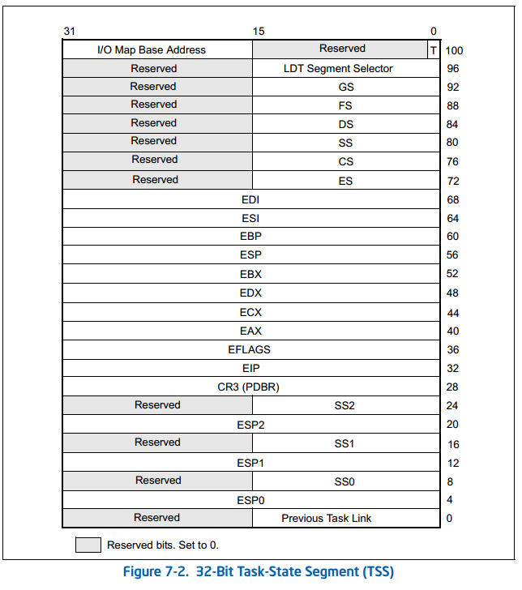

### 3.3 进程切换

#### 3.3.1 硬件上下文

#### 3.3.2 任务状态段



```c
struct tss_struct {
	unsigned short	back_link,__blh;
	unsigned long	esp0;
	unsigned short	ss0,__ss0h;
	unsigned long	esp1;
	unsigned short	ss1,__ss1h;	/* ss1 is used to cache MSR_IA32_SYSENTER_CS */
	unsigned long	esp2;
	unsigned short	ss2,__ss2h;
	unsigned long	__cr3;
	unsigned long	eip;
	unsigned long	eflags;
	unsigned long	eax,ecx,edx,ebx;
	unsigned long	esp;
	unsigned long	ebp;
	unsigned long	esi;
	unsigned long	edi;
	unsigned short	es, __esh;
	unsigned short	cs, __csh;
	unsigned short	ss, __ssh;
	unsigned short	ds, __dsh;
	unsigned short	fs, __fsh;
	unsigned short	gs, __gsh;
	unsigned short	ldt, __ldth;
	unsigned short	trace, io_bitmap_base;
	/*
	 * The extra 1 is there because the CPU will access an
	 * additional byte beyond the end of the IO permission
	 * bitmap. The extra byte must be all 1 bits, and must
	 * be within the limit.
	 */
	unsigned long	io_bitmap[IO_BITMAP_LONGS + 1];
	/*
	 * Cache the current maximum and the last task that used the bitmap:
	 */
	unsigned long io_bitmap_max;
	struct thread_struct *io_bitmap_owner;
	/*
	 * pads the TSS to be cacheline-aligned (size is 0x100)
	 */
	unsigned long __cacheline_filler[35];
	/*
	 * .. and then another 0x100 bytes for emergency kernel stack
	 */
	unsigned long stack[64];
} __attribute__((packed));
```

##### 3.3.2.1 thread 字段

```c
struct thread_struct {
/* cached TLS descriptors. */
	struct desc_struct tls_array[GDT_ENTRY_TLS_ENTRIES];
	unsigned long	esp0;
	unsigned long	sysenter_cs;
	unsigned long	eip;
	unsigned long	esp;
	unsigned long	fs;
	unsigned long	gs;
/* Hardware debugging registers */
	unsigned long	debugreg[8];  /* %%db0-7 debug registers */
/* fault info */
	unsigned long	cr2, trap_no, error_code;
/* floating point info */
	union i387_union	i387;
/* virtual 86 mode info */
	struct vm86_struct __user * vm86_info;
	unsigned long		screen_bitmap;
	unsigned long		v86flags, v86mask, saved_esp0;
	unsigned int		saved_fs, saved_gs;
/* IO permissions */
	unsigned long	*io_bitmap_ptr;
/* max allowed port in the bitmap, in bytes: */
	unsigned long	io_bitmap_max;
};
```

#### 3.3.3 执行进程切换

##### 3.3.3.1 `switch_to` 宏

##### 3.3.3.2 `__switch_to()` 函数

```c
#define current_thread_info()  __current_thread_info
#define smp_processor_id()	(current_thread_info()->cpu)
```

```c
struct task_struct fastcall * __switch_to(struct task_struct *prev_p, struct task_struct *next_p)
{
	struct thread_struct *prev = &prev_p->thread,
				 *next = &next_p->thread;
	int cpu = smp_processor_id();	// 2
	struct tss_struct *tss = &per_cpu(init_tss, cpu);

	/* never put a printk in __switch_to... printk() calls wake_up*() indirectly */

	__unlazy_fpu(prev_p);	// 1

	/*
	 * Reload esp0, LDT and the page table pointer:
	 */
	load_esp0(tss, next);	// 3

	/*
	 * Load the per-thread Thread-Local Storage descriptor.
	 */
	load_TLS(next, cpu);	// 4	->

	/*
	 * Save away %fs and %gs. No need to save %es and %ds, as
	 * those are always kernel segments while inside the kernel.
	 */
    // 5
	asm volatile("movl %%fs,%0":"=m" (*(int *)&prev->fs));
	asm volatile("movl %%gs,%0":"=m" (*(int *)&prev->gs));

	/*
	 * Restore %fs and %gs if needed.
	 */
    // 6
	if (unlikely(prev->fs | prev->gs | next->fs | next->gs)) {
		loadsegment(fs, next->fs);
		loadsegment(gs, next->gs);
	}

	/*
	 * Now maybe reload the debug registers
	 */
	if (unlikely(next->debugreg[7])) {		// 7
		loaddebug(next, 0);
		loaddebug(next, 1);
		loaddebug(next, 2);
		loaddebug(next, 3);
		/* no 4 and 5 */
		loaddebug(next, 6);
		loaddebug(next, 7);
	}

	if (unlikely(prev->io_bitmap_ptr || next->io_bitmap_ptr))	// 8	
		handle_io_bitmap(next, tss);	// ->

	return prev_p;		// 9
}
```

```c
static inline void load_TLS(struct thread_struct *t, unsigned int cpu)
{
	u64 *gdt = (u64 *)(cpu_gdt_table[cpu] + GDT_ENTRY_TLS_MIN);
	gdt[0] = t->tls_array[0];
	gdt[1] = t->tls_array[1];
	gdt[2] = t->tls_array[2];
} 
```

```C
static inline void
handle_io_bitmap(struct thread_struct *next, struct tss_struct *tss)
{
	if (!next->io_bitmap_ptr) {
		/*
		 * Disable the bitmap via an invalid offset. We still cache
		 * the previous bitmap owner and the IO bitmap contents:
		 */
        // #define INVALID_IO_BITMAP_OFFSET 0x8000
		tss->io_bitmap_base = INVALID_IO_BITMAP_OFFSET;
		return;
	}
	if (likely(next == tss->io_bitmap_owner)) {
		/*
		 * Previous owner of the bitmap (hence the bitmap content)
		 * matches the next task, we dont have to do anything but
		 * to set a valid offset in the TSS:
		 */
        // #define IO_BITMAP_OFFSET offsetof(struct tss_struct,io_bitmap)
		tss->io_bitmap_base = IO_BITMAP_OFFSET;
		return;
	}
	/*
	 * Lazy TSS's I/O bitmap copy. We set an invalid offset here
	 * and we let the task to get a GPF in case an I/O instruction
	 * is performed.  The handler of the GPF will verify that the
	 * faulting task has a valid I/O bitmap and, it true, does the
	 * real copy and restart the instruction.  This will save us
	 * redundant copies when the currently switched task does not
	 * perform any I/O during its timeslice.
	 */
    // #define INVALID_IO_BITMAP_OFFSET_LAZY 0x9000
	tss->io_bitmap_base = INVALID_IO_BITMAP_OFFSET_LAZY;
}
```

#### 3.3.4 保存和加载 FPU、MMX 及 XMM 寄存器

##### 3.3.4.1 保存 FPU 寄存器

```c
#define __unlazy_fpu( tsk ) do { \
	if ((tsk)->thread_info->status & TS_USEDFPU) \
		save_init_fpu( tsk ); \
} while (0)
```

```c
static inline void save_init_fpu( struct task_struct *tsk )
{
	asm volatile( "rex64 ; fxsave %0 ; fnclex"
		      : "=m" (tsk->thread.i387.fxsave));	// 1
	tsk->thread_info->status &= ~TS_USEDFPU;	// 2
	stts();		// 3
}
```

```c
#define stts() write_cr0(8 | read_cr0())
```

##### 3.3.4.2 装载 FPU 寄存器

```c
#define tsk_used_math(p) ((p)->flags & PF_USED_MATH)
#define used_math() tsk_used_math(current)
```

```c
asmlinkage void math_state_restore(void)
{
	struct task_struct *me = current;
	clts();			/* Allow maths ops (or we recurse) */

	if (!used_math())
		init_fpu(me);	// ->
	restore_fpu_checking(&me->thread.i387.fxsave);
	me->thread_info->status |= TS_USEDFPU;
}
```

```c
void init_fpu(struct task_struct *child)
{
	if (tsk_used_math(child)) {
		if (child == current)
			unlazy_fpu(child);
		return;
	}	
	memset(&child->thread.i387.fxsave, 0, sizeof(struct i387_fxsave_struct));
	child->thread.i387.fxsave.cwd = 0x37f;
	child->thread.i387.fxsave.mxcsr = 0x1f80;
	/* only the device not available exception or ptrace can call init_fpu */
    // #define set_stopped_child_used_math(child) do { (child)->flags |= PF_USED_MATH; } while (0)
	set_stopped_child_used_math(child);
}
```

##### 3.3.4.3 在内核态使用 FPU、MMX 和 SSE/SSE2 单元