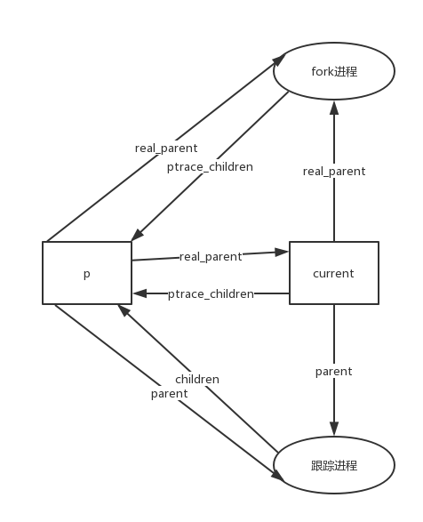

### 3.4 创建进程

#### 3.4.1 `clone()`、`fork()`、`vfork()` 系统调用

##### 3.4.1.1 `do_fork`  函数

```c
long do_fork(unsigned long clone_flags,
	      unsigned long stack_start,
	      struct pt_regs *regs,
	      unsigned long stack_size,
	      int __user *parent_tidptr,
	      int __user *child_tidptr)
{
	struct task_struct *p;
	int trace = 0;
	long pid = alloc_pidmap();		// 1 ->

	if (pid < 0)
		return -EAGAIN;
	if (unlikely(current->ptrace)) {	// 2	父进程被跟踪
		trace = fork_traceflag (clone_flags);	// ->
		if (trace)	// 需要被跟踪
			clone_flags |= CLONE_PTRACE;
	}

	p = copy_process(clone_flags, stack_start, regs, stack_size, parent_tidptr, child_tidptr, pid);		// 3 -->
	/*
	 * Do this prior waking up the new thread - the thread pointer
	 * might get invalid after that point, if the thread exits quickly.
	 */
	if (!IS_ERR(p)) {
		struct completion vfork;

		if (clone_flags & CLONE_VFORK) {
			p->vfork_done = &vfork;
			init_completion(&vfork);
		}

        //		必须跟踪子进程
		if ((p->ptrace & PT_PTRACED) || (clone_flags & CLONE_STOPPED)) {	// 4
			/*
			 * We'll start up with an immediate SIGSTOP.
			 */
			sigaddset(&p->pending.signal, SIGSTOP);
			set_tsk_thread_flag(p, TIF_SIGPENDING);
		}

		if (!(clone_flags & CLONE_STOPPED))		// 5
			wake_up_new_task(p, clone_flags);	// ->
		else
			p->state = TASK_STOPPED;	// 6

		if (unlikely (trace)) {		// 7
			current->ptrace_message = pid;
			ptrace_notify ((trace << 8) | SIGTRAP);		// ->
		}

		if (clone_flags & CLONE_VFORK) {	// 8
			wait_for_completion(&vfork);
			if (unlikely (current->ptrace & PT_TRACE_VFORK_DONE))
				ptrace_notify ((PTRACE_EVENT_VFORK_DONE << 8) | SIGTRAP);
		}
	} else {
		free_pidmap(pid);
		pid = PTR_ERR(p);
	}
	return pid;		// 9
}
```

```c
int alloc_pidmap(void)
{
	int i, offset, max_scan, pid, last = last_pid;
	pidmap_t *map;

	pid = last + 1;
    // #define PID_MAX_DEFAULT 0x8000	/* 4KB */
    // int pid_max = PID_MAX_DEFAULT;
    // 可以修改
	if (pid >= pid_max)
        // #define RESERVED_PIDS		300
		pid = RESERVED_PIDS;
    // #define BITS_PER_PAGE		(PAGE_SIZE*8)
	// #define BITS_PER_PAGE_MASK	(BITS_PER_PAGE-1)
	offset = pid & BITS_PER_PAGE_MASK;
	map = &pidmap_array[pid/BITS_PER_PAGE];
	max_scan = (pid_max + BITS_PER_PAGE - 1)/BITS_PER_PAGE - !offset;
    /* max_scan表征的查找次数只适用于从offset开始查找位图没有找到空闲pid的情况,
       因为一旦查找到了就直接返回pid了,不会再开始下一次查找;

       主要是担心offset如果不为0,即使从offset开始直到位图末没有查找到空闲pid,但
       是offset之前的位图中仍然可能有空闲的pid,于是将offset置为RESERVED_PIDS,重
       新从最初的位图开始查找,或者置offset为0,从下一张开始查找

       如果offset为0,max_scan就为1,从头开始查找,如果没有找到合适的pid,就说明的确
       是没有空闲的pid,就不必再继续遍历,max_scan为0即可
    */
	for (i = 0; i <= max_scan; ++i) {
        /* 分配新页作为pid位图 
           SOLVE_ME:为什么不用alloc_pages
        */
		if (unlikely(!map->page)) {
			unsigned long page = get_zeroed_page(GFP_KERNEL);
			/*
			 * Free the page if someone raced with us
			 * installing it:
			 */
			spin_lock(&pidmap_lock);
			if (map->page)
				free_page(page);
			else
				map->page = (void *)page;
			spin_unlock(&pidmap_lock);
			if (unlikely(!map->page))
				break;
		}
        /* 如果该位图内还有未分配的pid */
		if (likely(atomic_read(&map->nr_free))) {
			do {
                /*  查看位图中由偏移offset指定的位是否置位,没有就把它置位,返回原
                    先的值,返回0说明找到了未被使用的pid
                */
				if (!test_and_set_bit(offset, map->page)) {
					atomic_dec(&map->nr_free);
					last_pid = pid;
					return pid;
				}
                /* 如果offset指定的位已被占用,就从offset开始在map->page中找到
                   第一个为0的位,就是下一个pid,返回值offset是距离地址map起第一个
                   为0的位,offset如果大于BITS_PER_PAGE说明已经不属于该pidmap了
                */
				offset = find_next_offset(map, offset);
                // #define mk_pid(map, off)	(((map) - pidmap_array)*BITS_PER_PAGE + (off))
				pid = mk_pid(map, offset);
			/*
			 * find_next_offset() found a bit, the pid from it
			 * is in-bounds, and if we fell back to the last
			 * bitmap block and the final block was the same
			 * as the starting point, pid is before last_pid.
			 */
			} while (offset < BITS_PER_PAGE && pid < pid_max &&
                     /*
                      * 如果循环了一圈到了last所在的页，并且查找到的pid在last的后面，并且
                      * last是该页的最后一页，就不继续找了
                      * 本质上是循环了一圈又去找下一页
                      */
					(i != max_scan || pid < last ||
					    !((last+1) & BITS_PER_PAGE_MASK)));
		}
        /*
          在以上的代码中,比较理想的情况是找到了合适的pid,然后return,但是还有一
          些其他的情况,比如从某个offset开始直到该页结束的位都被用光了,那么根据
          find_next_offset查找到的offset就会超过BITS_PER_PAGE,此时假如还有多余的
          位图,offset置0,map指向下一个pidmap,从下一页继续查找即可;假如pid已使用到
          最后一张位图,就将map设为pidmap[0],从第一张位图开始继续查找,只不过要从
          offset 300开始查找,前提是max_scan为1,那么max_scan是否有可能不为1呢?
          
          如果最初查找空闲pid时获得的offset为0,只有一种情况,就是在内核启动过程中
          刚刚开始创建进程,即从offset为0开始查找空闲pid是肯定能查找到的,因而如果
          查找不到pid,最初的offset肯定不为0,即max_scan肯定为1,肯定还可以再执行一
          个for循环查找一次
        */
		if (map < &pidmap_array[(pid_max-1)/BITS_PER_PAGE]) {
			++map;
			offset = 0;
		} else {
			map = &pidmap_array[0];
			offset = RESERVED_PIDS;
			if (unlikely(last == offset))
				break;
		}
		pid = mk_pid(map, offset);
	}
	return -1;
}
```

```c
static inline int fork_traceflag (unsigned clone_flags)
{
	if (clone_flags & CLONE_UNTRACED)	// 内核线程
		return 0;
	else if (clone_flags & CLONE_VFORK) {
		if (current->ptrace & PT_TRACE_VFORK)
			return PTRACE_EVENT_VFORK;
	} else if ((clone_flags & CSIGNAL) != SIGCHLD) {
		if (current->ptrace & PT_TRACE_CLONE)
			return PTRACE_EVENT_CLONE;
	} else if (current->ptrace & PT_TRACE_FORK)
		return PTRACE_EVENT_FORK;

	return 0;
}
```

```c
void fastcall wake_up_new_task(task_t * p, unsigned long clone_flags)
{
	unsigned long flags;
	int this_cpu, cpu;
	runqueue_t *rq, *this_rq;

	rq = task_rq_lock(p, &flags);
	cpu = task_cpu(p);
	this_cpu = smp_processor_id();

	BUG_ON(p->state != TASK_RUNNING);

	schedstat_inc(rq, wunt_cnt);
	/*
	 * We decrease the sleep average of forking parents
	 * and children as well, to keep max-interactive tasks
	 * from forking tasks that are max-interactive. The parent
	 * (current) is done further down, under its lock.
	 */
	p->sleep_avg = JIFFIES_TO_NS(CURRENT_BONUS(p) *
		CHILD_PENALTY / 100 * MAX_SLEEP_AVG / MAX_BONUS);

	p->prio = effective_prio(p);

	if (likely(cpu == this_cpu)) {		// b	运行在同一 CPU 上
		if (!(clone_flags & CLONE_VM)) {	// 不能共享同一组页表
			/*
			 * The VM isn't cloned, so we're in a good position to
			 * do child-runs-first in anticipation of an exec. This
			 * usually avoids a lot of COW overhead.
			 */
			if (unlikely(!current->array))
				__activate_task(p, rq);
			else {
				p->prio = current->prio;
                // 子进程恰好在父进程前面
				list_add_tail(&p->run_list, &current->run_list);
				p->array = current->array;
				p->array->nr_active++;
				rq->nr_running++;
			}
			set_need_resched();
		} else
			/* Run child last */
			__activate_task(p, rq);
		/*
		 * We skip the following code due to cpu == this_cpu
	 	 *
		 *   task_rq_unlock(rq, &flags);
		 *   this_rq = task_rq_lock(current, &flags);
		 */
		this_rq = rq;
	} else {
		this_rq = cpu_rq(this_cpu);

		/*
		 * Not the local CPU - must adjust timestamp. This should
		 * get optimised away in the !CONFIG_SMP case.
		 */
		p->timestamp = (p->timestamp - this_rq->timestamp_last_tick)
					+ rq->timestamp_last_tick;
		__activate_task(p, rq);
		if (TASK_PREEMPTS_CURR(p, rq))
			resched_task(rq->curr);

		schedstat_inc(rq, wunt_moved);
		/*
		 * Parent and child are on different CPUs, now get the
		 * parent runqueue to update the parent's ->sleep_avg:
		 */
		task_rq_unlock(rq, &flags);
		this_rq = task_rq_lock(current, &flags);
	}
	current->sleep_avg = JIFFIES_TO_NS(CURRENT_BONUS(current) *
		PARENT_PENALTY / 100 * MAX_SLEEP_AVG / MAX_BONUS);
	task_rq_unlock(this_rq, &flags);
}
```

```c
void ptrace_notify(int exit_code)
{
	siginfo_t info;

	BUG_ON((exit_code & (0x7f | ~0xffff)) != SIGTRAP);

	memset(&info, 0, sizeof info);
	info.si_signo = SIGTRAP;
	info.si_code = exit_code;
	info.si_pid = current->pid;
	info.si_uid = current->uid;

	/* Let the debugger run.  */
	spin_lock_irq(&current->sighand->siglock);
	ptrace_stop(exit_code, 0, &info);
	spin_unlock_irq(&current->sighand->siglock);
}
```

##### 3.4.1.2 `copy_process()` 函数

> 在 Linux 2.6.11.12  `do_fork()`所调用的`copy_process()`中，若`child->ptrace` 的 `PT_PTRACED`标志被置位，将会调用`__ptrace_link(child, current->parent)`。
>
> `__ptrace_link()`将`child`添加至真实`parent`的 trace list 后，修改`child->parent`，使其指向`current->parent`。从这里可以很直观地看出，`task_struct.parent`所指向的，是跟踪（trace）自己的进程，与之对应的，`real_parent`则是`fork`他的那个进程。
>
> 进程退出时，将调用 `exit_nofity()`，这里所通知的，也是`parent`域所指向的进程（如果进程没有被跟踪，将有`parent == real_parent`）。



```c
static task_t *copy_process(unsigned long clone_flags,
				 unsigned long stack_start,
				 struct pt_regs *regs,
				 unsigned long stack_size,
				 int __user *parent_tidptr,
				 int __user *child_tidptr,
				 int pid)
{
	int retval;
	struct task_struct *p = NULL;

    // 1
	if ((clone_flags & (CLONE_NEWNS|CLONE_FS)) == (CLONE_NEWNS|CLONE_FS))
		return ERR_PTR(-EINVAL);

	/*
	 * Thread groups must share signals as well, and detached threads
	 * can only be started up within the thread group.
	 */
	if ((clone_flags & CLONE_THREAD) && !(clone_flags & CLONE_SIGHAND))
		return ERR_PTR(-EINVAL);

	/*
	 * Shared signal handlers imply shared VM. By way of the above,
	 * thread groups also imply shared VM. Blocking this case allows
	 * for various simplifications in other code.
	 */
	if ((clone_flags & CLONE_SIGHAND) && !(clone_flags & CLONE_VM))
		return ERR_PTR(-EINVAL);

	retval = security_task_create(clone_flags);		// 2
	if (retval)
		goto fork_out;

	retval = -ENOMEM;
	p = dup_task_struct(current);	// 3	->
	if (!p)
		goto fork_out;

	retval = -EAGAIN;
	if (atomic_read(&p->user->processes) >=
			p->signal->rlim[RLIMIT_NPROC].rlim_cur) {	// 4
		if (!capable(CAP_SYS_ADMIN) && !capable(CAP_SYS_RESOURCE) &&
				p->user != &root_user)	// 没有 root 权限
			goto bad_fork_free;
	}

    // 5
	atomic_inc(&p->user->__count);		// 使用计数器
	atomic_inc(&p->user->processes);	// 进程计数器
	get_group_info(p->group_info);

	/*
	 * If multiple threads are within copy_process(), then this check
	 * triggers too late. This doesn't hurt, the check is only there
	 * to stop root fork bombs.
	 */
	if (nr_threads >= max_threads)		// 6
		goto bad_fork_cleanup_count;

    // 7
	if (!try_module_get(p->thread_info->exec_domain->module))
		goto bad_fork_cleanup_count;

	if (p->binfmt && !try_module_get(p->binfmt->module))
		goto bad_fork_cleanup_put_domain;

	p->did_exec = 0;	// 8.b
	copy_flags(clone_flags, p);
	p->pid = pid;	// 9
	retval = -EFAULT;
	if (clone_flags & CLONE_PARENT_SETTID)		// 10
		if (put_user(p->pid, parent_tidptr))
			goto bad_fork_cleanup;

	p->proc_dentry = NULL;

    // 11
	INIT_LIST_HEAD(&p->children);
	INIT_LIST_HEAD(&p->sibling);
	p->vfork_done = NULL;
	spin_lock_init(&p->alloc_lock);
	spin_lock_init(&p->proc_lock);

	clear_tsk_thread_flag(p, TIF_SIGPENDING);
	init_sigpending(&p->pending);

	p->it_real_value = 0;
	p->it_real_incr = 0;
	p->it_virt_value = cputime_zero;
	p->it_virt_incr = cputime_zero;
	p->it_prof_value = cputime_zero;
	p->it_prof_incr = cputime_zero;
	init_timer(&p->real_timer);
	p->real_timer.data = (unsigned long) p;

	p->utime = cputime_zero;
	p->stime = cputime_zero;
	p->rchar = 0;		/* I/O counter: bytes read */
	p->wchar = 0;		/* I/O counter: bytes written */
	p->syscr = 0;		/* I/O counter: read syscalls */
	p->syscw = 0;		/* I/O counter: write syscalls */
	acct_clear_integrals(p);

	p->lock_depth = -1;		/* -1 = no lock */	// 8.a
	do_posix_clock_monotonic_gettime(&p->start_time);
	p->security = NULL;
	p->io_context = NULL;
	p->io_wait = NULL;
	p->audit_context = NULL;
#ifdef CONFIG_NUMA
 	p->mempolicy = mpol_copy(p->mempolicy);
 	if (IS_ERR(p->mempolicy)) {
 		retval = PTR_ERR(p->mempolicy);
 		p->mempolicy = NULL;
 		goto bad_fork_cleanup;
 	}
#endif

	p->tgid = p->pid;	// 24'
	if (clone_flags & CLONE_THREAD)
		p->tgid = current->tgid;	// 25'

    // 12
	if ((retval = security_task_alloc(p)))
		goto bad_fork_cleanup_policy;
	if ((retval = audit_alloc(p)))
		goto bad_fork_cleanup_security;
	/* copy all the process information */
	if ((retval = copy_semundo(clone_flags, p)))
		goto bad_fork_cleanup_audit;
	if ((retval = copy_files(clone_flags, p)))
		goto bad_fork_cleanup_semundo;
	if ((retval = copy_fs(clone_flags, p)))
		goto bad_fork_cleanup_files;
	if ((retval = copy_sighand(clone_flags, p)))
		goto bad_fork_cleanup_fs;
	if ((retval = copy_signal(clone_flags, p)))
		goto bad_fork_cleanup_sighand;
	if ((retval = copy_mm(clone_flags, p)))
		goto bad_fork_cleanup_signal;
	if ((retval = copy_keys(clone_flags, p)))
		goto bad_fork_cleanup_mm;
	if ((retval = copy_namespace(clone_flags, p)))
		goto bad_fork_cleanup_keys;
	retval = copy_thread(0, clone_flags, stack_start, stack_size, p, regs);	// 13	->
	if (retval)
		goto bad_fork_cleanup_namespace;

    // 14
	p->set_child_tid = (clone_flags & CLONE_CHILD_SETTID) ? child_tidptr : NULL;
	/*
	 * Clear TID on mm_release()?
	 */
	p->clear_child_tid = (clone_flags & CLONE_CHILD_CLEARTID) ? child_tidptr: NULL;

	/*
	 * Syscall tracing should be turned off in the child regardless
	 * of CLONE_PTRACE.
	 */
	clear_tsk_thread_flag(p, TIF_SYSCALL_TRACE);	// 15

	/* Our parent execution domain becomes current domain
	   These must match for thread signalling to apply */
	   
	p->parent_exec_id = p->self_exec_id;

	/* ok, now we should be set up.. */
    // 16
	p->exit_signal = (clone_flags & CLONE_THREAD) ? -1 : (clone_flags & CSIGNAL);
	p->pdeath_signal = 0;
	p->exit_state = 0;

	/* Perform scheduler related setup */
	sched_fork(p);	// 17	->

	/*
	 * Ok, make it visible to the rest of the system.
	 * We dont wake it up yet.
	 */
	p->group_leader = p;	// 24'
	INIT_LIST_HEAD(&p->ptrace_children);
	INIT_LIST_HEAD(&p->ptrace_list);

	/* Need tasklist lock for parent etc handling! */
	write_lock_irq(&tasklist_lock);

	/*
	 * The task hasn't been attached yet, so cpus_allowed mask cannot
	 * have changed. The cpus_allowed mask of the parent may have
	 * changed after it was copied first time, and it may then move to
	 * another CPU - so we re-copy it here and set the child's CPU to
	 * the parent's CPU. This avoids alot of nasty races.
	 */
	p->cpus_allowed = current->cpus_allowed;
	set_task_cpu(p, smp_processor_id());	// 18

	/*
	 * Check for pending SIGKILL! The new thread should not be allowed
	 * to slip out of an OOM kill. (or normal SIGKILL.)
	 */
	if (sigismember(&current->pending.signal, SIGKILL)) {
		write_unlock_irq(&tasklist_lock);
		retval = -EINTR;
		goto bad_fork_cleanup_namespace;
	}

	/* CLONE_PARENT re-uses the old parent */
	if (clone_flags & (CLONE_PARENT|CLONE_THREAD))	// 19
		p->real_parent = current->real_parent;
	else
		p->real_parent = current;
	p->parent = p->real_parent;

	if (clone_flags & CLONE_THREAD) {
		spin_lock(&current->sighand->siglock);
		/*
		 * Important: if an exit-all has been started then
		 * do not create this new thread - the whole thread
		 * group is supposed to exit anyway.
		 */
		if (current->signal->flags & SIGNAL_GROUP_EXIT) {
			spin_unlock(&current->sighand->siglock);
			write_unlock_irq(&tasklist_lock);
			retval = -EAGAIN;
			goto bad_fork_cleanup_namespace;
		}
		p->group_leader = current->group_leader;	// 25'

		if (current->signal->group_stop_count > 0) {
			/*
			 * There is an all-stop in progress for the group.
			 * We ourselves will stop as soon as we check signals.
			 * Make the new thread part of that group stop too.
			 */
			current->signal->group_stop_count++;
			set_tsk_thread_flag(p, TIF_SIGPENDING);
		}

		spin_unlock(&current->sighand->siglock);
	}

    /*
    #define add_parent(p, parent)	\
    list_add_tail(&(p)->sibling,&(parent)->children)
    
     #define SET_LINKS(p) do {					\
		if (thread_group_leader(p))				\
			list_add_tail(&(p)->tasks,&init_task.tasks);	\
		add_parent(p, (p)->parent);				\
		} while (0)
     */
	SET_LINKS(p);	// 21
	if (unlikely(p->ptrace & PT_PTRACED))	// 22
		__ptrace_link(p, current->parent);	// ->

    // 23
	attach_pid(p, PIDTYPE_PID, p->pid);
	attach_pid(p, PIDTYPE_TGID, p->tgid);
    // #define thread_group_leader(p)	(p->pid == p->tgid)
	if (thread_group_leader(p)) {	// 24
		attach_pid(p, PIDTYPE_PGID, process_group(p));
		attach_pid(p, PIDTYPE_SID, p->signal->session);
		if (p->pid)
			__get_cpu_var(process_counts)++;
	}

	nr_threads++;	// 26
	total_forks++;	// 27
	write_unlock_irq(&tasklist_lock);
	retval = 0;

fork_out:
	if (retval)
		return ERR_PTR(retval);
	return p;	// 28

bad_fork_cleanup_namespace:
	exit_namespace(p);
bad_fork_cleanup_keys:
	exit_keys(p);
bad_fork_cleanup_mm:
	if (p->mm)
		mmput(p->mm);
bad_fork_cleanup_signal:
	exit_signal(p);
bad_fork_cleanup_sighand:
	exit_sighand(p);
bad_fork_cleanup_fs:
	exit_fs(p); /* blocking */
bad_fork_cleanup_files:
	exit_files(p); /* blocking */
bad_fork_cleanup_semundo:
	exit_sem(p);
bad_fork_cleanup_audit:
	audit_free(p);
bad_fork_cleanup_security:
	security_task_free(p);
bad_fork_cleanup_policy:
#ifdef CONFIG_NUMA
	mpol_free(p->mempolicy);
#endif
bad_fork_cleanup:
	if (p->binfmt)
		module_put(p->binfmt->module);
bad_fork_cleanup_put_domain:
	module_put(p->thread_info->exec_domain->module);
bad_fork_cleanup_count:
	put_group_info(p->group_info);
	atomic_dec(&p->user->processes);
	free_uid(p->user);
bad_fork_free:
	free_task(p);
	goto fork_out;
}
```

```c
// 为子进程获取进程描述符
static struct task_struct *dup_task_struct(struct task_struct *orig)
{
	struct task_struct *tsk;
	struct thread_info *ti;

	prepare_to_copy(orig);	// a	->

    // # define alloc_task_struct()	kmem_cache_alloc(task_struct_cachep, GFP_KERNEL)
	tsk = alloc_task_struct();	// b
	if (!tsk)
		return NULL;

    /*
     * #define alloc_thread_info(tsk) \
	 * ((struct thread_info *) __get_free_pages(GFP_KERNEL,THREAD_ORDER))
     */
	ti = alloc_thread_info(tsk);	// c
	if (!ti) {
		free_task_struct(tsk);
		return NULL;
	}

    // d e
	*ti = *orig->thread_info;
	*tsk = *orig;
	tsk->thread_info = ti;
	ti->task = tsk;

	/* One for us, one for whoever does the "release_task()" (usually parent) */
	atomic_set(&tsk->usage,2);	// f
	return tsk;		// g
}
```

```c
void prepare_to_copy(struct task_struct *tsk)
{
	unlazy_fpu(tsk);
}

#define unlazy_fpu( tsk ) do {	\
	preempt_disable();	\
	__unlazy_fpu(tsk);	\
	preempt_enable();	\
} while (0)
```

```c
int copy_thread(int nr, unsigned long clone_flags, unsigned long rsp, 
		unsigned long unused,
	struct task_struct * p, struct pt_regs * regs)
{
	int err;
	struct pt_regs * childregs;
	struct task_struct *me = current;

	childregs = ((struct pt_regs *) (THREAD_SIZE + (unsigned long) p->thread_info)) - 1;

	*childregs = *regs;

	childregs->rax = 0;		// 子进程的返回值
	childregs->rsp = rsp;	// 子进程内核栈的基地址
	if (rsp == ~0UL) {
		childregs->rsp = (unsigned long)childregs;
	}

	p->thread.rsp = (unsigned long) childregs;
	p->thread.rsp0 = (unsigned long) (childregs+1);
	p->thread.userrsp = me->thread.userrsp; 

	set_ti_thread_flag(p->thread_info, TIF_FORK);

	p->thread.fs = me->thread.fs;
	p->thread.gs = me->thread.gs;

	asm("movl %%gs,%0" : "=m" (p->thread.gsindex));
	asm("movl %%fs,%0" : "=m" (p->thread.fsindex));
	asm("movl %%es,%0" : "=m" (p->thread.es));
	asm("movl %%ds,%0" : "=m" (p->thread.ds));

	if (unlikely(me->thread.io_bitmap_ptr != NULL)) { 
		p->thread.io_bitmap_ptr = kmalloc(IO_BITMAP_BYTES, GFP_KERNEL);
		if (!p->thread.io_bitmap_ptr) {
			p->thread.io_bitmap_max = 0;
			return -ENOMEM;
		}
        // 拷贝父进程的 I/O权限位图
		memcpy(p->thread.io_bitmap_ptr, me->thread.io_bitmap_ptr, IO_BITMAP_BYTES);
	} 

	/*
	 * Set a new TLS for the child thread?
	 */
	if (clone_flags & CLONE_SETTLS) {
#ifdef CONFIG_IA32_EMULATION
		if (test_thread_flag(TIF_IA32))
			err = ia32_child_tls(p, childregs); 	// ->
		else 			
#endif	 
			err = do_arch_prctl(p, ARCH_SET_FS, childregs->r8); 
		if (err) 
			goto out;
	}
	err = 0;
out:
	if (err && p->thread.io_bitmap_ptr) {
		kfree(p->thread.io_bitmap_ptr);
		p->thread.io_bitmap_max = 0;
	}
	return err;
}
```

```c
int ia32_child_tls(struct task_struct *p, struct pt_regs *childregs)
{
	struct n_desc_struct *desc;
	struct user_desc info;
	struct user_desc __user *cp;
	int idx;
	
	cp = (void __user *)childregs->rsi;		// 与 tls 有关
	if (copy_from_user(&info, cp, sizeof(info)))
		return -EFAULT;
	if (LDT_empty(&info))
		return -EINVAL;
	
	idx = info.entry_number;
	if (idx < GDT_ENTRY_TLS_MIN || idx > GDT_ENTRY_TLS_MAX)
		return -EINVAL;
	
	desc = (struct n_desc_struct *)(p->thread.tls_array) + idx - GDT_ENTRY_TLS_MIN;
	desc->a = LDT_entry_a(&info);
	desc->b = LDT_entry_b(&info);

	return 0;
}
```

```c
// 初始化调度程序数据结构
void fastcall sched_fork(task_t *p)
{
	/*
	 * We mark the process as running here, but have not actually
	 * inserted it onto the runqueue yet. This guarantees that
	 * nobody will actually run it, and a signal or other external
	 * event cannot wake it up and insert it on the runqueue either.
	 */
	p->state = TASK_RUNNING;
	INIT_LIST_HEAD(&p->run_list);
	p->array = NULL;
	spin_lock_init(&p->switch_lock);
#ifdef CONFIG_SCHEDSTATS
	memset(&p->sched_info, 0, sizeof(p->sched_info));
#endif
#ifdef CONFIG_PREEMPT
	/*
	 * During context-switch we hold precisely one spinlock, which
	 * schedule_tail drops. (in the common case it's this_rq()->lock,
	 * but it also can be p->switch_lock.) So we compensate with a count
	 * of 1. Also, we want to start with kernel preemption disabled.
	 */
	p->thread_info->preempt_count = 1;	// 禁止内核抢占
#endif
	/*
	 * Share the timeslice between parent and child, thus the
	 * total amount of pending timeslices in the system doesn't change,
	 * resulting in more scheduling fairness.
	 */
	local_irq_disable();
    // 共享父进程的时间片
	p->time_slice = (current->time_slice + 1) >> 1;
	/*
	 * The remainder of the first timeslice might be recovered by
	 * the parent if the child exits early enough.
	 */
	p->first_time_slice = 1;
	current->time_slice >>= 1;
	p->timestamp = sched_clock();
	if (unlikely(!current->time_slice)) {
		/*
		 * This case is rare, it happens when the parent has only
		 * a single jiffy left from its timeslice. Taking the
		 * runqueue lock is not a problem.
		 */
		current->time_slice = 1;
		preempt_disable();
		scheduler_tick();	// 共享父进程的时间片
		local_irq_enable();
		preempt_enable();
	} else
		local_irq_enable();
}
```

```c
void __ptrace_link(task_t *child, task_t *new_parent)
{
	if (!list_empty(&child->ptrace_list))
		BUG();
	if (child->parent == new_parent)
		return;
    // 将子进程插入调试程序的跟踪链表中
	list_add(&child->ptrace_list, &child->parent->ptrace_children);
	REMOVE_LINKS(child);
	child->parent = new_parent;
	SET_LINKS(child);
}
```

#### 3.4.2 内核线程

##### 3.4.2.1 创建一个内核线程

```c
int kernel_thread(int (*fn)(void *), void * arg, unsigned long flags)
{
	struct pt_regs regs;

	memset(&regs, 0, sizeof(regs));

	regs.ebx = (unsigned long) fn;
	regs.edx = (unsigned long) arg;

	regs.xds = __USER_DS;
	regs.xes = __USER_DS;
	regs.orig_eax = -1;
	regs.eip = (unsigned long) kernel_thread_helper;
	regs.xcs = __KERNEL_CS;
	regs.eflags = X86_EFLAGS_IF | X86_EFLAGS_SF | X86_EFLAGS_PF | 0x2;

	/* Ok, create the new process.. */
	return do_fork(flags | CLONE_VM | CLONE_UNTRACED, 0, &regs, 0, NULL, NULL);
}
```

```c
extern void kernel_thread_helper(void);
__asm__(".section .text\n"
	".align 4\n"
	"kernel_thread_helper:\n\t"
	"movl %edx,%eax\n\t"
	"pushl %edx\n\t"
	"call *%ebx\n\t"
	"pushl %eax\n\t"
	"call do_exit\n"
	".previous");
```

##### 3.4.2.2 进程0

##### 3.4.2.3 进程1

##### 3.4.2.4 其他内核线程