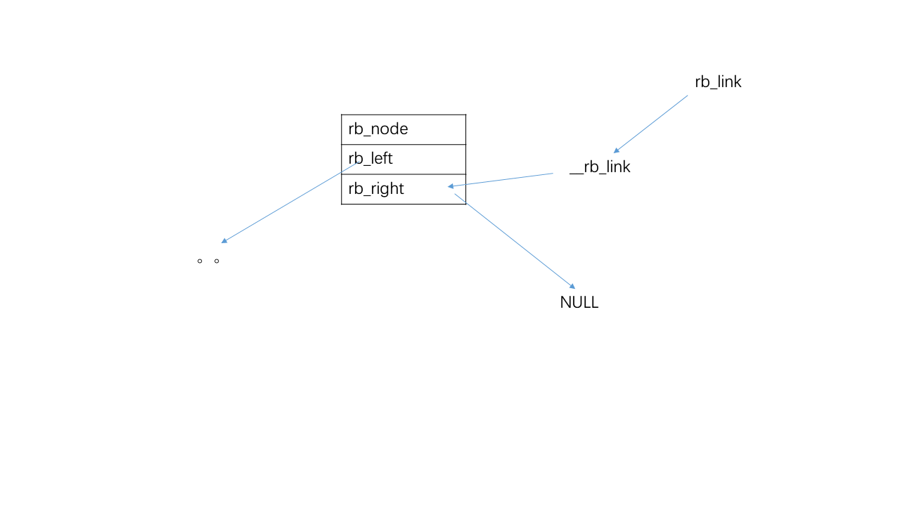

#### 9.3.3 线性区的处理

[与虚拟内存区域有关的操作](http://edsionte.com/techblog/archives/3564)

##### 9.3.3.1 查找给定地址的最邻近区：`find_vma()`

```c
struct vm_area_struct * find_vma(struct mm_struct * mm, unsigned long addr)
{
	struct vm_area_struct *vma = NULL;

	if (mm) {
		/* Check the cache first. */
		/* (Cache hit rate is typically around 35%.) */
		vma = mm->mmap_cache;
        // 局部性原理
		if (!(vma && vma->vm_end > addr && vma->vm_start <= addr)) {
            // 在红黑树中查找
			struct rb_node * rb_node;

			rb_node = mm->mm_rb.rb_node;
			vma = NULL;

			while (rb_node) {
				struct vm_area_struct * vma_tmp;

				vma_tmp = rb_entry(rb_node,
						struct vm_area_struct, vm_rb);

				if (vma_tmp->vm_end > addr) {
					vma = vma_tmp;		// 只要找到vm_end > addr的就可以了
					if (vma_tmp->vm_start <= addr)	// 尽可能找包含addr的
						break;
					rb_node = rb_node->rb_left;
				} else
					rb_node = rb_node->rb_right;
			}
			if (vma)
				mm->mmap_cache = vma;
		}
	}
	return vma;
}
```

```c
struct vm_area_struct *
find_vma_prev(struct mm_struct *mm, unsigned long addr,
			struct vm_area_struct **pprev)
{
	struct vm_area_struct *vma = NULL, *prev = NULL;
	struct rb_node * rb_node;
	if (!mm)
		goto out;

	/* Guard against addr being lower than the first VMA */
	vma = mm->mmap;

	/* Go through the RB tree quickly. */
	rb_node = mm->mm_rb.rb_node;

	while (rb_node) {
        // 找到偏左的一个，然后试探紧跟后面的是否是所求的
		struct vm_area_struct *vma_tmp;
		vma_tmp = rb_entry(rb_node, struct vm_area_struct, vm_rb);

		if (addr < vma_tmp->vm_end) {
			rb_node = rb_node->rb_left;
		} else {
			prev = vma_tmp;
            // 靠左的不符合条件，所以只需要vm_end > addr
			if (!prev->vm_next || (addr < prev->vm_next->vm_end))
				break;
			rb_node = rb_node->rb_right;
		}
	}

out:
	*pprev = prev;
	return prev ? prev->vm_next : vma;
}
```

```c
static struct vm_area_struct *
find_vma_prepare(struct mm_struct *mm, unsigned long addr,
		struct vm_area_struct **pprev, struct rb_node ***rb_link,
		struct rb_node ** rb_parent)
{
	struct vm_area_struct * vma;
	struct rb_node ** __rb_link, * __rb_parent, * rb_prev;

	__rb_link = &mm->mm_rb.rb_node;		// __rb_link 指向 rb_node
	rb_prev = __rb_parent = NULL;
	vma = NULL;

	while (*__rb_link) {
		struct vm_area_struct *vma_tmp;

		__rb_parent = *__rb_link;
		vma_tmp = rb_entry(__rb_parent, struct vm_area_struct, vm_rb);

		if (vma_tmp->vm_end > addr) {
			vma = vma_tmp;
			if (vma_tmp->vm_start <= addr)
				return vma;		// 找到了一个包含addr的vma，预示无法分配所需空间
			__rb_link = &__rb_parent->rb_left;
		} else {
			rb_prev = __rb_parent;
			__rb_link = &__rb_parent->rb_right;
		}
	}

    /*
     * *__rb_link 为空
     * 若 *__rb_link 为右孩子，则 rb_prev 为父节点
     * 若 *__rb_link 为左孩子，由于 *__rb_link 为空，即它没有左孩子，因此 rb_prev 为祖先节点中第一个作为右孩子的节点的父节点
     */
	*pprev = NULL;
	if (rb_prev)
		*pprev = rb_entry(rb_prev, struct vm_area_struct, vm_rb);	// 前一个节点
	*rb_link = __rb_link;	// 所求节点
	*rb_parent = __rb_parent;	// 父节点
	return vma;
}
```



##### 9.3.3.2 查找一个与给定的地址区间相重叠的线性区：`find_vma_intersection()`

两个区间交叉

```c
static inline struct vm_area_struct * 
find_vma_intersection(struct mm_struct * mm, unsigned long start_addr, 
                      unsigned long end_addr)
{
	struct vm_area_struct * vma = find_vma(mm,start_addr);

	if (vma && end_addr <= vma->vm_start)
		vma = NULL;
	return vma;
}
```

##### 9.3.3.3 查找一个空闲的地址区间：`get_unmapped_area()`

```c
unsigned long
get_unmapped_area(struct file *file, unsigned long addr, unsigned long len,
		unsigned long pgoff, unsigned long flags)
{
	if (flags & MAP_FIXED) {
		unsigned long ret;

		if (addr > TASK_SIZE - len)		// 是否在用户态空间
			return -ENOMEM;
		if (addr & ~PAGE_MASK)			// 是否与页边界对齐
			return -EINVAL;
		if (file && is_file_hugepages(file))  {
			/*
			 * Check if the given range is hugepage aligned, and
			 * can be made suitable for hugepages.
			 */
			ret = prepare_hugepage_range(addr, len);
		} else {
			/*
			 * Ensure that a normal request is not falling in a
			 * reserved hugepage range.  For some archs like IA-64,
			 * there is a separate region for hugepages.
			 */
			ret = is_hugepage_only_range(addr, len);
		}
		if (ret)
			return -EINVAL;
		return addr;
	}

    // 文件内存映射
	if (file && file->f_op && file->f_op->get_unmapped_area)
		return file->f_op->get_unmapped_area(file, addr, len,
						pgoff, flags);

    // 匿名内存映射
	return current->mm->get_unmapped_area(file, addr, len, pgoff, flags);	// ->
}
```

```c
unsigned long
arch_get_unmapped_area(struct file *filp, unsigned long addr,
		unsigned long len, unsigned long pgoff, unsigned long flags)
{
	struct mm_struct *mm = current->mm;
	struct vm_area_struct *vma;
	unsigned long start_addr;

	if (len > TASK_SIZE)	// 检查区间的长度
		return -ENOMEM;

	if (addr) {
		addr = PAGE_ALIGN(addr);
		vma = find_vma(mm, addr);
        // 空出了从addr开始的len长度的空间
		if (TASK_SIZE - len >= addr &&
		    (!vma || addr + len <= vma->vm_start))
			return addr;
	}
	start_addr = addr = mm->free_area_cache;

full_search:
	for (vma = find_vma(mm, addr); ; vma = vma->vm_next) {
		/* At this point:  (!vma || addr < vma->vm_end). */
		if (TASK_SIZE - len < addr) {
			/*
			 * Start a new search - just in case we missed
			 * some holes.
			 */
            // #define TASK_UNMAPPED_BASE	(PAGE_ALIGN(TASK_SIZE / 3))
            // 从用户态地址空间的三分之一处重新开始搜索
			if (start_addr != TASK_UNMAPPED_BASE) {
				start_addr = addr = TASK_UNMAPPED_BASE;
				goto full_search;
			}
            // 已经完成第二次搜索
			return -ENOMEM;
		}
        /*
         * 1. 如果通过 addr 查找临近的 vma 为空，则查找成功。也就是说 addr 之后并不存在任何的内
         * 存区域，则 addr 到 addr+len 之间的地址空间都是空闲可用的。
         * 2. 当 addr+len 并没有超过 vma 的起始地址时，也是指定起始地址查找成功的一种情况。这种
         * 情况表示所查找到的内存区间位于 vma 之前的空洞中。
         */
		if (!vma || addr + len <= vma->vm_start) {
			/*
			 * Remember the place where we stopped the search:
			 */
			mm->free_area_cache = addr + len;
			return addr;
		}
		addr = vma->vm_end;
	}
}
```

##### 9.3.3.4 向内存描述符链表中插入一个线性区：`insert_vm_struct()`

```c
int insert_vm_struct(struct mm_struct * mm, struct vm_area_struct * vma)
{
	struct vm_area_struct * __vma, * prev;
	struct rb_node ** rb_link, * rb_parent;

	/*
	 * The vm_pgoff of a purely anonymous vma should be irrelevant
	 * until its first write fault, when page's anon_vma and index
	 * are set.  But now set the vm_pgoff it will almost certainly
	 * end up with (unless mremap moves it elsewhere before that
	 * first wfault), so /proc/pid/maps tells a consistent story.
	 *
	 * By setting it to reflect the virtual start address of the
	 * vma, merges and splits can happen in a seamless way, just
	 * using the existing file pgoff checks and manipulations.
	 * Similarly in do_mmap_pgoff and in do_brk.
	 */
	if (!vma->vm_file) {
		BUG_ON(vma->anon_vma);
		vma->vm_pgoff = vma->vm_start >> PAGE_SHIFT;
	}
	__vma = find_vma_prepare(mm,vma->vm_start,&prev,&rb_link,&rb_parent);
	if (__vma && __vma->vm_start < vma->vm_end)		// 没有足够大的空闲区域
		return -ENOMEM;
	vma_link(mm, vma, prev, rb_link, rb_parent);	// ->
	return 0;
}
```

```c
static void vma_link(struct mm_struct *mm, struct vm_area_struct *vma,
			struct vm_area_struct *prev, struct rb_node **rb_link,
			struct rb_node *rb_parent)
{
	struct address_space *mapping = NULL;

	if (vma->vm_file)
		mapping = vma->vm_file->f_mapping;

	if (mapping) {
		spin_lock(&mapping->i_mmap_lock);
		vma->vm_truncate_count = mapping->truncate_count;
	}
	anon_vma_lock(vma);

	__vma_link(mm, vma, prev, rb_link, rb_parent);		// ->
	__vma_link_file(vma);

	anon_vma_unlock(vma);
	if (mapping)
		spin_unlock(&mapping->i_mmap_lock);

	mm->map_count++;	// 4
	validate_mm(mm);
}
```

**`__vma_link()`**：

```c
static void
__vma_link(struct mm_struct *mm, struct vm_area_struct *vma,
	struct vm_area_struct *prev, struct rb_node **rb_link,
	struct rb_node *rb_parent)
{
	__vma_link_list(mm, vma, prev, rb_parent);		// 1	->
	__vma_link_rb(mm, vma, rb_link, rb_parent);		// 2	->
	__anon_vma_link(vma);							// 3
}
```

```c
static inline void
__vma_link_list(struct mm_struct *mm, struct vm_area_struct *vma,
		struct vm_area_struct *prev, struct rb_node *rb_parent)
{
	if (prev) {
		vma->vm_next = prev->vm_next;
		prev->vm_next = vma;
	} else {	// vma 为第一个元素
		mm->mmap = vma;
		if (rb_parent)
			vma->vm_next = rb_entry(rb_parent,
					struct vm_area_struct, vm_rb);
		else
			vma->vm_next = NULL;
	}
}
```

```c
void __vma_link_rb(struct mm_struct *mm, struct vm_area_struct *vma,
		struct rb_node **rb_link, struct rb_node *rb_parent)
{
	rb_link_node(&vma->vm_rb, rb_parent, rb_link);		// ->
	rb_insert_color(&vma->vm_rb, &mm->mm_rb);	// 红黑树维护操作
}
```

```c
static inline void rb_link_node(struct rb_node * node, struct rb_node * parent,
				struct rb_node ** rb_link)
{
	node->rb_parent = parent;
	node->rb_color = RB_RED;
	node->rb_left = node->rb_right = NULL;

	*rb_link = node;	// 将 node 链接到红黑树上
}
```

**`__vma_unlink()`**：

```c
static inline void
__vma_unlink(struct mm_struct *mm, struct vm_area_struct *vma,
		struct vm_area_struct *prev)
{
	prev->vm_next = vma->vm_next;
	rb_erase(&vma->vm_rb, &mm->mm_rb);
	if (mm->mmap_cache == vma)
		mm->mmap_cache = prev;
}
```
