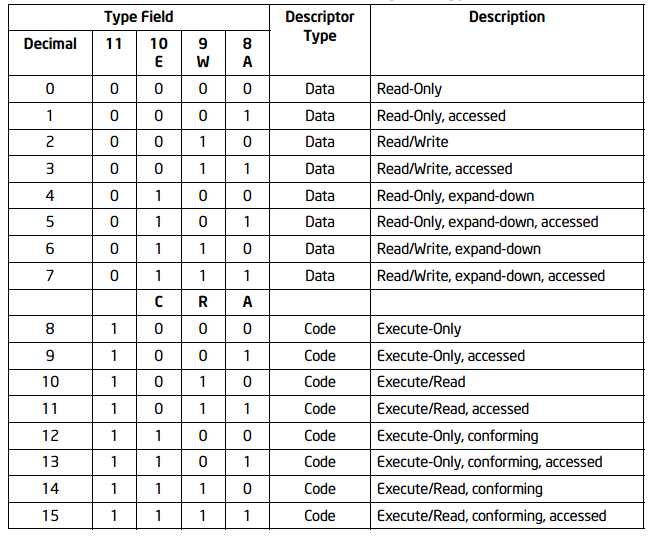
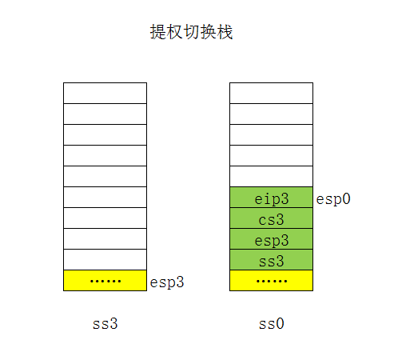
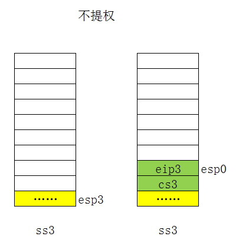
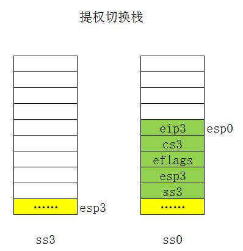
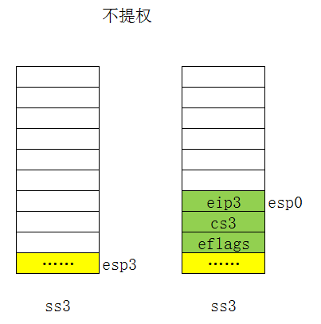

### 2.3 Linux 中的分段

>CPU 必然在背后帮我们做了一些事情，它从 GDT 表中取出对应的段描述符，经过分析后自动的填写到了段寄存器中。


**段描述符结构**：

```c
|   7    |     6       |     5     |   4    |   3    |   2    |   1    |   0    |
|76543210|7 6 5 4 3210 |7 65 4 3210|76543210|76543210|76543210|76543210|76543210|
|--------|-|-|-|-|---- |-|--|-|----|--------|--------|--------|--------|--------|
|  BASE  |G|D|0|A|LIMIT|P|D |S|TYPE|<------- BASE 23-0 ------>|<-- LIMIT 15-0 ->|
|  31-24 | |/| |V|19-16| |P |
           |B| |L|     | |L |
```

TYPE字段：

- 当 S = 1 时，TYPE 为不同值时，有以下含义：

  

  - W : 该数据段是否可写。
  - E : 扩展方向。通常来说，描述符的 [base, base + limit] 这段空间是可访问的，其它空间不可访问。如果 E = 1，[base, base +limit] 就变的不可访问，相反，其它空间变的可访问。所以 E 位，有反转有效空间的含义。
  - C : C = 1 表示一致代码段。
  - R : R = 1 表示该代码段可读。代码段是不可写的。
  - A : 访问位，该段是否被访问过。每当处理器将该段选择子置入某个段寄存器时，就将该位置 1.

- 当 S = 0 时，表示系统段，此时 TYPE 为不同值时，有以下含义：

  | TYPE |        含义         |
  | :--: | :-----------------: |
  |  0   |        保留         |
  |  1   | 16 位 TSS 段 (可用) |
  |  2   |         LDT         |
  |  3   |  16 位 TSS 段 (忙)  |
  |  4   |     16 位调用门     |
  |  5   |       任务门        |
  |  6   |     16 位中断门     |
  |  7   |     16 位陷阱门     |
  |  8   |        保留         |
  |  9   | 32 位 TSS 段 (可用) |
  |  a   |        保留         |
  |  b   |  32 位 TSS 段 (忙)  |
  |  c   |     32 位调用门     |
  |  d   |        保留         |
  |  e   |     32 位中断门     |
  |  f   |     32 为陷阱门     |


**修改段寄存器**：

[3 - 段选择子与段描述符结构](https://blog.csdn.net/q1007729991/article/details/52538080)


**limit 简算法**：

>如果 G = 0，把段描述符中的 20 bit LIMIT 取出来，比如 0x003ff，然后在前面补 0 至 32bit，即 limit = 0x000003ff. 
>如果 G=1，把段描述符中的 20 bit LIMIT 取出来，比如 0x003ff，然后在后面补 f 至 32bit, 即 LIMIT = 0x003fffff


[DPL,RPL,CPL 之间的联系和区别](https://blog.csdn.net/better0332/article/details/3416749)

[操作系统修炼指南——保护模式](https://blog.csdn.net/q1007729991/article/details/52538571)

**DPL,RPL,CPL 之间的联系和区别**：

- CPL 是**当前进程**的权限级别 (Current Privilege Level)，是当前正在执行的代码所在的段的特权级。

  存在于 CS 或 SS 寄存器的低两位。

  当选择子成功装入 CS 寄存器后，相应的选择子中的 RPL 就变成了 CPL。因为它的位置变了，已经被装入到 CS 寄存器中了，所表达的意思也发生了变化——原来的要求等级已经得到了满足，就是当前自己的等级。

  选择子可以有许多个，因此 RPL 也就有许多个。而 CPL 就不同了，正在执行的代码在某一时刻就只有这个值唯一的代表程序的 CPL.

  另外特别要求 CS 与 SS 的特权级必须保持一致。

- RPL 说明的是**进程对段访问的请求权限 **(Request Privilege Level)，是对于**段选择符**而言的，每个段选择符有自己的 RPL，有点像函数参数。而且 RPL 对每个段来说不是固定的，两次访问同一段时的 RPL 可以不同。RPL 可能会削弱 CPL 的作用，例如当前 CPL=0 的进程要访问一个数据段，它把段选择符中的 RPL 设为 3，这样虽然它对该段仍然只有特权为 3 的访问权限。

  存在于段选择符的低两位。

  RPL 的值由程序员自己来自由的设置，并不一定 RPL >= CPL，但是当 RPL < CPL 时，实际起作用的就是 CPL 了，因为访问时的特权检查是判断：EPL = max(RPL, CPL) <= DPL 是否成立，所以 RPL 可以看成是每次访问时的附加限制，RPL=0 时附加限制最小，RPL = 3 时附加限制最大。所以你不要想通过来随便设置一个 RPL 来访问一个比 CPL 更内层的段。

- DPL 存储在**段描述符**中，规定访问该段的权限级别 (Descriptor Privilege Level)，每个段的 DPL 固定。

- 当进程访问一个段时，需要进程特权级检查，一般要求 DPL >= max {CPL, RPL}


**Intel 将代码分为：**

1. 非一致代码段：受到隔离的代码，只能在同一级别间相互访问

   有些代码段描述符，绝对不允许低权限的程序跳转进去执行，这种段称为非一致代码段。

2. 一致代码段：不受到隔离的代码，允许被同等级或低等级代码调用

   只有得到段描述符的同意，才允许低权限的程序跳转进去执行。这种段称为一致代码段。


**跨段执行**：

改变 CS 段寄存器，可以使用 `jmp far` 和 `call far` 等等。

使用 jmp 跨段，并不能改变当前特权级 CPL。

**跨段提权**：



**调用门**：

调用门，是 CPU 提供给我们的一个功能，它允许 3 环程序（CPL=3）通过这扇 “门” 达到修改 cs 段寄存器的目的，同时达到提权的目的。

“门”，是一种系统段描述符（段描述符的 S=0），这个描述符的结构和数据段描述符和代码段描述符有很大区别，这种描述符中嵌入了选择子。如果你在 “门” 嵌入 DPL=0 的代码段选择子，那么你在 3 环，就可以通过这扇门，到达 0 环领空，这时候你的 CPL=3 就变成 CPL=0。

调用门就具备了这种功能。你可以在调用门中嵌入选择子 0x0008，这个选择子指向的是 DPL = 0 的代码段。然后使用 call far + 调用门描述符的段选择子，跨段到 0x0008 指向的代码段。

调用门描述符结构:

```c
|   7    |     6  |     5     |    4    |   3    |   2    |   1    |   0    |  字节
|76543210|76543210|7 65 4 3210|765 43210|76543210|76543210|76543210|76543210|  比特
|-----------------|1|--|0|1100|000|-----|--------|--------|--------|--------|  占位
|offset in segment|P|D |S|TYPE|   |param|segment selector |offset in segment|  含义
|     31-16         |P |          |nums |                 |       15-0      |
                    |L |
```

**跨段不提权**：




**使用调用门提权**：

- 查找需要提权的函数地址
- 构造调用门描述符
  - segment selector 为 0x08
  - offset in segment 为函数地址
  - 设置参数个数

调用门虽然是 CPU 提供给使用者提权的一种手段，但是 Windows 中却并未使用。在 Windows 中，大量使用了中断门来进行提权，包括后面的系统调用，都是采用中断的方式实现。

另外，所谓的后门，其实有很多，比如中断门，陷阱门，任务门。它们都可以实现提权。


**中断门**：

提权：

- 查找需要提权的函数地址
- 构造中断门描述符
  - segment selector 为 0x08
  - offset in segment 为函数地址
- `int` 指令指向中断门描述符
- 进入中断门，IF 置 0

中断门描述符结构：

```c
|   7    |     6  |     5     |   4    |   3    |   2    |   1    |   0    |  字节
|76543210|76543210|7 65 4 3210|76543210|76543210|76543210|76543210|76543210|  比特
|-----------------|1|--|0|1110|--------|--------|--------|--------|--------|  占位
|offset in segment|P|D |S|TYPE|        |segment selector |offset in segment|  含义
|     31-16         |P |               |                 |       15-0      |
                    |L |
```

提权：



不提权：




**陷阱门**：

提权：

- 与中断门几乎一样
- 进入陷阱门，CPU 并不修改 IF 位

陷阱门描述符结构：

```c
|   7    |     6  |     5     |   4    |   3    |   2    |   1    |   0    |  字节
|76543210|76543210|7 65 4 3210|76543210|76543210|76543210|76543210|76543210|  比特
|-----------------|1|--|0|1111|--------|--------|--------|--------|--------|  占位
|offset in segment|P|D |S|TYPE|        |segment selector |offset in segment|  含义
|     31-16         |P |               |                 |       15-0      |
                    |L |
```


**TSS段**：

TSS段描述符：

```c
|   7    |     6       |     5     |   4    |   3    |   2    |   1    |   0    |
|76543210|7 6 5 4 3210 |7 65 4 3210|76543210|76543210|76543210|76543210|76543210|
|--------|-|-|-|-|---- |-|--|-|----|--------|--------|--------|--------|--------|
|  BASE  |G|D|0|A|LIMIT|P|D |S|TYPE|<------- BASE 23-0 ------>|<-- LIMIT 15-0 ->|
|  31-24 | |/| |V|19-16| |P |
           |B| |L|     | |L |
```

TSS的用途：

GDT 表中可以存放多个 TSS 描述符，这意味着内存中可以存在多份不同的 TSS。总有一个 TSS 是在当前使用中的，也就是 tr 寄存器指向的那个 TSS。当使用 `call/jmp + TSS段选择子`的时候，CPU 做了以下几件事情。

> 1. 把当前所有寄存器（TSS 结构中有的那些寄存器）的值填写到当前 tr 段寄存器指向的 TSS 中
> 2. 把新的 TSS 段选择子指向的段描述符加载到 tr 段寄存器中
> 3. 把新的 TSS 段中的值覆盖到当前所有寄存器（TSS 结构中有的那些寄存器）中

步骤：


**任务门**：


1. 对数据段和堆栈段访问时的特权级控制：

   要求访问数据段或堆栈段的程序的 CPL≤待访问的数据段或堆栈段的 DPL，同时选择子的 RPL≤待访问的数据段或堆栈段的 DPL，即程序访问数据段或堆栈段要遵循一个准则：只有相同或更高特权级的代码才能访问相应的数据段。这里，RPL 可能会削弱 CPL 的作用，访问数据段或堆栈段时，默认用 CPU 和 RPL 中的最小特权级去访问数据段，所以 max {CPL, RPL} ≤ DPL，否则访问失败。

2. 对代码段访问的特权级控制（代码执行权的特权转移）：

#### 2.3.1 Linux GDT

```s
ENTRY(cpu_gdt_table)
	.quad 0x0000000000000000	/* NULL descriptor */
	.quad 0x0000000000000000	/* 0x0b reserved */
	.quad 0x0000000000000000	/* 0x13 reserved */
	.quad 0x0000000000000000	/* 0x1b reserved */
	.quad 0x0000000000000000	/* 0x20 unused */
	.quad 0x0000000000000000	/* 0x28 unused */
	.quad 0x0000000000000000	/* 0x33 TLS entry 1 */
	.quad 0x0000000000000000	/* 0x3b TLS entry 2 */
	.quad 0x0000000000000000	/* 0x43 TLS entry 3 */
	.quad 0x0000000000000000	/* 0x4b reserved */
	.quad 0x0000000000000000	/* 0x53 reserved */
	.quad 0x0000000000000000	/* 0x5b reserved */

	.quad 0x00cf9a000000ffff	/* 0x60 kernel 4GB code at 0x00000000 */
	.quad 0x00cf92000000ffff	/* 0x68 kernel 4GB data at 0x00000000 */
	.quad 0x00cffa000000ffff	/* 0x73 user 4GB code at 0x00000000 */
	.quad 0x00cff2000000ffff	/* 0x7b user 4GB data at 0x00000000 */

	.quad 0x0000000000000000	/* 0x80 TSS descriptor */
	.quad 0x0000000000000000	/* 0x88 LDT descriptor */

	/* Segments used for calling PnP BIOS */
	.quad 0x00c09a0000000000	/* 0x90 32-bit code */
	.quad 0x00809a0000000000	/* 0x98 16-bit code */
	.quad 0x0080920000000000	/* 0xa0 16-bit data */
	.quad 0x0080920000000000	/* 0xa8 16-bit data */
	.quad 0x0080920000000000	/* 0xb0 16-bit data */
	/*
	 * The APM segments have byte granularity and their bases
	 * and limits are set at run time.
	 */
	.quad 0x00409a0000000000	/* 0xb8 APM CS    code */
	.quad 0x00009a0000000000	/* 0xc0 APM CS 16 code (16 bit) */
	.quad 0x0040920000000000	/* 0xc8 APM DS    data */

	.quad 0x0000000000000000	/* 0xd0 - unused */
	.quad 0x0000000000000000	/* 0xd8 - unused */
	.quad 0x0000000000000000	/* 0xe0 - unused */
	.quad 0x0000000000000000	/* 0xe8 - unused */
	.quad 0x0000000000000000	/* 0xf0 - unused */
	.quad 0x0000000000000000	/* 0xf8 - GDT entry 31: double-fault TSS */
	
cpu_gdt_descr:
	.word GDT_ENTRIES*8-1
	.long cpu_gdt_table

	.fill NR_CPUS-1,8,0		# space for the other GDT descriptors
```

#### 2.3.2 Linux LDT