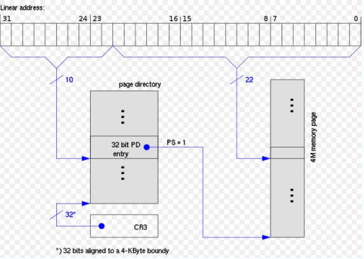
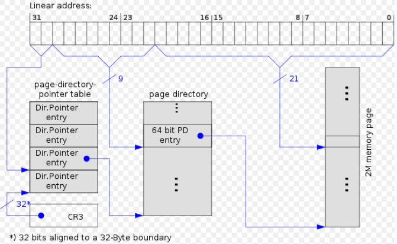

### 2.4 硬件中的分页

#### 2.4.1 常规分页

#### 2.4.2 扩展分页

#### 2.4.3 硬件保护方案

|   类别   |      段      |   页   |
| :------: | :----------: | :----: |
| 特权级别 |     4种      |  两个  |
| 存取权限 | 读、写、执行 | 读、写 |

#### 2.4.4 常规分页举例

#### 2.4.5 物理地址扩展 (PAE) 分页机制

- 页表项大小从 32 位变为 64 位，一个 4KB 的页表包含 512 个表项。
- 线性地址仍为 32 位。
- 只有内核能够修改页表，允许内核使用高达 64GB 的 RAM 。

**未启用 PAE 下的 4K 分页的页表结构**：

**未启用 PAE 下的 4M 分页的页表结构**：

**启用 PAE 下 4K 分页的页表结构**：

**启用 PAE 下 2M 分页的页表结构**：

#### 2.4.6 64位系统中的分页

#### 2.4.7 硬件高速缓存

#### 2.4.8 转换后援缓冲器 (TLB) 