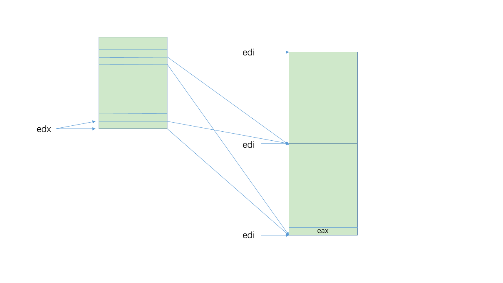
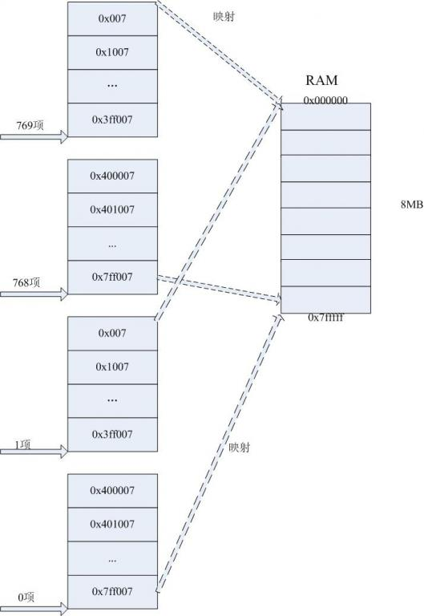

### 2.5 Linux 中的分页

#### 2.5.1 线性地址字段

- offset 字段

```c
#define PAGE_SHIFT	12
#define PAGE_SIZE	(1UL << PAGE_SHIFT)
#define PAGE_MASK	(~(PAGE_SIZE-1))	/* 0xfffff000 */
```

- offset 和 table 字段 (页中间目录项)

```c
#define PMD_SHIFT	21	/* pgtable-3level-defs.h 	PAE 激活 */
#define PMD_SHIFT	22	/* pgtable-2level.h 		PAE 禁用 */
#define PMD_SIZE	(1UL << PMD_SHIFT)	/* 2MB 4MB */
#define PMD_MASK	(~(PMD_SIZE-1))	/* 0xffe00000 0xffc00000 */

#define LARGE_PAGE_MASK (~(LARGE_PAGE_SIZE-1))
#define LARGE_PAGE_SIZE (1UL << PMD_SHIFT)
```

- 页上级目录项

```c
#define PUD_SHIFT	30
#define PUD_SIZE	(1UL << PUD_SHIFT)
#define PUD_MASK	(~(PUD_SIZE-1))
```

- 页全局目录项

```c
#define PGDIR_SHIFT	30	/* pgtable-3level-defs.h 	PAE 激活 */
#define PGDIR_SHIFT	22	/* pgtable-2level-defs.h 	PAE 禁用 */
#define PGDIR_SIZE	(1UL << PGDIR_SHIFT)	/* 1GB 4MB */
#define PGDIR_MASK	(~(PGDIR_SIZE-1))	/* 0xc0000000 0xffc00000 */
```

```c
// pgtable-3level-defs.h	PAE 激活
#define PTRS_PER_PTE	512
#define PTRS_PER_PMD	512
#define PTRS_PER_PGD	4

// pgtable.h
#define PTRS_PER_PUD	1

// pgtable-2level.h 	PAE 禁用
#define PTRS_PER_PTE	1024
#define PTRS_PER_PMD	1
#define PTRS_PER_PGD	1024
```

#### 2.5.2 页表处理

```c
#define PTE_MASK	PAGE_MASK
// mem_map (struct page *)：所有的物理内存数组
// 第pfn个物理页的描述符
#define pfn_to_page(pfn)	(mem_map + (pfn))

// 物理页索引
#define page_to_pfn(page)	((unsigned long)((page) - mem_map))

// 将第pfn个物理页的地址与标志位组合形成页表项
#define pfn_pte(pfn, prot)	__pte(((pfn) << PAGE_SHIFT) | pgprot_val(prot))

#define __PHYSICAL_MASK_SHIFT	46
#define __PHYSICAL_MASK		((1UL << __PHYSICAL_MASK_SHIFT) - 1)
// 物理页索引
#define pte_pfn(x)  ((pte_val(x) >> PAGE_SHIFT) & __PHYSICAL_MASK)

#define PHYSICAL_PAGE_MASK	(~(PAGE_SIZE-1) & (__PHYSICAL_MASK << PAGE_SHIFT))
#define pte_to_pgoff(pte) ((pte_val(pte) & PHYSICAL_PAGE_MASK) >> PAGE_SHIFT)

// TODO:
#define pgoff_to_pte(off) ((pte_t) { ((off) << PAGE_SHIFT) | _PAGE_FILE })

// 项在表中的索引
#define pgd_index(address) (((address) >> PGDIR_SHIFT) & (PTRS_PER_PGD-1))
#define pud_index(address) (((address) >> PUD_SHIFT) & (PTRS_PER_PUD-1))
#define pmd_index(address) (((address) >> PMD_SHIFT) & (PTRS_PER_PMD-1))
#define pte_index(address) (((address) >> PAGE_SHIFT) & (PTRS_PER_PTE - 1))

// 项的线性地址
#define pgd_offset(mm, address) ((mm)->pgd+pgd_index(address))
#define pud_offset(pgd, address) ((pud_t *) pgd_page(*(pgd)) + pud_index(address))
#define pmd_offset(dir, address) ((pmd_t *) pud_page(*(dir)) + pmd_index(address))

#define pgd_offset_k(address) pgd_offset(&init_mm, address)
#define pte_offset_kernel(dir, address) \
	((pte_t *) pmd_page_kernel(*(dir)) +  pte_index(address))
// TODO:
#define pte_offset_map(dir, address) \
	((pte_t *)kmap_atomic(pmd_page(*(dir)),KM_PTE0) + pte_index(address))
// x86_64
#define pte_offset_map(dir,address) pte_offset_kernel(dir,address)

// 项产生表的页描述符地址
#define pgd_page(pgd) ((unsigned long) __va((unsigned long)pgd_val(pgd) & PTE_MASK))
#define pud_page(pud) ((struct page *) __va(pud_val(pud) & PAGE_MASK))
#define pmd_page_kernel(pmd) ((unsigned long) __va(pmd_val(pmd) & PAGE_MASK))
#define pmd_page(pmd) (pfn_to_page(pmd_val(pmd) >> PAGE_SHIFT))
#define pte_page(x)		pfn_to_page(pte_pfn(x))

#define mk_pte(page, pgprot)	pfn_pte(page_to_pfn(page), (pgprot))
```

#### 2.5.3 物理内存布局

#### 2.5.4 进程页表 

进程的线性地址空间分为两部分：

1. 0x00000000 - 0xbfffffff 用户态和内核态都可以寻址
2. 0xc0000000 - 0xffffffff 只有内核态的进程才可以寻址

#### 2.5.5 内核页表

当内核被解压到线性地址 0x100000 后，为了继续启动内核，即启动内核的第一进程即 swapper 进程，内核需要建立一张临时页表供其使用。

**内核初始化自己的页表的两个阶段**：

1. 内核创建 128KB 空间
   - 代码段
   - 数据段
   - 初始页表
   - 动态数据结构
2. 利用剩余的 RAM 并建立分页表

##### 2.5.5.1 临时内核页表

**假设前 8MB 空间**：

- 内核使用的段
- 临时页表 (`pg0` 变量，紧接在 `_end` 后面)
- 128KB 空间

**变量定义**：

- `swapper_pg_dir` 变量存放**页全局目录**的线性地址
- `pg0` 变量存放第一张**页表**的线性地址

**目标**：

- 在实模式和保护模式都可以对 8MB 进行寻址
- 0x00000000 - 0x007fffff 和 0xc0000000 - 0xc07fffff 的线性地址映射到 0x00000000 - 0x007fffff 物理地址

**页全局目录的初步初始化**：

```armasm
ENTRY(swapper_pg_dir)
	.fill 1024,4,0
```

这两行汇编代码执行了页全局目录的初步初始化，它的意思是从 `swapper_pg_dir` 开始，填充 1024 项，每项为 4 字节，值为 0，正好是 4K 一个页面。

**页全局目录进一步初始化**：

为映射 8MB 地址空间，内核通过填充 `swapper_pg_dir` 中第 0 项，1 项，768 项和 769 项实现（768 和 769 是通过计算内核线性地址空间对应的页目录偏移量获得的）。前两项是给用户线性地址映射，后两项给内核线性地址映射。内核会将 `swapper_gp_dir` 的 0 项和 768 项字段设置为 `pg0` 的物理地址（`pg0` 中存放第一张页表的地址），而 1 项和 769 项设置为紧随 `pg0` 后的页框的物理地址（一般是 `pg0` + 4k）。

```armas
page_pde_offset = (__PAGE_OFFSET >> 20);			// 0xc00 = 0x300 * 4 每一项4字节

	movl $(pg0 - __PAGE_OFFSET), %edi					// 页表的物理地址
	movl $(swapper_pg_dir - __PAGE_OFFSET), %edx		// 页目录的物理地址
	movl $0x007, %eax			/* 0x007 = PRESENT+RW+USER */
10:
	leal 0x007(%edi),%ecx			/* Create PDE entry */
	movl %ecx,(%edx)			/* Store identity PDE entry */
	movl %ecx,page_pde_offset(%edx)		/* Store kernel PDE entry */
	addl $4,%edx				// 下一个页目录项
	movl $1024, %ecx
11:
	// 将 EAX 中的值保存到 ES:EDI 指向的地址中，若设置了 EFLAGS 中的方向位置位 (即在 STOSL 指令前使用 STD 指令) 则 EDI 自减 4，否则(使用 CLD 指令)EDI 自增 4；
	stosl
	addl $0x1000,%eax		// 4KB
	loop 11b
	/* End condition: we must map up to and including INIT_MAP_BEYOND_END */
	/* bytes beyond the end of our own page tables; the +0x007 is the attribute bits */
	// 结束条件: 从代码中可知，当映射到当前所操作的页表项往下 INIT_MAP_BEYOND_END（128K）处映射结束。临时页表的后面(edi结束时指向的位置)需要有128KB的空间(eax结束时指向的位置)。
				// 128KB
	leal (INIT_MAP_BEYOND_END+0x007)(%edi),%ebp
	cmpl %ebp,%eax
	jb 10b
	/* 最后把 edi 放入 init_pg_tables_end 所表示的物理地址中。也在 /boot/System.map 中。*/
	movl %edi,(init_pg_tables_end - __PAGE_OFFSET)
```

**映射后示意图**：





##### 2.5.5.2 当 RAM 小于 896MB 时的最终内核页表

把内核的可用内存空间 (896MB) 固定映射到物理内存 (0 ~ 896MB - 1) 处，其余物理内存由动态重映射处理。

**`__pa` 和 `__va` 定义**：

```c
#define __pa(x)			((unsigned long)(x)-PAGE_OFFSET)
#define __va(x)			((void *)((unsigned long)(x)+PAGE_OFFSET))
```

**`paging_init()`**：

```c
void __init paging_init(void)
{
#ifdef CONFIG_X86_PAE
	set_nx();
	if (nx_enabled)
		printk("NX (Execute Disable) protection: active\n");
#endif

	pagetable_init();	// 1

	load_cr3(swapper_pg_dir);	// 2

#ifdef CONFIG_X86_PAE
	/*
	 * We will bail out later - printk doesn't work right now so
	 * the user would just see a hanging kernel.
	 */
	if (cpu_has_pae)
		set_in_cr4(X86_CR4_PAE);	// 3
#endif
	__flush_tlb_all();	// 4

	kmap_init();
	zone_sizes_init();
}
```

**`pagetable_init()`**：

将每一个 4MB 页的物理地址保存到相应的页目录项处。

##### 2.5.5.3 当RAM 大小在 896MB 和 4096MB 之间时的最终内核页表

- 把一个 896MB 的 RAM 窗口映射到内核线性地址空间
- 其余部分采用动态重映射方式
- 使用与前一种情况相同的代码初始化页全局目录

##### 2.5.5.4 当 RAM 大于 4096MB 时的最终内核页表

- 把一个 896MB 的 RAM 窗口映射到内核线性地址空间
- 其余部分采用动态重映射方式
- 使用三级分页模型

```c
static void __init pagetable_init (void)
{
	unsigned long vaddr;
	pgd_t *pgd_base = swapper_pg_dir;

#ifdef CONFIG_X86_PAE
	int i;
	/* Init entries of the first-level page table to the zero page */
    // PTRS_PER_PGD: 二级页表 1024，三级页表 4
	for (i = 0; i < PTRS_PER_PGD; i++)
		set_pgd(pgd_base + i, __pgd(__pa(empty_zero_page) | _PAGE_PRESENT));
#endif

	/* Enable PSE if available */
	if (cpu_has_pse) {
		set_in_cr4(X86_CR4_PSE);
	}

	/* Enable PGE if available */
	if (cpu_has_pge) {
		set_in_cr4(X86_CR4_PGE);
		__PAGE_KERNEL |= _PAGE_GLOBAL;
		__PAGE_KERNEL_EXEC |= _PAGE_GLOBAL;
	}

	kernel_physical_mapping_init(pgd_base);		// ->
	remap_numa_kva();

	/*
	 * Fixed mappings, only the page table structure has to be
	 * created - mappings will be set by set_fixmap():
	 */
	vaddr = __fix_to_virt(__end_of_fixed_addresses - 1) & PMD_MASK;
	page_table_range_init(vaddr, 0, pgd_base);

	permanent_kmaps_init(pgd_base);

#ifdef CONFIG_X86_PAE
	/*
	 * Add low memory identity-mappings - SMP needs it when
	 * starting up on an AP from real-mode. In the non-PAE
	 * case we already have these mappings through head.S.
	 * All user-space mappings are explicitly cleared after
	 * SMP startup.
	 */
	pgd_base[0] = pgd_base[USER_PTRS_PER_PGD];
#endif
}
```

```c
static void __init kernel_physical_mapping_init(pgd_t *pgd_base)
{
	unsigned long pfn;
	pgd_t *pgd;
	pmd_t *pmd;
	pte_t *pte;
	int pgd_idx, pmd_idx, pte_ofs;

	pgd_idx = pgd_index(PAGE_OFFSET);
	pgd = pgd_base + pgd_idx;
	pfn = 0;

	for (; pgd_idx < PTRS_PER_PGD; pgd++, pgd_idx++) {
		pmd = one_md_table_init(pgd);		// ->
		if (pfn >= max_low_pfn)
			continue;
		for (pmd_idx = 0; pmd_idx < PTRS_PER_PMD && pfn < max_low_pfn; pmd++, pmd_idx++) {
			unsigned int address = pfn * PAGE_SIZE + PAGE_OFFSET;

			/* Map with big pages if possible, otherwise create normal page tables. */
			if (cpu_has_pse) {
				unsigned int address2 = (pfn + PTRS_PER_PTE - 1) * PAGE_SIZE + PAGE_OFFSET + PAGE_SIZE-1;

				if (is_kernel_text(address) || is_kernel_text(address2))
					set_pmd(pmd, pfn_pmd(pfn, PAGE_KERNEL_LARGE_EXEC));
				else
					set_pmd(pmd, pfn_pmd(pfn, PAGE_KERNEL_LARGE));
				pfn += PTRS_PER_PTE;
			} else {
				pte = one_page_table_init(pmd);

				for (pte_ofs = 0; pte_ofs < PTRS_PER_PTE && pfn < max_low_pfn; pte++, pfn++, pte_ofs++) {
						if (is_kernel_text(address))
							set_pte(pte, pfn_pte(pfn, PAGE_KERNEL_EXEC));
						else
							set_pte(pte, pfn_pte(pfn, PAGE_KERNEL));
				}
			}
		}
	}
}
```

```c
static pmd_t * __init one_md_table_init(pgd_t *pgd)
{
	pud_t *pud;
	pmd_t *pmd_table;
		
#ifdef CONFIG_X86_PAE
	pmd_table = (pmd_t *) alloc_bootmem_low_pages(PAGE_SIZE);
	set_pgd(pgd, __pgd(__pa(pmd_table) | _PAGE_PRESENT));
	pud = pud_offset(pgd, 0);
	if (pmd_table != pmd_offset(pud, 0)) 
		BUG();
#else
	pud = pud_offset(pgd, 0);
	pmd_table = pmd_offset(pud, 0);
#endif

	return pmd_table;
}
```

#### 2.5.6 固定映射的线性地址

每个固定映射的线性地址都映射一个物理内存的**页框**。