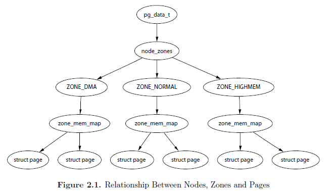
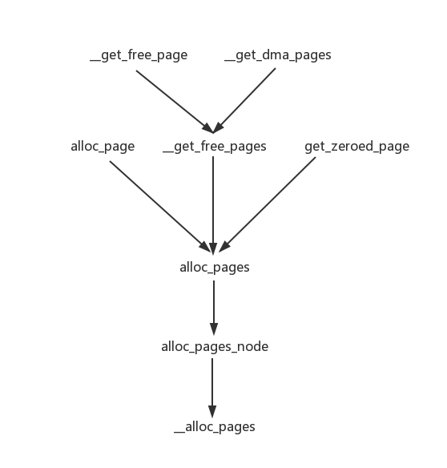

### 8.1 页框管理



#### 8.1.1 页描述符

```c
/* 产生线性地址 kaddr 对应的页描述符地址 */
#define virt_to_page(kaddr)	pfn_to_page(__pa(kaddr) >> PAGE_SHIFT)

/* 产生与页框号 pfn 对应的页描述符地址 */
#define pfn_to_page(pfn)	(mem_map + (pfn))

struct page *mem_map;	// 存放所有页描述符
```

#### 8.1.2 非一致内存访问 (NUMA)

```c
struct pglist_data *pgdat_list;		// 节点描述符链表

typedef struct bootmem_data {
	unsigned long node_boot_start;
	unsigned long node_low_pfn;
	void *node_bootmem_map;
	unsigned long last_offset;
	unsigned long last_pos;
	unsigned long last_success;	/* Previous allocation point.  To speed
					 * up searching */
} bootmem_data_t;
static bootmem_data_t contig_bootmem_data;
// 节点0描述符
struct pglist_data contig_page_data = { .bdata = &contig_bootmem_data };
```

#### 8.1.3 内存管理区

```c
// 确定相应的管理区描述符的地址
static inline struct zone *page_zone(struct page *page)
{
	return zone_table[page->flags >> NODEZONE_SHIFT];
}

struct zone *zone_table[1 << (ZONES_SHIFT + NODES_SHIFT)];

#define ZONES_SHIFT		2	/* ceil(log2(MAX_NR_ZONES)) */

#ifdef CONFIG_NUMA
#define NODES_SHIFT	6
#else
#define NODES_SHIFT	0
#endif

#define NODEZONE_SHIFT (sizeof(page_flags_t)*8 - MAX_NODES_SHIFT - MAX_ZONES_SHIFT)
```

#### 8.1.4 保留的页框池

- 原子内存请求不能被阻塞
- 为了减小原子内存分配失败发生的可能性，内核保留一个页框池，只有在内存不足时才使用
- 保留内存的数量 -> `min_free_kbytes` -> 1024KB
- 管理区描述符中的字段`pages_min` 管理区内保留页框的数目
- `pages_low` = `pages_min` * 5/4
- `pages_high` = `pages_min` * 3/2

#### 8.1.5 分区页框分配器

##### 8.1.5.1 请求和释放页框



```c
#define alloc_pages(gfp_mask, order) \
		alloc_pages_node(numa_node_id(), gfp_mask, order)

#define alloc_page(gfp_mask) alloc_pages(gfp_mask, 0)

fastcall unsigned long __get_free_pages(unsigned int gfp_mask, unsigned int order)
{
	struct page * page;
	page = alloc_pages(gfp_mask, order);
	if (!page)
		return 0;
	return (unsigned long) page_address(page);
}

#define __get_free_page(gfp_mask) \
		__get_free_pages((gfp_mask),0)

fastcall unsigned long get_zeroed_page(unsigned int gfp_mask)
{
	struct page * page;

	/*
	 * get_zeroed_page() returns a 32-bit address, which cannot represent
	 * a highmem page
	 */
	BUG_ON(gfp_mask & __GFP_HIGHMEM);

	page = alloc_pages(gfp_mask | __GFP_ZERO, 0);
	if (page)
		return (unsigned long) page_address(page);
	return 0;
}

#define __get_dma_pages(gfp_mask, order) \
		__get_free_pages((gfp_mask) | GFP_DMA,(order))

#define NODE_DATA(nid)		(&contig_page_data)
static inline struct page *alloc_pages_node(int nid, unsigned int gfp_mask,
						unsigned int order)
{
	if (unlikely(order >= MAX_ORDER))
		return NULL;

	return __alloc_pages(gfp_mask, order,
		NODE_DATA(nid)->node_zonelists + (gfp_mask & GFP_ZONEMASK));
}
```

```c
fastcall void __free_pages(struct page *page, unsigned int order)
{
	if (!PageReserved(page) && put_page_testzero(page)) {
		if (order == 0)
			free_hot_page(page);
		else
			__free_pages_ok(page, order);
	}
}

#define put_page_testzero(p)				\
	({						\
		BUG_ON(page_count(p) == 0);		\
		atomic_add_negative(-1, &(p)->_count);	\
	})

fastcall void free_pages(unsigned long addr, unsigned int order)
{
	if (addr != 0) {
		BUG_ON(!virt_addr_valid((void *)addr));
		__free_pages(virt_to_page((void *)addr), order);
	}
}

#define __free_page(page) __free_pages((page), 0)

#define free_page(addr) free_pages((addr),0)
```

#### 8.1.6 高端内存页框的内核映射

##### 8.1.6.1 永久内核映射

```c
// 高端页框到内核地址空间长期映射的页表
pte_t * pkmap_page_table;

// 页表项的个数
#ifdef CONFIG_X86_PAE
#define LAST_PKMAP 512
#else
#define LAST_PKMAP 1024
#endif

// 计数器
static int pkmap_count[LAST_PKMAP];

#define PA_HASH_ORDER	7

// ____cacheline_aligned_in_smp 是一个编译优化选项，用于 SMP 方式的缓存优化
static struct page_address_slot {
	struct list_head lh;			/* List of page_address_maps */
	spinlock_t lock;			/* Protect this bucket's list */
} ____cacheline_aligned_in_smp page_address_htable[1<<PA_HASH_ORDER];

struct page_address_map {
	struct page *page;		// 指向页描述符的指针
	void *virtual;			// 分配给该页框的线性地址
	struct list_head list;
};
```

```c
void *page_address(struct page *page)
{
	unsigned long flags;
	void *ret;
	struct page_address_slot *pas;

	if (!PageHighMem(page))		// ->
		return lowmem_page_address(page);

	pas = page_slot(page);	// ->
	ret = NULL;
	spin_lock_irqsave(&pas->lock, flags);
	if (!list_empty(&pas->lh)) {
		struct page_address_map *pam;

        // 在散列表中找出页框
		list_for_each_entry(pam, &pas->lh, list) {
			if (pam->page == page) {
				ret = pam->virtual;
				goto done;
			}
		}
	}
done:
	spin_unlock_irqrestore(&pas->lock, flags);
	return ret;
}
```

```c
static inline void *lowmem_page_address(struct page *page)
{
	return __va(page_to_pfn(page) << PAGE_SHIFT);
}
```

```c
// 拉链法哈希
static struct page_address_slot *page_slot(struct page *page)
{
    // 						对地址本身进行哈希		返回的位数
	return &page_address_htable[hash_ptr(page, PA_HASH_ORDER)];
}
```

[关于 might_sleep 的一点说明](https://blog.csdn.net/dayancn/article/details/50844985)

`kmap()`：

```c
// 建立永久内核映射
void *kmap(struct page *page)
{
	might_sleep();
	if (!PageHighMem(page))
		return page_address(page);
	return kmap_high(page);
}
```

```c
void fastcall *kmap_high(struct page *page)
{
	unsigned long vaddr;

	/*
	 * For highmem pages, we can't trust "virtual" until
	 * after we have the lock.
	 *
	 * We cannot call this from interrupts, as it may block
	 */
	spin_lock(&kmap_lock);
	vaddr = (unsigned long)page_address(page);
	if (!vaddr)		// 在散列表中没有找到
		vaddr = map_new_virtual(page);		// ->
	pkmap_count[PKMAP_NR(vaddr)]++;
	if (pkmap_count[PKMAP_NR(vaddr)] < 2)
		BUG();
	spin_unlock(&kmap_lock);
	return (void*) vaddr;
}
```

```c
/*
 * 把页框的物理地址插入到 pkmap_page_table 的一个项中并在
 * page_address_htable 散列表中加入一个元素
 */
static inline unsigned long map_new_virtual(struct page *page)
{
	unsigned long vaddr;
	int count;

start:
	count = LAST_PKMAP;
	/* Find an empty entry */
	for (;;) {
		last_pkmap_nr = (last_pkmap_nr + 1) & LAST_PKMAP_MASK;
		if (!last_pkmap_nr) {
			flush_all_zero_pkmaps();	// ->
			count = LAST_PKMAP;
		}
		if (!pkmap_count[last_pkmap_nr])
			break;	/* Found a usable entry */
		if (--count)
			continue;

		/*
		 * Sleep for somebody else to unmap their entries
		 * count == 0，全部被映射了
		 */
		{
			DECLARE_WAITQUEUE(wait, current);

			__set_current_state(TASK_UNINTERRUPTIBLE);
			add_wait_queue(&pkmap_map_wait, &wait);
			spin_unlock(&kmap_lock);
			schedule();		// 调度
			remove_wait_queue(&pkmap_map_wait, &wait);
			spin_lock(&kmap_lock);

			/* Somebody else might have mapped it while we slept */
			if (page_address(page))
				return (unsigned long)page_address(page);

			/* Re-start */
			goto start;
		}
	}
    // #define PKMAP_BASE ( (FIXADDR_BOOT_START - PAGE_SIZE*(LAST_PKMAP + 1)) & PMD_MASK )
    // #define PKMAP_ADDR(nr)  (PKMAP_BASE + ((nr) << PAGE_SHIFT))
	vaddr = PKMAP_ADDR(last_pkmap_nr);
	set_pte(&(pkmap_page_table[last_pkmap_nr]), mk_pte(page, kmap_prot));

    // 该项已经被使用了
    // 不着急加1，因为退出这个函数后会自动加的
	pkmap_count[last_pkmap_nr] = 1;
	set_page_address(page, (void *)vaddr);		// ->

	return vaddr;
}
```

```c
// 插入一个新元素到 page_address_htable 散列表中，并返回线性地址
void set_page_address(struct page *page, void *virtual)
{
	unsigned long flags;
	struct page_address_slot *pas;
	struct page_address_map *pam;

	BUG_ON(!PageHighMem(page));

	pas = page_slot(page);
	if (virtual) {		/* Add */
		BUG_ON(list_empty(&page_address_pool));

		spin_lock_irqsave(&pool_lock, flags);
        // 在未映射链表中取出一个
		pam = list_entry(page_address_pool.next,
				struct page_address_map, list);
        // 在链表中删除
		list_del(&pam->list);
		spin_unlock_irqrestore(&pool_lock, flags);

        // 映射
		pam->page = page;
		pam->virtual = virtual;

		spin_lock_irqsave(&pas->lock, flags);
        // 插入到哈希项的列表中
		list_add_tail(&pam->list, &pas->lh);
		spin_unlock_irqrestore(&pas->lock, flags);
	} else {		/* Remove */
		spin_lock_irqsave(&pas->lock, flags);
		list_for_each_entry(pam, &pas->lh, list) {
			if (pam->page == page) {
				list_del(&pam->list);
				spin_unlock_irqrestore(&pas->lock, flags);
				spin_lock_irqsave(&pool_lock, flags);
				list_add_tail(&pam->list, &page_address_pool);
				spin_unlock_irqrestore(&pool_lock, flags);
				goto done;
			}
		}
		spin_unlock_irqrestore(&pas->lock, flags);
	}
done:
	return;
}
```

```c
// 刷新掉所有映射为1的映射
static void flush_all_zero_pkmaps(void)
{
	int i;

	flush_cache_kmaps();

	for (i = 0; i < LAST_PKMAP; i++) {
		struct page *page;

		/*
		 * zero means we don't have anything to do,
		 * >1 means that it is still in use. Only
		 * a count of 1 means that it is free but
		 * needs to be unmapped
		 */
		if (pkmap_count[i] != 1)
			continue;
        
        // pkmap_count[i] == 1
		pkmap_count[i] = 0;

		/* sanity check */
		if (pte_none(pkmap_page_table[i]))
			BUG();

		/*
		 * Don't need an atomic fetch-and-clear op here;
		 * no-one has the page mapped, and cannot get at
		 * its virtual address (and hence PTE) without first
		 * getting the kmap_lock (which is held here).
		 * So no dangers, even with speculative execution.
		 */
		page = pte_page(pkmap_page_table[i]);
		pte_clear(&pkmap_page_table[i]);

		set_page_address(page, NULL);
	}
	flush_tlb_kernel_range(PKMAP_ADDR(0), PKMAP_ADDR(LAST_PKMAP));
}
```

补充：

```c
#define ARRAY_SIZE(x) (sizeof(x) / sizeof((x)[0]))

static struct list_head page_address_pool;	/* freelist */

static struct page_address_map page_address_maps[LAST_PKMAP];

// page_address_pool 初始化
// page_address_pool 存放未映射的 page_address_map
void __init page_address_init(void)
{
	int i;

	INIT_LIST_HEAD(&page_address_pool);
	for (i = 0; i < ARRAY_SIZE(page_address_maps); i++)
		list_add(&page_address_maps[i].list, &page_address_pool);
	for (i = 0; i < ARRAY_SIZE(page_address_htable); i++) {
		INIT_LIST_HEAD(&page_address_htable[i].lh);
		spin_lock_init(&page_address_htable[i].lock);
	}
	spin_lock_init(&pool_lock);
}
```

`kunmap()`：

```c
void kunmap(struct page *page)
{
	if (in_interrupt())
		BUG();
	if (!PageHighMem(page))
		return;
	kunmap_high(page);
}
```

```c
void fastcall kunmap_high(struct page *page)
{
	unsigned long vaddr;
	unsigned long nr;
	int need_wakeup;

	spin_lock(&kmap_lock);
	vaddr = (unsigned long)page_address(page);
	if (!vaddr)
		BUG();
    // #define PKMAP_NR(virt)  ((virt-PKMAP_BASE) >> PAGE_SHIFT)
	nr = PKMAP_NR(vaddr);

	/*
	 * A count must never go down to zero
	 * without a TLB flush!
	 */
	need_wakeup = 0;
	switch (--pkmap_count[nr]) {
	case 0:
		BUG();
	case 1:
		/*
		 * Avoid an unnecessary wake_up() function call.
		 * The common case is pkmap_count[] == 1, but
		 * no waiters.
		 * The tasks queued in the wait-queue are guarded
		 * by both the lock in the wait-queue-head and by
		 * the kmap_lock.  As the kmap_lock is held here,
		 * no need for the wait-queue-head's lock.  Simply
		 * test if the queue is empty.
		 */
		need_wakeup = waitqueue_active(&pkmap_map_wait);	// ->
	}
	spin_unlock(&kmap_lock);

	/* do wake-up, if needed, race-free outside of the spin lock */
	if (need_wakeup)
		wake_up(&pkmap_map_wait);
}
```

```c
static inline int waitqueue_active(wait_queue_head_t *q)
{
	return !list_empty(&q->task_list);
}
```

##### 8.1.6.2 临时内核映射

用固定映射的线性地址映射请求页

```c
enum km_type {
	KM_BOUNCE_READ,
	KM_SKB_SUNRPC_DATA,
	KM_SKB_DATA_SOFTIRQ,
	KM_USER0,
	KM_USER1,
	KM_BIO_SRC_IRQ,
	KM_BIO_DST_IRQ,
	KM_IRQ0,
	KM_IRQ1,
	KM_SOFTIRQ0,
	KM_SOFTIRQ1,
	KM_TYPE_NR
};
```

```c
 */
void *kmap_atomic(struct page *page, enum km_type type)
{
	enum fixed_addresses idx;
	unsigned long vaddr;

	/* even !CONFIG_PREEMPT needs this, for in_atomic in do_page_fault */
	inc_preempt_count();
	if (!PageHighMem(page))		// 不属于高端内存
		return page_address(page);

	idx = type + KM_TYPE_NR*smp_processor_id();		// 在所有CPU所有窗口的下标
	vaddr = __fix_to_virt(FIX_KMAP_BEGIN + idx);
#ifdef CONFIG_DEBUG_HIGHMEM
	if (!pte_none(*(kmap_pte-idx)))
		BUG();
#endif
	set_pte(kmap_pte-idx, mk_pte(page, kmap_prot));
	__flush_tlb_one(vaddr);

	return (void*) vaddr;
}
```

```c
void kunmap_atomic(void *kvaddr, enum km_type type)
{
#ifdef CONFIG_DEBUG_HIGHMEM
	unsigned long vaddr = (unsigned long) kvaddr & PAGE_MASK;
	enum fixed_addresses idx = type + KM_TYPE_NR*smp_processor_id();

	if (vaddr < FIXADDR_START) { // FIXME
		dec_preempt_count();
		preempt_check_resched();
		return;
	}

	if (vaddr != __fix_to_virt(FIX_KMAP_BEGIN+idx))
		BUG();

	/*
	 * force other mappings to Oops if they'll try to access
	 * this pte without first remap it
	 */
	pte_clear(kmap_pte-idx);
	__flush_tlb_one(vaddr);
#endif

	dec_preempt_count();
	preempt_check_resched();	// ->
}
```

```c
#define preempt_check_resched() \
do { \
	if (unlikely(test_thread_flag(TIF_NEED_RESCHED))) \
		preempt_schedule(); \
} while (0)
```

#### 8.1.7 伙伴系统算法

##### 8.1.7.1 数据结构

```c
struct free_area {
	struct list_head	free_list;
	unsigned long		nr_free;	// 空闲块的个数
};
```

##### 8.1.7.2 分配块

```c
static struct page *__rmqueue(struct zone *zone, unsigned int order)
{
	struct free_area * area;
	unsigned int current_order;
	struct page *page;

	for (current_order = order; current_order < MAX_ORDER; ++current_order) {
		area = zone->free_area + current_order;
		if (list_empty(&area->free_list))
			continue;

		page = list_entry(area->free_list.next, struct page, lru);
		list_del(&page->lru);
		rmv_page_order(page);	// ->
		area->nr_free--;
		zone->free_pages -= 1UL << order;
		return expand(zone, page, order, current_order, area);		// ->
	}

	return NULL;
}
```

```c
#define __ClearPagePrivate(page) __clear_bit(PG_private, &(page)->flags)

static inline void rmv_page_order(struct page *page)
{
	__ClearPagePrivate(page);
	page->private = 0;
}
```

```c
static inline struct page *
expand(struct zone *zone, struct page *page,
 	int low, int high, struct free_area *area)
{
	unsigned long size = 1 << high;

	while (high > low) {
		area--;
		high--;
		size >>= 1;
        // #define BUG_ON(condition) do { if (unlikely((condition)!=0)) BUG(); } while(0)
		BUG_ON(bad_range(zone, &page[size]));	// ->
		list_add(&page[size].lru, &area->free_list);
		area->nr_free++;
		set_page_order(&page[size], high);		// ->
	}
	return page;
}
```

```c
static int bad_range(struct zone *zone, struct page *page)
{
    //							管理区第一个页框的下标		以页为单位的管理区总大小
	if (page_to_pfn(page) >= zone->zone_start_pfn + zone->spanned_pages)
		return 1;
	if (page_to_pfn(page) < zone->zone_start_pfn)
		return 1;
#ifdef CONFIG_HOLES_IN_ZONE
	if (!pfn_valid(page_to_pfn(page)))
		return 1;
#endif
	if (zone != page_zone(page))
		return 1;
	return 0;
}
```

```c
#define __SetPagePrivate(page)  __set_bit(PG_private, &(page)->flags)

static inline void set_page_order(struct page *page, int order) {
	page->private = order;
	__SetPagePrivate(page);
}
```

##### 8.1.7.3 释放块

```c
static inline void __free_pages_bulk (struct page *page, struct page *base,
		struct zone *zone, unsigned int order)
{
	unsigned long page_idx;
	struct page *coalesced;
	int order_size = 1 << order;

	if (unlikely(order))	// order不为0
        /* 解决巨页标志，如果巨页标志有问题，则退出 */  
		destroy_compound_page(page, order);		// ->

	page_idx = page - base;

	BUG_ON(page_idx & (order_size - 1));	// 下标必须为order_size的倍数
	BUG_ON(bad_range(zone, page));

	zone->free_pages += order_size;
	while (order < MAX_ORDER-1) {
		struct free_area *area;
		struct page *buddy;
		int buddy_idx;

        // 对应位为1，则处在前一半，否则处在后一半
        // 找到另一半
		buddy_idx = (page_idx ^ (1 << order));
		buddy = base + buddy_idx;
		if (bad_range(zone, buddy))
			break;
		if (!page_is_buddy(buddy, order))	// ->
			break;
		/* Move the buddy up one level. */
		list_del(&buddy->lru);
		area = zone->free_area + order;
		area->nr_free--;
		rmv_page_order(buddy);
		page_idx &= buddy_idx;
		order++;
	}
	coalesced = base + page_idx;
	set_page_order(coalesced, order);
	list_add(&coalesced->lru, &zone->free_area[order].free_list);
	zone->free_area[order].nr_free++;
}
```

```c
#define PageCompound(page)	test_bit(PG_compound, &(page)->flags)

/*
* Higher-order pages are called "compound pages".  They are structured thusly:
*
* The first PAGE_SIZE page is called the "head page".
*
* The remaining PAGE_SIZE pages are called "tail pages".
*
* All pages have PG_compound set.  All pages have their ->private pointing at
* the head page (even the head page has this).
*
* The first tail page's ->mapping, if non-zero, holds the address of the
* compound page's put_page() function.
*
* The order of the allocation is stored in the first tail page's ->index
* This is only for debug at present.  This usage means that zero-order pages
* may not be compound.
*/
static void destroy_compound_page(struct page *page, unsigned long order)
{
	int i;
	int nr_pages = 1 << order;

	if (!PageCompound(page))
		return;

	if (page[1].index != order)
		bad_page(__FUNCTION__, page);

	for (i = 0; i < nr_pages; i++) {
		struct page *p = page + i;

		if (!PageCompound(p))
			bad_page(__FUNCTION__, page);
		if (p->private != (unsigned long)page)
			bad_page(__FUNCTION__, page);
		ClearPageCompound(p);
	}
}
```

```c
static inline int page_is_buddy(struct page *page, int order)
{
       if (PagePrivate(page)           &&	// private字段必须有意义
           (page_order(page) == order) &&	// private字段必须存放将要被释放的块的order
           !PageReserved(page)         &&	// 必须属于动态内存
            page_count(page) == 0)			// 第一个页必须为空闲
               return 1;
       return 0;
}
```

#### 8.1.8 每 CPU 页框高速缓存

```c
struct per_cpu_pageset {
	struct per_cpu_pages pcp[2];	/* 0: hot.  1: cold */
#ifdef CONFIG_NUMA
	unsigned long numa_hit;		/* allocated in intended node */
	unsigned long numa_miss;	/* allocated in non intended node */
	unsigned long numa_foreign;	/* was intended here, hit elsewhere */
	unsigned long interleave_hit; 	/* interleaver prefered this zone */
	unsigned long local_node;	/* allocation from local node */
	unsigned long other_node;	/* allocation from other node */
#endif
} ____cacheline_aligned_in_smp;
```

##### 8.1.8.1 通过每 CPU 页框高速缓存分配页框

```c
static struct page *
buffered_rmqueue(struct zone *zone, int order, int gfp_flags)
{
	unsigned long flags;
	struct page *page = NULL;
	int cold = !!(gfp_flags & __GFP_COLD);

	if (order == 0) {	// 1
		struct per_cpu_pages *pcp;

		pcp = &zone->pageset[get_cpu()].pcp[cold];
		local_irq_save(flags);
		if (pcp->count <= pcp->low)		// 2
			pcp->count += rmqueue_bulk(zone, 0,		// 2.c
						pcp->batch, &pcp->list);	// ->
		if (pcp->count) {	// 3
			page = list_entry(pcp->list.next, struct page, lru);
			list_del(&page->lru);
			pcp->count--;
		}
		local_irq_restore(flags);
		put_cpu();
	}

    // 1.请求跨越了多个连续的页框
    // 2.当前cpu的页框高速缓存为空
	if (page == NULL) {		// 4
		spin_lock_irqsave(&zone->lock, flags);
		page = __rmqueue(zone, order);
		spin_unlock_irqrestore(&zone->lock, flags);
	}

	if (page != NULL) {		// 5
		BUG_ON(bad_range(zone, page));
		mod_page_state_zone(zone, pgalloc, 1 << order);		// ->
		prep_new_page(page, order);

		if (gfp_flags & __GFP_ZERO)
			prep_zero_page(page, order, gfp_flags);		// ->

		if (order && (gfp_flags & __GFP_COMP))
			prep_compound_page(page, order);
	}
	return page;	// 6
}
```

```c
static int rmqueue_bulk(struct zone *zone, unsigned int order, 
			unsigned long count, struct list_head *list)
{
	unsigned long flags;
	int i;
	int allocated = 0;
	struct page *page;
	
	spin_lock_irqsave(&zone->lock, flags);
	for (i = 0; i < count; ++i) {
		page = __rmqueue(zone, order);		// 2.a
		if (page == NULL)
			break;
		allocated++;
		list_add_tail(&page->lru, list);	// 2.b
	}
	spin_unlock_irqrestore(&zone->lock, flags);
	return allocated;
}
```

```c
// 这个函数会先判断 zone 所属哪类页区，然后更新当前处理器的页状态
#define mod_page_state_zone(zone, member, delta)				\
	do {									\
		unsigned offset;						\
		if (is_highmem(zone))						\
			offset = offsetof(struct page_state, member##_high);	\
		else if (is_normal(zone))					\
			offset = offsetof(struct page_state, member##_normal);	\
		else								\
			offset = offsetof(struct page_state, member##_dma);	\
		__mod_page_state(offset, (delta));				\
	} while (0)

static char *vmstat_text[] = {
	// ...
	"pgalloc_high",

	"pgalloc_normal",
	"pgalloc_dma",
	// ...
};

struct page_state {
	// ...
	unsigned long pgalloc_high;	/* page allocations */

	unsigned long pgalloc_normal;
	unsigned long pgalloc_dma;
	// ...
};

#define offsetof(TYPE, MEMBER) ((size_t) &((TYPE *)0)->MEMBER)
```

```c
#define ZONE_DMA		0
#define ZONE_NORMAL		1
#define ZONE_HIGHMEM		2

static inline int is_highmem(struct zone *zone)
{
	return zone == zone->zone_pgdat->node_zones + ZONE_HIGHMEM;
}

static inline int is_normal(struct zone *zone)
{
	return zone == zone->zone_pgdat->node_zones + ZONE_NORMAL;
}
```

```c
void __mod_page_state(unsigned offset, unsigned long delta)
{
	unsigned long flags;
	void* ptr;

	local_irq_save(flags);
	ptr = &__get_cpu_var(page_states);
	*(unsigned long*)(ptr + offset) += delta;
	local_irq_restore(flags);
}
```

```c
static inline void prep_zero_page(struct page *page, int order, int gfp_flags)
{
	int i;

	BUG_ON((gfp_flags & (__GFP_WAIT | __GFP_HIGHMEM)) == __GFP_HIGHMEM);
	for(i = 0; i < (1 << order); i++)
		clear_highpage(page + i);
}

// 每次使用临时内核映射清空页再撤销页的映射
static inline void clear_highpage(struct page *page)
{
	void *kaddr = kmap_atomic(page, KM_USER0);
	clear_page(kaddr);
	kunmap_atomic(kaddr, KM_USER0);
}
```

```c
static void prep_compound_page(struct page *page, unsigned long order)
{
	int i;
	int nr_pages = 1 << order;

	page[1].mapping = NULL;
	page[1].index = order;
	for (i = 0; i < nr_pages; i++) {
		struct page *p = page + i;

		SetPageCompound(p);
		p->private = (unsigned long)page;
	}
}
```

##### 8.1.8.2 释放页框到每 CPU 页框高速缓存

```c
static void fastcall free_hot_cold_page(struct page *page, int cold)
{
	struct zone *zone = page_zone(page);	// 1
	struct per_cpu_pages *pcp;
	unsigned long flags;

	arch_free_page(page, 0);	// 只有在 um 处理器系统中定义了这个函数，其他的都为空。

	kernel_map_pages(page, 1, 0);	// 同上
    // 当前处理器的 per_cpu_page_state 结构的 pgfree 成员加一，pgfree 是空闲页计数器。
	inc_page_state(pgfree);		
	if (PageAnon(page))		// 当 page->mapping 的第 0 位如果为 1 时，说明该页是匿名页
		page->mapping = NULL;	// 这样就使 page->mapping 指向 null
    // 这个函数就是检测 page 的 flag 和 mapping,_count,_mapcount 这几个成员，如果
    // 有误，我们就会进行相应的处理，我们还用一个全局变量 taintd 来记录错误。
	free_pages_check(__FUNCTION__, page);
	pcp = &zone->pageset[get_cpu()].pcp[cold];	// 2
	local_irq_save(flags);
	if (pcp->count >= pcp->high)	// 3
		pcp->count -= free_pages_bulk(zone, pcp->batch, &pcp->list, 0);
    // 4
	list_add(&page->lru, &pcp->list);
	pcp->count++;
	local_irq_restore(flags);
	put_cpu();
}
```

```c
static int
free_pages_bulk(struct zone *zone, int count,
		struct list_head *list, unsigned int order)
{
	unsigned long flags;
	struct page *base, *page = NULL;
	int ret = 0;

	base = zone->zone_mem_map;
	spin_lock_irqsave(&zone->lock, flags);
    // 在管理区中填满不可回收页时此标志被置位
    // 为0表示未填满
	zone->all_unreclaimable = 0;
    // 管理区内回收页框时使用的计数器
	zone->pages_scanned = 0;
	while (!list_empty(list) && count--) {
		page = list_entry(list->prev, struct page, lru);
		/* have to delete it as __free_pages_bulk list manipulates */
		list_del(&page->lru);
		__free_pages_bulk(page, base, zone, order);
		ret++;
	}
	spin_unlock_irqrestore(&zone->lock, flags);
	return ret;
}
```

#### 8.1.9 管理区分配器

```c
#ifndef NODES_SHIFT
#define NODES_SHIFT     0
#endif

#define MAX_NUMNODES    (1 << NODES_SHIFT)

#define MAX_NR_ZONES		3	/* Sync this with ZONES_SHIFT */

struct zonelist {
	struct zone *zones[MAX_NUMNODES * MAX_NR_ZONES + 1]; // NULL delimited
};
```

```c
struct page * fastcall
__alloc_pages(unsigned int gfp_mask, unsigned int order,
		struct zonelist *zonelist)
{
	const int wait = gfp_mask & __GFP_WAIT;
	struct zone **zones, *z;
	struct page *page;
	struct reclaim_state reclaim_state;
	struct task_struct *p = current;
	int i;
	int classzone_idx;
	int do_retry;
	int can_try_harder;
	int did_some_progress;

	might_sleep_if(wait);

	/*
	 * The caller may dip into page reserves a bit more if the caller
	 * cannot run direct reclaim, or is the caller has realtime scheduling
	 * policy
	 */
	can_try_harder = (unlikely(rt_task(p)) && !in_interrupt()) || !wait;	// ？？

	zones = zonelist->zones;  /* the list of zones suitable for gfp_mask */

	if (unlikely(zones[0] == NULL)) {
		/* Should this ever happen?? */
		return NULL;
	}

    // #define zone_idx(zone)		((zone) - (zone)->zone_pgdat->node_zones)
	classzone_idx = zone_idx(zones[0]);

 restart:
	/* Go through the zonelist once, looking for a zone with enough free */
	for (i = 0; (z = zones[i]) != NULL; i++) {

		if (!zone_watermark_ok(z, order, z->pages_low,
				       classzone_idx, 0, 0))	// 第一次扫描
			continue;

		page = buffered_rmqueue(z, order, gfp_mask);
		if (page)
			goto got_pg;
	}
    
    // 没有剩下多少空闲内存

	for (i = 0; (z = zones[i]) != NULL; i++)
		wakeup_kswapd(z, order);	// 异步地回收页框

	/*
	 * Go through the zonelist again. Let __GFP_HIGH and allocations
	 * coming from realtime tasks to go deeper into reserves
	 */
	for (i = 0; (z = zones[i]) != NULL; i++) {
		if (!zone_watermark_ok(z, order, z->pages_min,
				       classzone_idx, can_try_harder,
				       gfp_mask & __GFP_HIGH))		// 第二次扫描，使用了较低的阈值
			continue;

		page = buffered_rmqueue(z, order, gfp_mask);
		if (page)
			goto got_pg;
	}
    
    // 系统内存肯定不足

	/* This allocation should allow future memory freeing. */
	if (((p->flags & PF_MEMALLOC) || unlikely(test_thread_flag(TIF_MEMDIE))) && !in_interrupt()) {	// 第三次扫描
		/* go through the zonelist yet again, ignoring mins */
		for (i = 0; (z = zones[i]) != NULL; i++) {
			page = buffered_rmqueue(z, order, gfp_mask);
			if (page)
				goto got_pg;
		}
		goto nopage;
	}

	/* Atomic allocations - we can't balance anything */
	if (!wait)		// 5
		goto nopage;

rebalance:
	cond_resched();		// 6

	/* We now go into synchronous reclaim */
	p->flags |= PF_MEMALLOC;	// 7
	reclaim_state.reclaimed_slab = 0;	// 8
	p->reclaim_state = &reclaim_state;

	did_some_progress = try_to_free_pages(zones, gfp_mask, order);	// 9

	p->reclaim_state = NULL;
	p->flags &= ~PF_MEMALLOC;

	cond_resched();

	if (likely(did_some_progress)) {
		/*
		 * Go through the zonelist yet one more time, keep
		 * very high watermark here, this is only to catch
		 * a parallel oom killing, we must fail if we're still
		 * under heavy pressure.
		 */
        // 与第3步相同
		for (i = 0; (z = zones[i]) != NULL; i++) {
			if (!zone_watermark_ok(z, order, z->pages_min,
					       classzone_idx, can_try_harder,
					       gfp_mask & __GFP_HIGH))
				continue;

			page = buffered_rmqueue(z, order, gfp_mask);
			if (page)
				goto got_pg;
		}
	} else if ((gfp_mask & __GFP_FS) && !(gfp_mask & __GFP_NORETRY)) {
		/*
		 * Go through the zonelist yet one more time, keep
		 * very high watermark here, this is only to catch
		 * a parallel oom killing, we must fail if we're still
		 * under heavy pressure.
		 */
		for (i = 0; (z = zones[i]) != NULL; i++) {
			if (!zone_watermark_ok(z, order, z->pages_high,
					       classzone_idx, 0, 0))	// 11.a
				continue;

			page = buffered_rmqueue(z, order, gfp_mask);
			if (page)
				goto got_pg;
		}

		out_of_memory(gfp_mask);	// 11.b
		goto restart;	// 11.c
	}

	/*
	 * Don't let big-order allocations loop unless the caller explicitly
	 * requests that.  Wait for some write requests to complete then retry.
	 *
	 * In this implementation, __GFP_REPEAT means __GFP_NOFAIL for order
	 * <= 3, but that may not be true in other implementations.
	 */
	do_retry = 0;
	if (!(gfp_mask & __GFP_NORETRY)) {
		if ((order <= 3) || (gfp_mask & __GFP_REPEAT))
			do_retry = 1;
		if (gfp_mask & __GFP_NOFAIL)
			do_retry = 1;
	}
	if (do_retry) {
		blk_congestion_wait(WRITE, HZ/50);		// 10
		goto rebalance;
	}

nopage:
	if (!(gfp_mask & __GFP_NOWARN) && printk_ratelimit()) {
		printk(KERN_WARNING "%s: page allocation failure."
			" order:%d, mode:0x%x\n",
			p->comm, order, gfp_mask);
		dump_stack();
	}
	return NULL;
got_pg:
	zone_statistics(zonelist, z);
	return page;
}
```

```c
int zone_watermark_ok(struct zone *z, int order, unsigned long mark,
		      int classzone_idx, int can_try_harder, int gfp_high)
{
	/* free_pages my go negative - that's OK */
	long min = mark, free_pages = z->free_pages - (1 << order) + 1;
	int o;

	if (gfp_high)		// gfp_mask中__GFP_HIGHMEM被置位
		min -= min / 2;
    // gfp_mask中__GFP_WAIT被置位，或者当前进程是一个实时进程并且在进程上下文中已经完成了内存分配
	if (can_try_harder)	
		min -= min / 4;

	if (free_pages <= min + z->lowmem_reserve[classzone_idx])	// 1
		return 0;
	for (o = 0; o < order; o++) {
		/* At the next order, this order's pages become unavailable */
		free_pages -= z->free_area[o].nr_free << o;

		/* Require fewer higher order pages to be free */
		min >>= 1;

		if (free_pages <= min)
			return 0;
	}
	return 1;
}
```

##### 8.1.9.1 释放一组页框

```c
fastcall void __free_pages(struct page *page, unsigned int order)
{
	if (!PageReserved(page) && put_page_testzero(page)) {	// 1 2
        // 多页时通过伙伴机制，单页时使用 “热冷区”。
		if (order == 0)		// 3
			free_hot_page(page);
		else	// 4
			__free_pages_ok(page, order);	// ->
	}
}
```

```c
void __free_pages_ok(struct page *page, unsigned int order)
{
	LIST_HEAD(list);
	int i;

	arch_free_page(page, order);

    // 将当前处理器的页状态结构 per_cpu_page_state 中的空闲页计数器 pgfree 加
	// 1<<order, 这个函数和 inc_page_state() 函数类似。
	mod_page_state(pgfree, 1 << order);

#ifndef CONFIG_MMU
	if (order > 0)
		for (i = 1 ; i < (1 << order) ; ++i)
			__put_page(page + i);
#endif

	for (i = 0 ; i < (1 << order) ; ++i)
        // 在释放前要检测页是否有错误，如果有错误的话就必须进行检错。
		free_pages_check(__FUNCTION__, page + i);
	list_add(&page->lru, &list);	// 将页框加入到本地链表中
	kernel_map_pages(page, 1<<order, 0);
	free_pages_bulk(page_zone(page), 1, &list, order);
}
```

