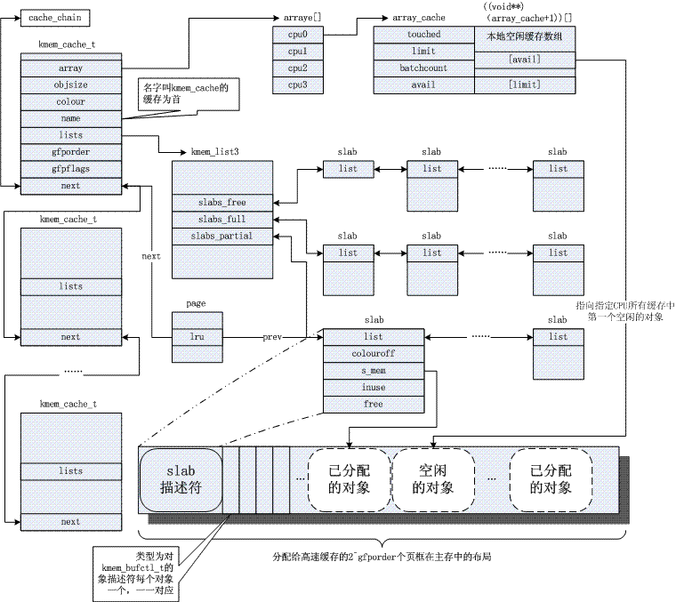

### 8.2 内存区管理

**避免内碎片的方法**：

- 提供按几何分布的内存区大小
- slab 分配器

**slab 相关数据结构图解**



#### 8.2.1 slab 分配器

#### 8.2.2 高速缓存描述符

#### 8.2.3 slab 描述符

#### 8.2.4 普通和专用高速缓存

#### 8.2.5 slab 分配器与分区页框分配器的接口

#### 8.2.6 给高速缓存分配 slab

必须满足两个条件：

- 已发出一个分配新对象的请求
- 高速缓存不包含任何空闲对象

```c
static int cache_grow (kmem_cache_t * cachep, int flags, int nodeid)
{
	struct slab	*slabp;
	void		*objp;
	size_t		 offset;
	int		 local_flags;
	unsigned long	 ctor_flags;

    // ...
    
	// 1. 获取一组页框存放 slab，返回线性地址，见 8.2.5
	/* Get mem for the objs. */
	if (!(objp = kmem_getpages(cachep, flags, nodeid)))
		goto failed;

    // 2. 获得一个新的 slab 描述符，见下一个函数
	/* Get slab management. */
    // offset 见 8.2.10
	if (!(slabp = alloc_slabmgmt(cachep, objp, offset, local_flags)))
		goto opps1;

    // 3. 给定一个页框，可以迅速得到相应高速缓存和 slab 描述符的地址
	set_slab_attr(cachep, slabp, objp);

    // 4. 将构造方法(如果定义了的话)应用到新 slab 包含的所有对象上
	cache_init_objs(cachep, slabp, ctor_flags);

	if (local_flags & __GFP_WAIT)
		local_irq_disable();
	check_irq_off();
	spin_lock(&cachep->spinlock);

	/* Make slab active. */
    // 5. 插入到高速缓存描述符全空 slab 链表的末端
	list_add_tail(&slabp->list, &(list3_data(cachep)->slabs_free));
	STATS_INC_GROWN(cachep);
    // 6. 更新高速缓存中空闲对象计数器
	list3_data(cachep)->free_objects += cachep->num;
	spin_unlock(&cachep->spinlock);
	return 1;
opps1:
	kmem_freepages(cachep, objp);
failed:
	if (local_flags & __GFP_WAIT)
		local_irq_disable();
	return 0;
}
```

```c
static struct slab* alloc_slabmgmt (kmem_cache_t *cachep,
			void *objp, int colour_off, int local_flags)
{
	struct slab *slabp;
	
    // #define	OFF_SLAB(x)	((x)->flags & CFLGS_OFF_SLAB)
	if (OFF_SLAB(cachep)) {	// slab 描述符存放在 slab 外部
		/* Slab management obj is off-slab. */
        // 见 8.2.12
        // 每一个对象为一个 slab 描述符
		slabp = kmem_cache_alloc(cachep->slabp_cache, local_flags);
		if (!slabp)
			return NULL;
	} else {	// 从 slab 的第一个页框中分配 slab 描述符
		slabp = objp+colour_off;
		colour_off += cachep->slab_size;
	}
	slabp->inuse = 0;
	slabp->colouroff = colour_off;
	slabp->s_mem = objp+colour_off;

	return slabp;
}
```

```c
static void set_slab_attr(kmem_cache_t *cachep, struct slab *slabp, void *objp)
{
	int i;
	struct page *page;

	/* Nasty!!!!!! I hope this is OK. */
	i = 1 << cachep->gfporder;
	page = virt_to_page(objp);
	do {
        // 强制转换
        // #define	SET_PAGE_CACHE(pg,x)  ((pg)->lru.next = (struct list_head *)(x))
		SET_PAGE_CACHE(page, cachep);
        // #define	SET_PAGE_SLAB(pg,x)   ((pg)->lru.prev = (struct list_head *)(x))
		SET_PAGE_SLAB(page, slabp);
		page++;
	} while (--i);
}
```

#### 8.2.7 从高速缓存中释放 slab

必须满足两个条件：

- slab 高速缓存中有太多的空闲对象
- 被周期性调用的定时器函数确定是否**有完全未使用的** slab 能被释放

#### 8.2.8 对象描述符

`kmem_bufctl_t` 结构体 (`unsigned short`)

- 位于相应的 slab 描述符之后
- 值为下一个空闲对象在 slab 中的下标，形成一个空闲对象链表

#### 8.2.9 对齐内存中的对象

```c
kmem_cache_t *
kmem_cache_create (const char *name, size_t size, size_t align,
	unsigned long flags, void (*ctor)(void*, kmem_cache_t *, unsigned long),
	void (*dtor)(void*, kmem_cache_t *, unsigned long))
{
    size_t left_over, slab_size, ralign;
	kmem_cache_t *cachep = NULL;
    
	// ...

	/* calculate out the final buffer alignment: */
	/* 1) arch recommendation: can be overridden for debug */
	if (flags & SLAB_HWCACHE_ALIGN) {	// 0
		/* Default alignment: as specified by the arch code.
		 * Except if an object is really small, then squeeze multiple
		 * objects into one cacheline.
		 */
		ralign = cache_line_size();	// L1_CACHE_BYTES 高速缓存行(cache line)
		while (size <= ralign/2)	// 2
			ralign /= 2;
	} else {	// 缺省情况
		ralign = BYTES_PER_WORD;
	}
    
    // ...
}
```

#### 8.2.10 Slab 着色

- 把 slab 中的一些空闲区域从末尾移到开始，达到把对象展开在不同的线性地址的效果。
- 对齐：对象的地址为 `aln` 的倍数

```c
static int cache_grow (kmem_cache_t * cachep, int flags, int nodeid)
{
	// ...

	/* Get colour for the slab, and cal the next value. */
	offset = cachep->colour_next;	// col
	cachep->colour_next++;
	if (cachep->colour_next >= cachep->colour)
		cachep->colour_next = 0;
    // dsize == 0 猜测：slab对象描述符在外部
	offset *= cachep->colour_off;	// colour_off: aln

	// ...

	/* Get slab management. */
	if (!(slabp = alloc_slabmgmt(cachep, objp, offset, local_flags)))
		goto opps1;

	// ...
}
```

#### 8.2.11 空闲 Slab 对象的本地高速缓存

slab 本地高速缓存：`array_cache` 结构体

- 每 CPU 元素
- 本地高速缓存数组紧跟其之后
- avail 存放 slab 中对象数组的下标

#### 8.2.12 分配 Slab 对象

1. 从 avail 中找
2. 从共享本地高速缓存填充 avail
3. 从部分或空闲 slab 中的一个空闲对象填充 avail
4. 换一个对象再找

```c
static void* cache_alloc_refill(kmem_cache_t* cachep, int flags)
{
	int batchcount;
	struct kmem_list3 *l3;
	struct array_cache *ac;

	check_irq_off();
	ac = ac_data(cachep);	// 1
retry:
	batchcount = ac->batchcount;
	if (!ac->touched && batchcount > BATCHREFILL_LIMIT) {
		/* if there was little recent activity on this
		 * cache, then perform only a partial refill.
		 * Otherwise we could generate refill bouncing.
		 */
		batchcount = BATCHREFILL_LIMIT;
	}
	l3 = list3_data(cachep);

	BUG_ON(ac->avail > 0);
	spin_lock(&cachep->spinlock);	// 2
	if (l3->shared) {	// 3.1
		struct array_cache *shared_array = l3->shared;
		if (shared_array->avail) {	// 3.2
			if (batchcount > shared_array->avail)
				batchcount = shared_array->avail;
            
            /* 
             * ac->avail == 0
             * 把 shared_array->avail 中 batchcount 个可使用对象的指针给了 ac->avail
             */
			shared_array->avail -= batchcount;	// 3.3
			ac->avail = batchcount;
            
             /*
             static inline void ** ac_entry(struct array_cache *ac)
			{
				// 返回 ac 后的本地高速缓存数组
				return (void**)(ac+1);
			}
              */ 
			memcpy(ac_entry(ac), &ac_entry(shared_array)[shared_array->avail],
					sizeof(void*)*batchcount);	// 3.4
			shared_array->touched = 1;
			goto alloc_done;	// -> 6
		}
	}
	while (batchcount > 0) {	// 4.a.1
		struct list_head *entry;
		struct slab *slabp;
		/* Get slab alloc is to come from. */
		entry = l3->slabs_partial.next;
		if (entry == &l3->slabs_partial) {	// slabs_partial 为空
			l3->free_touched = 1;	// 由 slab 分配器的页回收算法使用
			entry = l3->slabs_free.next;
			if (entry == &l3->slabs_free)	// slabs_free 为空
				goto must_grow;	// -> 5
		}

         // 4.a.2
		slabp = list_entry(entry, struct slab, list);
		check_slabp(cachep, slabp);
		check_spinlock_acquired(cachep);
		while (slabp->inuse < cachep->num && batchcount--) {
			kmem_bufctl_t next;
			STATS_INC_ALLOCED(cachep);
			STATS_INC_ACTIVE(cachep);
			STATS_SET_HIGH(cachep);

             // 4.b
			/* get obj pointer */
			ac_entry(ac)[ac->avail++] = slabp->s_mem + slabp->free*cachep->objsize;

			slabp->inuse++;
             /*
             static inline kmem_bufctl_t *slab_bufctl(struct slab *slabp)
             {
             	 // 返回 slab 描述符后的对象描述符数组
                 return (kmem_bufctl_t *)(slabp+1);
             }
              */
			next = slab_bufctl(slabp)[slabp->free];
#if DEBUG
			slab_bufctl(slabp)[slabp->free] = BUFCTL_FREE;
#endif
		       	slabp->free = next;
		}
		check_slabp(cachep, slabp);

         // 4.c
		/* move slabp to correct slabp list: */
		list_del(&slabp->list);
		if (slabp->free == BUFCTL_END)
			list_add(&slabp->list, &l3->slabs_full);
		else
			list_add(&slabp->list, &l3->slabs_partial);
	}

must_grow:
	l3->free_objects -= ac->avail;	// 5
alloc_done:
	spin_unlock(&cachep->spinlock);	// 6

	if (unlikely(!ac->avail)) {	// 7.1
		int x;
		x = cache_grow(cachep, flags, -1);	// 8
		
         // 9
		// cache_grow can reenable interrupts, then ac could change.
		ac = ac_data(cachep);
		if (!x && ac->avail == 0)	// no objects in sight? abort
			return NULL;

		if (!ac->avail)		// objects refilled by interrupt?
			goto retry;
	}
	ac->touched = 1;	// 7.2
	return ac_entry(ac)[--ac->avail];	// 7.3
}
```

#### 8.2.13 释放 Slab 对象

```c
static void cache_flusharray (kmem_cache_t* cachep, struct array_cache *ac)
{
	int batchcount;

	batchcount = ac->batchcount;
#if DEBUG
	BUG_ON(!batchcount || batchcount > ac->avail);
#endif
	check_irq_off();
	spin_lock(&cachep->spinlock);	// 1
	if (cachep->lists.shared) {	// 2.1
		struct array_cache *shared_array = cachep->lists.shared;
		int max = shared_array->limit-shared_array->avail;
		if (max) {	// 2.2
			if (batchcount > max)
				batchcount = max;
			memcpy(&ac_entry(shared_array)[shared_array->avail],
					&ac_entry(ac)[0],
					sizeof(void*)*batchcount);	// 2.3
			shared_array->avail += batchcount;
			goto free_done;	// -> 4
		}
	}

	free_block(cachep, &ac_entry(ac)[0], batchcount);	// 3
free_done:
#if STATS
	{
		int i = 0;
		struct list_head *p;

		p = list3_data(cachep)->slabs_free.next;
		while (p != &(list3_data(cachep)->slabs_free)) {
			struct slab *slabp;

			slabp = list_entry(p, struct slab, list);
			BUG_ON(slabp->inuse);

			i++;
			p = p->next;
		}
		STATS_SET_FREEABLE(cachep, i);
	}
#endif
	spin_unlock(&cachep->spinlock);	// 4
	ac->avail -= batchcount;	// 5
	memmove(&ac_entry(ac)[0], &ac_entry(ac)[batchcount],
			sizeof(void*)*ac->avail);	// 6	为什么不把高地址的复制过去？？
}
```

```c
static void free_block(kmem_cache_t *cachep, void **objpp, int nr_objects)
{
	int i;

	check_spinlock_acquired(cachep);

	/* NUMA: move add into loop */
	cachep->lists.free_objects += nr_objects;	// a

	for (i = 0; i < nr_objects; i++) {
		void *objp = objpp[i];
		struct slab *slabp;
		unsigned int objnr;

         // #define	GET_PAGE_SLAB(pg)     ((struct slab *)(pg)->lru.prev)
		slabp = GET_PAGE_SLAB(virt_to_page(objp));	// b
		list_del(&slabp->list);	// c
		objnr = (objp - slabp->s_mem) / cachep->objsize;	// d
		check_slabp(cachep, slabp);
#if DEBUG
		if (slab_bufctl(slabp)[objnr] != BUFCTL_FREE) {
			printk(KERN_ERR "slab: double free detected in cache '%s', objp %p.\n",
						cachep->name, objp);
			BUG();
		}
#endif
		slab_bufctl(slabp)[objnr] = slabp->free;	// e
		slabp->free = objnr;	// e
		STATS_DEC_ACTIVE(cachep);
		slabp->inuse--;	// f
		check_slabp(cachep, slabp);

		/* fixup slab chains */
		if (slabp->inuse == 0) {	// g.1
			if (cachep->lists.free_objects > cachep->free_limit) {	// g.2
				cachep->lists.free_objects -= cachep->num;	// g.3
				slab_destroy(cachep, slabp);	// g.3	见 8.2.7
			} else {	// h
				list_add(&slabp->list,
				&list3_data_ptr(cachep, objp)->slabs_free);
			}
		} else {	// i
			/* Unconditionally move a slab to the end of the
			 * partial list on free - maximum time for the
			 * other objects to be freed, too.
			 */
			list_add_tail(&slabp->list,
				&list3_data_ptr(cachep, objp)->slabs_partial);
		}
	}
}
```

#### 8.2.14 通用对象

- `kmalloc()`

  调用 `malloc_cache_alloc()` 分配对象

- `kfree()`

  调用 `kmem_cache_free()` 释放相应的内存区

#### 8.2.15 内存池

内存池：`mempool_t` 结构体

- 一个内存池允许一个内核成分，如块设备子系统，仅在内存不足的紧急情况下分配一些动态内存来使用。
- 与 8.1.4 区分
