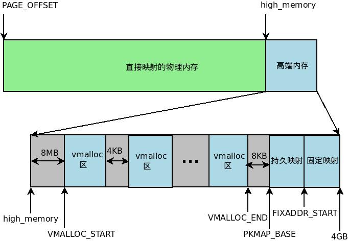
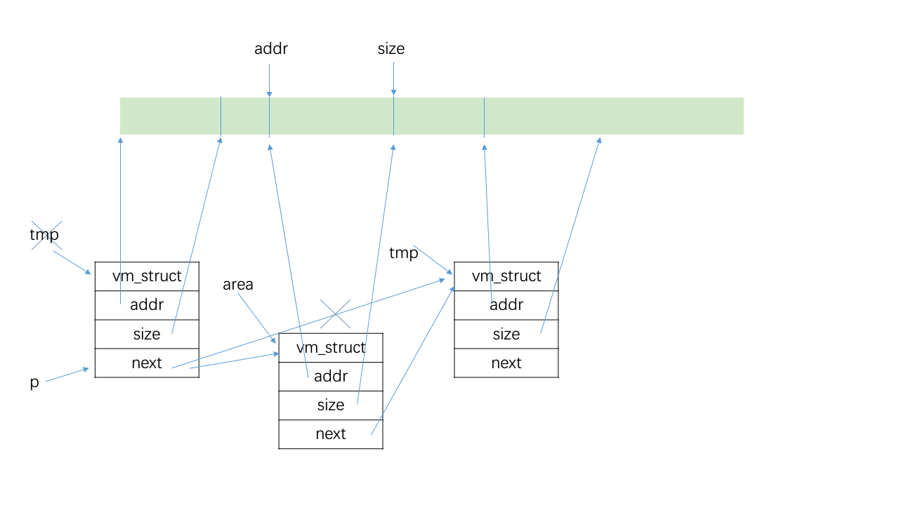

### 8.3 非连续内存区管理

#### 8.3.1 非连续内存区的线性地址



#### 8.3.2 非连续内存区的描述符

`vm_struct` 结构体

**`get_vm_area()`**：

```c
struct vm_struct *get_vm_area(unsigned long size, unsigned long flags)
{
	return __get_vm_area(size, flags, VMALLOC_START, VMALLOC_END);
}
```

```c
// 计算x以a为倍数的上界
#define ALIGN(x,a) (((x)+(a)-1)&~((a)-1))
```

```c
struct vm_struct *__get_vm_area(unsigned long size, unsigned long flags,
				unsigned long start, unsigned long end)
{
	struct vm_struct **p, *tmp, *area;
	unsigned long align = 1;
	unsigned long addr;

	if (flags & VM_IOREMAP) {
        // fls(): find last bit set
		int bit = fls(size);

		if (bit > IOREMAP_MAX_ORDER)
			bit = IOREMAP_MAX_ORDER;
		else if (bit < PAGE_SHIFT)
			bit = PAGE_SHIFT;

		align = 1ul << bit;
	}
	addr = ALIGN(start, align);

	area = kmalloc(sizeof(*area), GFP_KERNEL);	// 1
	if (unlikely(!area))
		return NULL;

	/*
	 * We always allocate a guard page.
	 */
	size += PAGE_SIZE;
	if (unlikely(!size)) {
		kfree (area);
		return NULL;
	}

	write_lock(&vmlist_lock);	// 2.1
    // vmlist 中是已分配的
    //									p 指向 tmp->next
	for (p = &vmlist; (tmp = *p) != NULL ;p = &tmp->next) {
		if ((unsigned long)tmp->addr < addr) {	// 查找到的地址在初始位置之前
            // // 查找到的末尾地址在初始位置之后
			if((unsigned long)tmp->addr + tmp->size >= addr)
				addr = ALIGN(tmp->size + 
					     (unsigned long)tmp->addr, align);
			continue;
		}
		if ((size + addr) < addr)	// 溢出
			goto out;
        // 从上一个分配的到tmp有size大小的空闲区域
		if (size + addr <= (unsigned long)tmp->addr)
			goto found;
		addr = ALIGN(tmp->size + (unsigned long)tmp->addr, align);
		if (addr > end - size)	// 空间不足
			goto out;
	}

found:	// 3
	area->next = *p;
	*p = area;

	area->flags = flags;
	area->addr = (void *)addr;
	area->size = size;
	area->pages = NULL;
	area->nr_pages = 0;
	area->phys_addr = 0;
	write_unlock(&vmlist_lock);

	return area;

out:	// 4
	write_unlock(&vmlist_lock);
	kfree(area);
	if (printk_ratelimit())
		printk(KERN_WARNING "allocation failed: out of vmalloc space - use vmalloc=<size> to increase size.\n");
	return NULL;
}
```



#### 8.3.3 分配非连续内存区

- 获取足够的页框

```c
void *vmalloc(unsigned long size)
{
       return __vmalloc(size, GFP_KERNEL | __GFP_HIGHMEM, PAGE_KERNEL);
}
```

```c
void *__vmalloc(unsigned long size, int gfp_mask, pgprot_t prot)
{
	struct vm_struct *area;
	struct page **pages;
	unsigned int nr_pages, array_size, i;

	size = PAGE_ALIGN(size);	// 1
	if (!size || (size >> PAGE_SHIFT) > num_physpages)
		return NULL;

	area = get_vm_area(size, VM_ALLOC);		// 2
	if (!area)
		return NULL;

	nr_pages = size >> PAGE_SHIFT;
	array_size = (nr_pages * sizeof(struct page *));

	area->nr_pages = nr_pages;
	/* Please note that the recursion is strictly bounded. */
	if (array_size > PAGE_SIZE)
        // 递归给 页描述符指针数组 分配 连续页框
		pages = __vmalloc(array_size, gfp_mask, PAGE_KERNEL);
	else
		pages = kmalloc(array_size, (gfp_mask & ~__GFP_HIGHMEM));	// 3
	area->pages = pages;
	if (!area->pages) {		// 见下一节
		remove_vm_area(area->addr);
		kfree(area);
		return NULL;
	}
	memset(area->pages, 0, array_size);		// 4

	for (i = 0; i < area->nr_pages; i++) {		// 5
		area->pages[i] = alloc_page(gfp_mask);
		if (unlikely(!area->pages[i])) {
			/* Successfully allocated i pages, free them in __vunmap() */
			area->nr_pages = i;
			goto fail;
		}
	}
	
	if (map_vm_area(area, prot, &pages))	// 6
		goto fail;
	return area->addr;

fail:
	vfree(area->addr);
	return NULL;
}
```

- 修改页表，将 非连续页框 映射到 连续线性地址空间

```c
#define PGDIR_SHIFT	22
#define PTRS_PER_PGD	1024	/* pgtable-2level-defs.h */
#define PGDIR_SHIFT	30
#define PTRS_PER_PGD	4		/* pgtable-3level-defs.h */
#define pgd_index(address) (((address) >> PGDIR_SHIFT) & (PTRS_PER_PGD-1))
#define pgd_offset(mm, address) ((mm)->pgd+pgd_index(address))	/* P354 */
#define pgd_offset_k(address) pgd_offset(&init_mm, address)
```

```c
int map_vm_area(struct vm_struct *area, pgprot_t prot, struct page ***pages)
{
	unsigned long address = (unsigned long) area->addr;
	unsigned long end = address + (area->size-PAGE_SIZE);
	unsigned long next;
	pgd_t *pgd;
	int err = 0;
	int i;

	pgd = pgd_offset_k(address);		// 主内核页全局目录中 address 对应的目录项
	spin_lock(&init_mm.page_table_lock);
	for (i = pgd_index(address); i <= pgd_index(end-1); i++) {
		pud_t *pud = pud_alloc(&init_mm, pgd, address);
		if (!pud) {
			err = -ENOMEM;
			break;
		}
		next = (address + PGDIR_SIZE) & PGDIR_MASK;
		if (next < address || next > end)
			next = end;
		if (map_area_pud(pud, address, next, prot, pages)) {
			err = -ENOMEM;
			break;
		}

		address = next;
		pgd++;
	}

	spin_unlock(&init_mm.page_table_lock);
	flush_cache_vmap((unsigned long) area->addr, end);
	return err;
}
```

```c
static int map_area_pud(pud_t *pud, unsigned long address,
			       unsigned long end, pgprot_t prot,
			       struct page ***pages)
{
	do {
		pmd_t *pmd = pmd_alloc(&init_mm, pud, address);
		if (!pmd)
			return -ENOMEM;
		if (map_area_pmd(pmd, address, end - address, prot, pages))
			return -ENOMEM;
		address = (address + PUD_SIZE) & PUD_MASK;	// 将地址对齐，便于计算
		pud++;
	} while (address && address < end);

	return 0;
}
```

```c
static int map_area_pmd(pmd_t *pmd, unsigned long address,
			       unsigned long size, pgprot_t prot,
			       struct page ***pages)
{
	unsigned long base, end;

	base = address & PUD_MASK;	// 高位
	address &= ~PUD_MASK;		// 低位
	end = address + size;
	if (end > PUD_SIZE)
		end = PUD_SIZE;

	do {
		pte_t * pte = pte_alloc_kernel(&init_mm, pmd, base + address);
		if (!pte)
			return -ENOMEM;
		if (map_area_pte(pte, address, end - address, prot, pages))
			return -ENOMEM;
		address = (address + PMD_SIZE) & PMD_MASK;
		pmd++;
	} while (address < end);

	return 0;
}
```

```c
static int map_area_pte(pte_t *pte, unsigned long address,
			       unsigned long size, pgprot_t prot,
			       struct page ***pages)
{
	unsigned long end;

	address &= ~PMD_MASK;	// 即使下面的地址不用，也要分配空间
	end = address + size;
	if (end > PMD_SIZE)
		end = PMD_SIZE;

	do {
		struct page *page = **pages;
		WARN_ON(!pte_none(*pte));
		if (!page)
			return -ENOMEM;

		set_pte(pte, mk_pte(page, prot));
		address += PAGE_SIZE;
		pte++;
		(*pages)++;
	} while (address < end);
	return 0;
}
```

#### 8.3.4 释放非连续内存区

```c
void __vunmap(void *addr, int deallocate_pages)
{
	struct vm_struct *area;

	if (!addr)
		return;

	if ((PAGE_SIZE-1) & (unsigned long)addr) {
		printk(KERN_ERR "Trying to vfree() bad address (%p)\n", addr);
		WARN_ON(1);
		return;
	}

	area = remove_vm_area(addr);	// 1
	if (unlikely(!area)) {
		printk(KERN_ERR "Trying to vfree() nonexistent vm area (%p)\n",
				addr);
		WARN_ON(1);
		return;
	}
	
	if (deallocate_pages) {
		int i;

		for (i = 0; i < area->nr_pages; i++) {
			if (unlikely(!area->pages[i]))
				BUG();
			__free_page(area->pages[i]);	// 2
		}

		if (area->nr_pages > PAGE_SIZE/sizeof(struct page *))
			vfree(area->pages);
		else
			kfree(area->pages);
	}

	kfree(area);	// 3
	return;
}
```